<div align ="center">

# Informe del Trabajo Final


## Universidad Peruana de Ciencias Aplicadas
### Ingeniería de Software 💻
### Curso: Aplicaciones Web (1ASI0730)
### NRC: 4370
### Docente: Alberto Wilmer Sanchez Seña
### Startup: MyMind
## YOUPER 


<div align = "left">

* Integrantes

    * Tantaleán Mesta Guillermo Fabián U202311958
    * Tasayco Osorio Raul Hiroshi U202319415
    * Nanfuñay Liza Pedro Jesús U202215462
    * Angel Guillermo Berrospi Marin U202114701
    * Orellana Rodriguez Mel Andree U202116018
    * Joel Prudencio Alcantara U20241d689


<div>

## Contenido

- [✨ Informe Trabajo Final ✨](#-informe-trabajo-final-)
    - [Universidad Peruana de Ciencias Aplicadas 🎓](#universidad-peruana-de-ciencias-aplicadas-)
  - [Registro de versiones del Informe](#registro-de-versiones-del-informe)
  - [Project Report Collaboration Insights](#project-report-collaboration-insights)
  - [Contenido](#contenido)
  - [Student Outcome](#student-outcome)
- [Capítulo I: Introducción](#capítulo-i-introducción)
  - [1.1. Startup Profile](#11-startup-profile)
    - [1.1.1. Descripción de la Startup](#111-descripción-de-la-startup)
    - [1.1.2 Perfiles de integrantes del equipo](#112-perfiles-de-integrantes-del-equipo)
  - [1.2. Solution Profile](#12-solution-profile)
    - [1.2.1 Antecedentes y problemática](#121-antecedentes-y-problemática)
      - [⁉️5“W”s + 2"H"'s](#️5ws--2hs)
        - [🟡 WHAT (QUÉ)](#-what-qué)
        - [🟡 WHEN (CUANDO)](#-when-cuando)
        - [🟡 WHERE (DONDE)](#-where-donde)
        - [🟡 WHO (QUIEN)](#-who-quien)
        - [🟡 WHY (POR QUE)](#-why-por-que)
        - [🟡 HOW (COMO)](#-how-como)
        - [🟡 HOW MUCH (CUANTO)](#-how-much-cuanto)
    - [1.2.2 Lean Ux Process](#122-lean-ux-process)
      - [1.2.2.1. Lean UX Problem Statements](#1221-lean-ux-problem-statements)
      - [1.2.2.2. Lean UX Assumptions](#1222-lean-ux-assumptions)
        - [Business Outcomes:](#business-outcomes)
        - [User Outcomes](#user-outcomes)
      - [1.2.2.3. Lean UX Hypothesis Statements](#1223-lean-ux-hypothesis-statements)
      - [1.2.2.4. Lean UX Canvas](#1224-lean-ux-canvas)
  - [Segmentos Objetivos](#segmentos-objetivos)
- [Capítulo II: Requeriments Elicitation \& Analysis](#capítulo-ii-requeriments-elicitation--analysis)
  - [2.1. Competidores](#21-competidores)
    - [2.1.1. Análisis competitivo](#211-análisis-competitivo)
    - [2.1.2. Estrategias y tácticas frente a competidores](#212-estrategias-y-tácticas-frente-a-competidores)
  - [2.2. Entrevistas 📝](#22-entrevistas-)
    - [2.2.1. Diseño de entrevistas](#221-diseño-de-entrevistas)
    - [2.2.2. Registro de entrevistas](#222-registro-de-entrevistas)
    - [2.2.3. Análisis de entrevistas](#223-análisis-de-entrevistas)
  - [2.3. Needfinding](#23-needfinding)
    - [2.3.1. User Personas](#231-user-personas)
    - [2.3.2. User Task Matrix](#232-user-task-matrix)
    - [2.3.3. User Journey Mapping](#233-user-journey-mapping)
    - [2.3.4. Empathy Mapping](#234-empathy-mapping)
    - [2.3.5. As-is Scenario Mapping](#235-as-is-scenario-mapping)
  - [2.4. Ubiquitous Language](#24-ubiquitous-language)
- [Capítulo III: Requeriments Specification](#capítulo-iii-requeriments-specification)
  - [3.1. To-Be Scenario Mapping](#31-to-be-scenario-mapping)
  - [3.2. User Stories](#32-user-stories)
  - [3.3. Impact Mapping](#33-impact-mapping)
  - [3.4. Product Backlog](#34-product-backlog)
- [Capítulo IV: Product Desing](#capítulo-iv-product-desing)
  - [4.1. Style Guidelines](#41-style-guidelines)
    - [4.1.1. General Style Guidelines](#411-general-style-guidelines)
    - [4.1.2. Web Style Guidelines](#412-web-style-guidelines)
  - [4.2. Information Architecture](#42-information-architecture)
    - [4.2.1. Organization Systems](#421-organization-systems)
    - [4.2.2. Labeling Systems](#422-labeling-systems)
    - [4.2.3. SEO Tags and Meta Tags](#423-seo-tags-and-meta-tags)
    - [4.2.4. Searching Systems](#424-searching-systems)
    - [4.2.5. Navigation Systems](#425-navigation-systems)
  - [4.3. Landing Page UI Desing](#43-landing-page-ui-desing)
    - [4.3.1. Landing Page Wireframes](#431-landing-page-wireframes)
    - [4.3.2. Landing Page Mock-Up](#432-landing-page-mock-up)
  - [4.4. Web Applications UX/UI Desing](#44-web-applications-uxui-desing)
    - [4.4.1. Web Applications Wireframes](#441-web-applications-wireframes)
    - [4.4.2. Web Applications Wireflow Diagrams](#442-web-applications-wireflow-diagrams)
    - [4.4.3. Web Applications User Flow Diagrams](#443-web-applications-user-flow-diagrams)
  - [4.5. Web Applications Prototyping](#45-web-applications-prototyping)
  - [4.6. Domain-Driven Software Architecture](#46-domain-driven-software-architecture)
    - [4.6.1. Software Architecture Context Diagram](#461-software-architecture-context-diagram)
    - [4.6.2. Software Architecture Container Diagram](#462-software-architecture-container-diagram)
    - [4.6.3. Software Architecture Components Diagram](#463-software-architecture-components-diagram)
  - [4.7. Software Object-Oriented Desing](#47-software-object-oriented-desing)
    - [4.7.1. Class Diagram](#471-class-diagram)
    - [4.7.2. Class Dictionary](#472-class-dictionary)
  - [4.8. Database Desing](#48-database-desing)
    - [4.8.1. Database Diagram](#481-database-diagram)
- [Capítulo V: Product Implementation, Validation \& Deployment](#capítulo-v-product-implementation-validation--deployment)
  - [5.1. Software Configuration Management](#51-software-configuration-management)
    - [5.1.1. Software Development Environment Configuration](#511-software-development-environment-configuration)
    - [5.1.2. Source Code Management](#512-source-code-management)
    - [5.1.3. Source Code Style Guide \& Conventions](#513-source-code-style-guide--conventions)
    - [5.1.4. Software Deployment Configuration](#514-software-deployment-configuration)
  - [5.2. Landing Page, Service \& Applications Implementation](#52-landing-page-service--applications-implementation)
    - [5.2.1. Sprints](#52x-sprints)
    -  [5.2.1.1. Sprint Planning 1](#5211-Sprint-Planning1)
    -  [5.2.1.2. Aspect Leaders and Collaborators](#5212-Aspect-Leaders-and-Collaborators)
    -  [5.2.1.3. Sprint Backlog 1](#5213-Sprint-Backlog-1)
    -  [5.2.1.4. Development Evidence for Sprint Review](#5214-Development-Evidence-for-Sprint-Review)
    -  [5.2.1.5. Execution Evidence for Sprint Review](#5215-Execution-Evidence-for-Sprint-Review)
    -  [5.2.1.6. Services Documentation Evidence for Sprint Review](#5216-Services-Documentation-Evidence-for-Sprint-Review)
    -  [5.2.1.7. Software Deployment Evidence for Sprint Review](#5217-Software-Deployment-Evidence-for-Sprint-Review)
    -  [5.2.1.8. Team Collaboration Insights during Sprint](#5218-Team-Collaboration-Insights-during-Sprint)
    - [5.2.2. Sprint 2](#52x-sprints)
    -  [5.2.2.1. Sprint Planning 2](#5211-Sprint-Planning1)
    -  [5.2.2.2. Aspect Leaders and Collaborators](#5212-Aspect-Leaders-and-Collaborators)
    -  [5.2.2.3. Sprint Backlog 2](#5213-Sprint-Backlog-1)
    -  [5.2.2.4. Development Evidence for Sprint Review](#5214-Development-Evidence-for-Sprint-Review)
    -  [5.2.2.5. Execution Evidence for Sprint Review](#5215-Execution-Evidence-for-Sprint-Review)
    -  [5.2.2.6. Services Documentation Evidence for Sprint Review](#5216-Services-Documentation-Evidence-for-Sprint-Review)
    -  [5.2.2.7. Software Deployment Evidence for Sprint Review](#5217-Software-Deployment-Evidence-for-Sprint-Review)
    -  [5.2.2.8. Team Collaboration Insights during Sprint](#5218-Team-Collaboration-Insights-during-Sprint)
    -  [Conclusiones](#Conclusiones)
    -  [Bibliografía](#Bibliografía)
    -  [Anexos](#Anexos)


# **Registro de Versiones del Informe**

| Versión | Fecha | Autor | Descripción de modificación |
|-----------|-----------|-----------|-----------|
| TB1 | 07/04/2025 | - Tantaleán Mesta Guillermo Fabián <br> - Tasayco Osorio Raul Hiroshi <br> - Nanfuñay Liza Pedro Jesús <br> - Angel Guillermo Berrospi Marin <br> - Orellana Rodriguez Mel Andree | Se han incluido los siguientes capítulos: <br> - Capítulo I: Introducción <br> - Capítulo II: Requirements Elicitation & Analysis <br> - Capítulo III: Requirements Specification <br> - Capítulo IV: Product Design <br> - Avance del Capítulo V: Product Implementation, Validation & Deployment hasta el punto 5.2.1.8 <br> - Avance de Conclusiones, Bibliografía y Anexos |
| TP | 05/05/2025 | - Tantaleán Mesta Guillermo Fabián <br> - Tasayco Osorio Raul Hiroshi <br> - Nanfuñay Liza Pedro Jesús <br> - Angel Guillermo Berrospi Marin <br> - Orellana Rodriguez Mel Andree | Se han actualizado los siguientes capítulos: <br> - Capítulo I: Introducción <br> - Capítulo II: Requirements Elicitation & Analysis <br> - Capítulo III: Requirements Specification <br> - Capítulo IV: Product Design <br> - Capítulo V: Product Implementation, Validation & Deployment hasta el punto 5.2.1.8 <br> - Avance de Conclusiones, Bibliografía y Anexos <br><br> Se han incluido los siguientes capítulos: <br> - Capítulo V: Sprint 2 <br> - Implementación de la primera versión de la Web Application |

# **Project Report Collaboration Insights**

URL Project Report (Github): [https://github.com/1ASI0730-2510-4370-G2-Youper/Report](https://github.com/1ASI0730-2510-4370-G2-Youper/Report)

# **Student Outcome**

**ABET – EAC - Student Outcome 5**
Criterio: La capacidad de funcionar efectivamente en un equipo cuyos miembros juntos proporcionan liderazgo, crean un entorno de colaboración e inclusivo, establecen objetivos, planifican tareas y cumplen objetivos. 
En el siguiente cuadro se describe las acciones realizadas y enunciados de conclusiones por parte del grupo, que permiten sustentar el haber alcanzado el logro del ABET – EAC - Student Outcome 5. 

| Criterio específico | Acciones realizadas | Conclusiones |
| ------------------- | ------------------- | ------------ |
| Trabaja en equipo para proporcionar liderazgo en forma conjunta | **Nanfuñay Liza, Pedro Jesús** <br> **TB1** <br> Participé activamente en las reuniones y decisiones del equipo, cumpliendo mi parte del trabajo en los plazos establecidos, demostrando compromiso y responsabilidad con el desarrollo del proyecto y del equipo. <br> **Nanfuñay Liza, Pedro Jesús** <br> **TP** <br> Realicé correcciones de los items retroalimentados por el docente, compartiendo ideas de solución y desarrollo con mi equipo. | **TB1** <br> Se trabajó en equipo en reuniones remotas, proporcionamos conjuntamente un liderazgo de equipo integro para la elaboración de nuestro producto y el desarrollo profesional de cada miembro del equipo. |
| Crea un entorno colaborativo e inclusivo, establece metas, planifica tareas y cumple objetivos | **Nanfuñay Liza, Pedro Jesús** <br> **TB1** <br> Participé activamente en el desarrollo del proyecto mediante una organización en Github, plataforma que nos permite realizar avances y cumplir con las tareas asignadas, cumpliendo con estas de manera eficiente y en el plazo planificado. <br> **Nanfuñay Liza, Pedro Jesús** <br> **TP** <br> Fomenté la organización y planificación de tareas a partir de las retroalimentaciones brindadas por el docente para las correcciones respectivas en el informe y para el desarrollo de la primera versión de la Web Application. | **TB1** <br> Creamos un entorno de trabajo colaborativo mediante el uso de medios de comunicación eficaces, donde cada integrante del equipo mostró compromiso y apoyo mutuo a través de reuniones, entregas anticipadas y revisiones constantes del informe del proyecto. Nos reunimos de manera periódica para aportar ideas y colaborar en cada etapa del desarrollo de nuestro producto y su documentación. |


# Capítulo I: Introducción

## 1.1. Startup Profile

### 1.1.1. Descripción de la Startup

**MyMind** es una startup innovadora que está enfocada en impulsar y transformar el cuidado de la salud mental. A través de nuestra plataforma Youper, se permitirá a los usuarios mejorar y gestionar su bienestar emocional a través de herramientas digitales y el seguimiento personalizado adaptado a las necesidades individuales de cada usuario.

**Misión:** Promover el bienestar emocional a las personas mediante una plataforma digital personalizada, accesible y basada en evidencia, que integre tecnología y acompañamiento terapéutico para mejorar la calidad de vida de los usuarios.

**Visión:** Ser referentes en innovación tecnológica para la salud mental, con el objetivo de facilitar el acceso a herramientas digitales que fomenten el autocuidado, el desarrollo personal y emocional y una sociedad más empática y saludable

### 1.1.2. Perfiles de integrantes del equipo

| Integrante | Descripción |
|-|-|
| |  |
|  | Me llamo Pedro Jesús Nanfuñay Liza, estudiante de la carrera de Ingeniería de Software. Me considero una persona responsable, perseverante y siempre dispuesto a trabajar en equipo. Tengo conocimientos en lenguajes de programación como C++ y Python; en desarrollo web como HTML, CSS y JavaScript; en base de datos relacionales y no relacionales como SQL y MongoDB; y en frameworks como Angular y PrimeVue. Espero poder aportar de manera positiva al equipo y cumplir con los objetivos establecidos. |
|  | Me llamo Angel Guillermo Berrospi, soy estudiante de ingeniería de software, me considero una persona responsable y sociable con mis compañeros dando siempre alternativas de solución ante los problemas, me gusta aprender más sobre la tecnología y cómo progresa conforme pase el tiempo. Puedo brindar aporte al equipo por los conocimientos de programación cómo C++, SQL, y un poco de Python, HTML y CSS. Por lo tanto de esta forma trato de mejorar siempre cómo persona y profesional. |
|  | Me llamo Guillermo Tantaleán, soy estudiante de la carrera de Ingeniería de Software, actualmente cursando el quinto ciclo. Tengo habilidades para comunicarme acertivamente, me enfoco en el desarrollo de aplicaciones web y móvil, tengo conocimientos de business management, leadership, emprendimientos y negocios. Soy un amante de la tecnología y del buen café. Tengo buenas habilidades de trabajo en equipo. Domino lenguajes como Swift, Python, y C++. |
|   | Mi nombre es Mel Andree Orellana Rodríguez. Soy estudiante de la carrera de Ingeniería de Software en la UPC y actualmente me encuentro cursando el séptimo ciclo.Tengo conocimientos en C++ y estoy desarrollándome en JavaScript, lo que me ha permitido ampliar mis habilidades hacia el desarrollo web. Me considero una persona comprensiva, con buena capacidad de comunicación y trabajo en equipo. Siempre estoy dispuesta a aprender cosas nuevas y a seguir mejorando. Además, me gusta colaborar y apoyar en lo que pueda ser útil, especialmente en proyectos donde pueda aportar valor y seguir creciendo tanto a nivel profesional como personal. |
|  | Mi nombre es Raul Hiroshi Tasayco Osorio, soy un estudiante de la carrera de Ingeniería de Software, me gusta trabajar en equipo, puesto que me considero alguien responsable y que puede dar buenos aportes al grupo, en cuanto a las tecnólogías que aprendí tanto adentro como afuera de la universidad se encuentran Python, C++, HTML, CSS, SQL, Mariadb. Considero que estos trabajos en grupo nos ayudan bastante para poder tener una buena coordinación en equipo y mejorar mutuamente. |


## 1.2. Solution Profile

### 1.2.1 Antecedentes y problemática

| LAS 5W y 2H | Pregunta | Descripción |
|-------------|----------|-------------|
| What? | ¿Cuál es el problema?  | La falta de acceso oportuno, económico y personalizado a procesos terapéuticos, agravada por barreras como el costo, el tiempo y la escasa disponibilidad de atención profesional. Esto impide que muchas personas enfrenten adecuadamente sus problemas de salud mental. |
| Why? | ¿Cuál es la causa del problema? | La causa del problema surge de diversos factores personales, como los antecedentes familiares, experiencias traumáticas, consumo de sustancias, estigmatización, y factores sociales recientes como la pandemia del Covid-19, que aumentó un 25% la prevalencia mundial de ansiedad y depresión (OMS, 2022). |
| When? | ¿Cuándo surge el problema? | Aunque el problema ha existido desde hace años, se intensificó notablemente durante la pandemia de Covid-19, donde el confinamiento, el aislamiento social y la incertidumbre provocaron un fuerte impacto en la salud emocional a nivel global. |
| Where? | ¿Dónde surge el problema? | El problema tiene un alcance global, con mayor impacto en situaciones de pobreza extrema, experiencias traumáticas, o en regiones donde el acceso a un proceso terapéutico sea escaso. Según la última edición del Atlas de Salud Mental de la OMS reveló que en 2020 los gobiernos de todo el mundo destinaron a la salud, por término medio, poco más del 2% de sus presupuestos de salud, y numerosos países de ingresos bajos comunicaron disponer de menos de un trabajador de salud mental por cada 100 000 habitantes. (OMS, 2022) |
| Who? | ¿Quiénes son afectados? | Los principales afectados son los jóvenes y adultos que enfrentan altos niveles de estrés, ansiedad, o dificultades emocionales y no cuentan con recursos o tiempo suficiente para recibir atención profesional. En el caso de los niños o adolescentes, la pandemia afectó el proceso de socialización y de educabilidad, informa Campodónico. (Redacción National Geographic, 2022) |
| How? | ¿Cómo se manifiesta el problema? | A través de la falta de soluciones digitales enfocadas en facilitar el acompañamiento terapéutico continuo. Las iniciativas existentes suelen ser costosas  o poco adaptadas a las realidades emocionales de los usuarios. |
| How Much? | ¿Cuál es la magnitud del problema? | A nivel personal, puede derivar en trastornos crónicos, aislamiento o riesgo suicida que fueron causas de experiencias tales como la pérdida del empleo, distanciamiento social, fallecimiento de seres cercanos o el temor a contagiar a otros . A nivel social, genera sobrecarga en los sistemas de salud, pérdida de productividad y deterioro del bienestar general. |


## 1.2.2 Lean Ux Process

## 1.2.2.1. Lean Ux Problem Statment
###
El propósito de nuestra Startup se centra en la ayuda tanto para los adultos, jóvenes y profesionales con alta carga laboral que sufren de ansiedad, estrés, baja autoestima y otros transtornos emocionales, quienes enfrentan barreras como el costo elevado, la estigmación y la falta de acceso a atención de salud mental adecuada que lamenteblemente no se le ofrece a los usuarios en atención pública, el problema es que no tienen acceso a una solución personalizada, accesible y efectiva que se adapte a sus necesidades emocionales y les brinde apoyo emocional continuo y puedan superar sus declives.

## 1.2.2.2. Lean UX Assumptions
### 
- Assumptions 1:Usuarios con carga emocional alta y acceso limitado a terapia profesional buscan soluciones accesibles y personalizadas para manejar su salud mental.
- Assumptions 2: La inteligencia artificial y la terapia cognitivo-conductual digital son efectivas si se personalizan según emociones y patrones del usuario.
- Assumptions 3: La personalización de la experiencia aumenta la conexión emocional con la plataforma y fomenta su uso continuo.
- Assumptions 4:El seguimiento constante de emociones y ejercicios de bienestar como respiración, meditación y sonidos, mejora la estabilidad emocional y sueño.
- Assumptions 5: Los profesionales de salud mental desean herramientas para hacer seguimiento asincrónico del progreso de sus pacientes, sin depender de sesiones presenciales.
  
## 1.2.2.3. Lean UX Hypothesis Statements
###
- Hypothesis 1: Creemos que ofrecer un sistema personalizado de acompañamiento emocional guiado por IA para jóvenes profesionales con poco tiempo para terapia ayudará a manejar sus niveles de estrés de manera más efectiva lo que incrementará el uso semanal de la app y reducirá la tasa de abandono.
- Hypothesis 2: Estamos convencidos de que permitir a los usuarios personalizar su panel emocional y recordatorios para usuarios emocionalmente sobrecargados hará que se sientan más en control de su estado mental lo que aumentará las interacciones diarias y la retención durante 30 días.
- Hypothesis 3: Asumimos que integrar ejercicios de respiración, meditaciones y sonidos relajantes para usuarios con ansiedad o problemas de sueño les ayudará a reducir su estrés percibido y mejorar su calidad de sueño lo que aumentará las valoraciones positivas de la app (más de 4 estrellas).
- Hypothesis 4: Suponemos que ofrecer un panel de control para profesionales con el historial emocional y de actividad de los pacientes para profesionales de la salud mental les permitirá hacer un seguimiento más preciso y planificar terapias personalizadas lo que generará mayor adopción entre terapeutas.
- Hypothesis 5: Estimamos que ofrecer planes de salud mental cortos y con metas claras (ej. reducir ansiedad en 7 días)
para usuarios nuevos que exploran herramientas emocionales los guiará hacia una experiencia de valor rápido lo que aumentará la tasa de retención en los primeros 7 días al menos en un 40%.
- Hypothesis 6: Sostenemos que enviar notificaciones diarias para registrar el estado de ánimo con preguntas breves para usuarios con estados emocionales fluctuantes fomentará la conciencia emocional constante y la autorreflexión lo que aumentará los usuarios activos diarios y la formación de hábitos saludables.
- Hypothesis 7: Planteamos que incorporar espacios de apoyo entre pares anónimos moderados por IA para usuarios que se sienten aislados pero no buscan ayuda profesional fomentará el sentido de comunidad y reducirá el estigma sobre la salud mental lo que extenderá la duración promedio de las sesiones y reducirá el abandono de la app en un 20%.
- Hypothesis 8: Consideramos que ofrecer una introducción guiada por un coach conversacional con IA para nuevos usuarios que no conocen herramientas digitales de salud mental disminuirá la fricción inicial y mejorará la comprensión del valor de la app lo que aumentará la adopción de funciones dentro de las primeras 3 sesiones.

## 1.2.2.4. Lean UX Canvas


# 2. Capítulo 2: Requirements Elicitation & Analysis
## 2.1 Competidores
### 2.1.1 Análisis Competitivo

<table>
  <tr>
    <th colspan="22">Competitive Analysis Landscape</th>
  </tr>
  <tr>
    <td colspan="1">¿Por qué llevar a cabo el análisis?</td>
    <td colspan="17">Realizar un análisis comparativo permite identificar las fortalezas y debilidades de Youper frente a los principales competidores en el mercado del bienestar emocional digital, como Headspace, un referente global en soluciones de salud mental. Este estudio facilita la comprensión de sus enfoques estratégicos, modelos de personalización, experiencia de usuario y propuestas de valor, lo que permite posicionar a Youper de manera más competitiva. Además, el análisis ayuda a detectar oportunidades de innovación y diferenciación, asegurando que Youper aborde eficazmente las necesidades emocionales de sus usuarios, superando barreras como la accesibilidad y la estigmatización.
    </td>

  </tr>
  <tr>
    <td colspan="2"></td>
    <td>Youper<br></td>
    <td>Headspace<br></td>
    <td>Calm<br></td>
    <td>Meditopia<br></td>
</tr>
  <tr>
    <td rowspan="2">Perfil</td>
    <td>Overview</td>
    <td>Youper es una app de bienestar emocional que combina inteligencia artificial, terapia cognitivo-conductual (TCC) y tecnologías IoT para ayudar a los usuarios a gestionar el estrés, mejorar la autoestima y regular sus emociones. Ofrece una experiencia personalizada basada en respuestas emocionales, datos fisiológicos y objetivos personales.
</td>
    <td>Headspace es una plataforma digital que ofrece herramientas para la salud mental y el bienestar emocional. Sus servicios incluyen meditación guiada, música relajante, artículos educativos y coaching personalizado. 
</td>
    <td>Calm es una aplicación enfocada en mejorar el bienestar mental y la calidad del sueño. Ofrece meditaciones guiadas, sonidos de la naturaleza, historias para dormir y contenido audiovisual diseñado para reducir el estrés, promover la relajación y generar hábitos de mindfulness.</td>
    <td>Meditopia es una aplicación de meditación y bienestar emocional que ofrece herramientas para mejorar la calidad del sueño, reducir la ansiedad y cultivar el mindfulness. Está disponible en múltiples idiomas y destaca por su accesibilidad y diversidad de contenido.
</td>
</tr>
  <tr>
  <td>Ventaja competitiva ¿Qué valor ofrece a los clientes?</td>
    <td>Youper se distingue por ofrecer una experiencia emocional altamente personalizada, combinando IA, psicología y dispositivos IoT. A diferencia de otras apps, adapta sus recomendaciones en tiempo real y permite seguimiento terapéutico, integrando datos emocionales y fisiológicos.</td>
    <td>La marca cuenta con una fuerte presencia global, respaldo científico, contenido exclusivo de alta calidad y asociaciones con instituciones de salud. Su enfoque está validado clínicamente y sus recursos son variados y accesibles.
</td>
    <td>Ofrece una experiencia de usuario muy pulida, con contenido exclusivo (como historias narradas por celebridades), gran variedad de formatos (música, video, sesiones guiadas), y disponibilidad en múltiples dispositivos Apple, incluyendo Vision Pro y Apple TV.
</td>
    <td>Meditopia ofrece una experiencia más personalizada que otras apps similares, permitiendo adaptar las sesiones diarias según el estado emocional del usuario. Además, está fuertemente localizada y es accesible en una amplia gama de dispositivos.
</td>
    </tr>
<tr>
    <td rowspan="2">Perfil de Marketing</td>
    <td>Mercado Objetivo</td>
    <td>Youper está dirigido a jóvenes y adultos que enfrentan ansiedad, estrés o dificultades emocionales, así como a profesionales de la salud mental que buscan herramientas digitales para complementar sus terapias.</td>
    <td>Adultos jóvenes y trabajadores con altos niveles de estrés, problemas de sueño, o ansiedad cotidiana. También es usada por instituciones y empresas como herramienta de bienestar laboral.
</td>
    <td>Usuarios adultos y jóvenes que buscan mejorar su bienestar emocional, dormir mejor o tener momentos de relajación guiada. También personas que buscan contenido accesible y relajante en formatos atractivos.
</td>
    <td>Jóvenes y adultos interesados en el autocuidado, especialmente en países de habla no inglesa donde otras apps tienen menor presencia. También personas que valoran la personalización diaria y las meditaciones sin guía.
</td>
  </tr>
  <tr>
  <td>Estrategias de Marketing</td>
    <td>La app se posicionará mediante contenido emocional en redes sociales, campañas temáticas en fechas clave, alianzas con universidades y empresas, y el uso de testimonios reales para generar conexión y confianza.</td>
    <td>Campañas digitales en redes sociales, presencia en plataformas como YouTube y Spotify, partnerships con empresas (ej. LinkedIn Learning), marketing basado en contenido y testimonios de usuarios.
</td>
    <td>Marketing digital de alto impacto, storytelling emocional en redes sociales, uso de celebridades como embajadores de marca, alianzas estratégicas y una estética visual muy cuidada que refuerza el concepto de calma y bienestar.
</td>
    <td>Enfoque en campañas digitales localizadas, fuerte presencia en plataformas móviles, uso de notificaciones diarias con mensajes inspiradores y una propuesta de valor enfocada en salud emocional asequible y diaria.
</td>
    </tr>
<tr>
    <td rowspan="3">Perfil de Producto</td>
    <td>Productos y Servicios</td>
    <td>Youper ofrece módulos personalizados, meditaciones, sonidos relajantes, ejercicios de respiración, recomendaciones dinámicas por IA, y herramientas para el seguimiento de emociones, incluyendo integración con dispositivos IoT.</td>
    <td>Meditaciones guiadas, Música relajante y sonidos de la naturaleza, Ejercicios de respiración, Coaching personalizado, Artículos y contenido educativo</td>
    <td>Meditaciones guiadas, Historias para dormir narradas por celebridades, Música relajante y sonidos naturales, Herramientas de respiración, Masterclasses y programas multisesión</td>
    <td>Meditaciones guiadas personalizadas, Música y sonidos naturales, Temporizador de meditación libre, Citas diarias e inspiraciones, Retos con amigos y seguimiento personal</td>
  </tr>
  <tr>
  <td>Precios y Costos</td>
    <td>Opera bajo un modelo freemium: acceso gratuito limitado y versión premium desde $5.99/mes, que desbloquea funciones avanzadas como personalización, estadísticas emocionales y herramientas para profesionales.</td>
    <td>Modelo freemium. La app ofrece contenido gratuito limitado y una suscripción premium con acceso completo (Headspace Premium).</td>
    <td>Freemium con opción de suscripción premium (Calm Premium) que desbloquea más de 100 horas de contenido exclusivo.</td>
    <td>Freemium con suscripción premium que desbloquea todo el contenido (Meditopia Premium). Ofrece precios competitivos, especialmente en países emergentes.
</td>
    </tr>
<td>Canales de distribución (Web y/o Móvil)</td>
    <td>Youper estará disponible como app móvil en App Store y Google Play, y también como Web App responsive. Su landing page funcionará como canal principal de conversión y contará con versiones adaptadas para usuarios individuales y convenios institucionales (B2B).</td>
    <td>Disponible vía Web, App Store (iOS, iPadOS, macOS), Google Play (Android), Apple Watch, Apple TV, y Apple Vision.</td>
    <td>Disponible en App Store y Google Play. También compatible con iPhone, iPad, Apple TV, Apple Watch, Mac y Apple Vision.</td>
    <td>Disponible en App Store y Google Play. Compatible con iPhone, iPad, Apple Watch, iPod touch y Mac. También sincroniza con Apple Health.</td>
<tr>
    <td rowspan="4">Análisis SWOT</td>
    <td>Fortalezas</td>
    <td>- Alta personalización gracias a IA + cuestionarios emocionales + datos IoT.<br><br>- Enfoque estructurado basado en TCC (modelo clínico).<br><br>- Potencial de integración en procesos terapéuticos reales (uso por parte de profesionales).</td>
    <td> -Reconocimiento global de marca<br><br>- Amplia biblioteca de contenido<br><br>- Enfoque clínico y validado</td>
    <td>- Altísima calidad visual y sonora<br><br>- Colaboraciones con figuras públicas<br><br>- 	Multiplataforma avanzada (compatible con dispositivos Apple de última generación)</td>
    <td>- Personalización emocional diaria<br><br>- Accesible en múltiples idiomas<br><br>- Sincronización con dispositivos Apple</td>
  </tr>
  <tr>
<td>Debilidades</td>
    <td>- Al ser un producto aún en desarrollo, existe una falta de comunidad sólida o reputación establecida.<br><br>- dAlgunas funciones clave aún están en fase de planificación o pruebas, lo que limita su alcance actual.<br><br>- Alta dependencia de la precisión del feedback emocional proporcionado por el usuario.</td>
    <td>- Precio elevado para ciertos segmentos<br><br>-Menor personalización emocional<br><br>-Interfaz no tan flexible o adaptable a nichos específicos</td>
    <td>- Costos relativamente altos para usuarios de bajos ingresos<br><br>- Experiencia poco personalizada<br><br>- Puede sentirse más como una app de entretenimiento que de terapia emocional</td>
    <td>- Interfaz menos moderna comparada con Calm o Headspace<br><br>- Falta de integración con terapeutas o seguimiento profesional<br><br>- Algunos contenidos no tan profundos</td>
    </tr>
  <tr>
<td>Oportunidades</td>
    <td>- Expansión a mercados emergentes con alta demanda de salud emocional.<br><br>- Alianzas con universidades y clínicas para uso institucional..<br><br>- Creciente apertura de los usuarios a hablar y gestionar emociones desde lo digital.</td>
    <td>- Expansión en el mercado hispanohablante.<br><br>- Integración con IoT y wearables más avanzados.<br><br>- Enfoques más especializados (ej. ansiedad social, relaciones).</td>
    <td>- Integración con IoT y wearables.<br><br>- Contenido localizado y multilingüe para nuevos mercados.<br><br>- Expansión del contenido a públicos escolares o corporativos.</td>
    <td>- Expansión en mercados hispanohablantes.<br><br>- Integración con IoT para seguimiento emocional.<br><br>- Alianzas con especialistas en salud mental.</td>
</tr>
  <tr>
<td>Amenazas</td>
    <td>- Competidores grandes con fuerte inversión publicitaria (Headspace, Calm).<br><br>-Saturación del mercado de apps de meditación con propuestas similares.<br><br>- Riesgos relacionados con la privacidad de los datos emocionales o de salud.</td>
    <td>- Competencia creciente en apps de salud emocional.<br><br>- Saturación del mercado de meditación.<br><br>- Barreras culturales para la adopción en ciertos mercados.
</td>
    <td>- Competidores con enfoque más terapéutico o con inteligencia artificial (como Youper o Aura).<br><br>- Dependencia de contenido exclusivo puede dificultar escalabilidad.<br><br>- Cambios en políticas de plataformas móviles (Apple/Google).</td>
    <td>- Apps con contenido más especializado o con IA (como Aura o Youper).<br><br>- Pérdida de usuarios ante plataformas más visuales.<br><br>- Cambios en políticas de suscripción móvil.</td>
</tr>
</table>

### 2.1.2. Estrategias y tácticas frente a competidores.

___
Youper adoptará una estrategia de diferenciación centrada en ofrecer una experiencia emocionalmente personalizada, respaldada por la terapia cognitivo-conductual (TCC), distinguiéndose de competidores como Calm, Headspace y Meditopia, que adoptan enfoques más genéricos y universales. Para destacar, Youper priorizará un enfoque humano, empático y culturalmente adaptado al público hispanohablante, integrando desde el primer uso algoritmos simples pero efectivos que generen recomendaciones personalizadas basadas en las necesidades individuales de los usuarios. Además, enriquecerá su contenido con voces, ejemplos y referencias contextuales del mundo latinoamericano, reforzando la relevancia cultural. La startup aprovechará fechas clave (como el Día de la Salud Mental o festividades locales) para lanzar campañas emocionales que fortalezcan el vínculo con su audiencia. Para ganarse la confianza en un mercado competitivo, Youper implementará una comunicación transparente sobre el manejo de datos, respaldada por testimonios reales de usuarios, y se apoyará en fundamentos clínicos sólidos, consolidándose como una propuesta cercana, ética y profundamente adaptada a su comunidad.

``` Youper ofrece mejoras frente a otros como:```
___
  * **Personalización emocional avanzada con TCC:** A diferencia de los enfoques genéricos de Calm y Headspace, que ofrecen meditaciones y ejercicios estandarizados, Youper integra algoritmos desde el primer uso para adaptar recomendaciones basadas en TCC, atendiendo las necesidades emocionales individuales de los usuarios de forma más precisa.
  ___
  * **Adaptación cultural al público hispanohablante:** Mientras Meditopia y otros competidores presentan contenido mayormente global, Youper incorpora voces, ejemplos y referencias del contexto latinoamericano, haciendo que la experiencia sea más relatable y cercana para este segmento.
  ___
  * **Enfoque humano y empático:** A diferencia del tono más neutro o comercial de Headspace, Youper prioriza un enfoque empático con contenido que refleja las realidades culturales y emocionales de sus usuarios, fortaleciendo la conexión emocional.
  ___
  * **Campañas emocionales contextuales:** Mientras Calm y Meditopia lanzan campañas genéricas, Youper aprovechará fechas clave relevantes para el público hispanohablante (ej., Día de la Salud Mental, Día de los Muertos) para crear campañas emocionalmente significativas, aumentando el engagement.
  ___
  * **Transparencia y confianza éticas:** Frente a la percepción de opacidad en el uso de datos de algunos competidores, Youper se diferenciará con una comunicación clara sobre la protección de datos y testimonios reales, respaldados por fundamentos clínicos, generando mayor credibilidad en un mercado saturado.
  ___
  * **Acceso temprano a personalización:** A diferencia de la personalización limitada inicial en competidores como Headspace (que requiere tiempo de uso), Youper ofrece recomendaciones personalizadas desde el onboarding, mejorando la experiencia desde el inicio.
  ___
  * **Integración cultural en contenido:** Mientras Meditopia ofrece meditaciones generales, Youper incluirá ejercicios y narrativas que reflejen desafíos específicos del mundo laboral o familiar en América Latina, aumentando su relevancia.


## 2.2. Entrevistas.
### 2.2.1. Diseño de entrevistas

Se han realizado las siguientes preguntas correspondiente a la realización de entrevistas por segmento objetivo:
___
**Segmento 1: Jóvenes Adultos con Estrés o Ansiedad**
___
* ¿Con qué frecuencia experimentas ansiedad o estrés en tu vida diaria, y qué situaciones específicas (estudios, trabajo, relaciones familiares o personales) las desencadenan más?
* ¿Qué emociones dominan tus días (ansiedad, frustración, tristeza, agotamiento), y qué estrategias intentas usar para manejarlas, ya sea por tu cuenta o con ayuda?
* ¿Has buscado apoyo emocional antes, y si es así, qué experiencias tuviste con psicólogos, amigos o herramientas digitales (como apps o sitios web)?
* ¿Qué tan cómodo te sentirías usando una aplicación para registrar tus emociones de forma privada, y qué características te harían confiar más en ella?
* ¿Te interesaría que una app te enviara preguntas diarias para reflexionar sobre tus emociones, y qué tipo de preguntas te ayudarían más?
* ¿Qué tipo de contenido (meditaciones guiadas, ejercicios de respiración, frases motivadoras, música relajante o algo diferente) te gustaría tener en una app para apoyarte emocionalmente, y por qué?
* ¿En qué momentos del día sientes mayor vulnerabilidad emocional, y qué tipo de apoyo (inmediato, estructurado, breve) te gustaría recibir en esos instantes?
* ¿Qué tan crucial es para ti que una app sea completamente discreta y proteja tu información sensible, y qué te preocuparía si no lo fuera?
* ¿Prefieres que una app te sugiera ejercicios automáticamente según tu estado de ánimo o que te permita elegirlos manualmente, y por qué?
* ¿Qué esperas lograr a largo plazo con una app emocional (sentirte más calmado, mejorar tu sueño, ganar claridad mental, aumentar tu autoestima), y cómo medirías ese progreso?
___
**Segmento 2: Adultos con Carga Laboral**
___
* ¿Qué estrategias utilizas para desconectarte mental o emocionalmente al terminar tu jornada laboral, y qué tan efectivas consideras que son?
* ¿Hay momentos en los que te cuesta conciliar el sueño debido a pensamientos relacionados con el trabajo, y qué intentas hacer en esas situaciones para relajarte?
* ¿Con qué frecuencia sientes agotamiento emocional a pesar de estar físicamente bien, y qué factores laborales crees que lo desencadenan?
* ¿Cómo describirías tu estado mental un lunes por la mañana y un viernes por la noche con una frase o palabra clave, y por qué crees que varía?
* ¿Qué elementos (privacidad total, respaldo científico, anonimato, acceso sin conexión, diseño intuitivo, etc.) te harían confiar plenamente en una app emocional como Youper?
* Si supieras que tus datos emocionales se utilizan exclusivamente para personalizar tu experiencia y mejorar la app, ¿te sentirías cómodo o no, y qué aspectos te preocuparían o tranquilizarían?
* ¿Te parecería útil que la app se integre con tu smartwatch o pulsera para monitorear tu estrés en tiempo real y ofrecerte recomendaciones inmediatas, y qué tipo de recomendaciones valorarías más?
* ¿Cómo te gustaría sentirte después de usar una app como Youper durante un mes (más tranquilo, motivado, con mejor autoestima, durmiendo mejor), y qué señales te indicarían que está funcionando?
* ¿Qué características o incentivos (notificaciones personalizadas, progreso visible, ejercicios cortos, recompensas) harían que la app se integre fácilmente en tu rutina diaria sin sentirse como una carga adicional?
* ¿Te interesaría que la app detecte momentos en los que podrías necesitar apoyo profesional y te brinde orientación confidencial, y qué tipo de soporte buscarías en esos casos?
___
**Segmento 3: Especialistas de la Salud Mental**
___
* ¿Qué herramientas digitales utilizas actualmente para acompañar a tus pacientes, y qué limitaciones encuentras en ellas para el seguimiento emocional?
* ¿Cuáles son los principales desafíos que enfrentas al dar seguimiento emocional a tus pacientes fuera de las consultas presenciales o virtuales?
* ¿Te gustaría tener una plataforma donde tus pacientes registren sus emociones y tú puedas monitorear su progreso de forma estructurada y confidencial?
* ¿Qué tipo de información (ej., patrones emocionales, respuestas a ejercicios, niveles de estrés) consideras esencial para evaluar el bienestar emocional de un paciente entre sesiones?
* ¿Te interesaría que la app genere un resumen automático del estado emocional de tus pacientes basado en sus registros, y qué detalles te gustaría que incluya?
* ¿Qué formato prefieres para recibir reportes sobre el progreso de tus pacientes: gráficos visuales, texto detallado, alertas personalizadas, o una combinación, y por qué?
* ¿Te sentirías cómodo recomendando una app como complemento terapéutico a tus pacientes, y qué factores influirían en tu decisión (seguridad, evidencia científica, facilidad de uso)?
* ¿Qué características (seguridad de datos, diseño intuitivo, integración con otros sistemas, etc.) te darían confianza para usar una app y recomendarla a tus pacientes?
* ¿Considerarías útil que los pacientes puedan enviarte feedback directo sobre los ejercicios o herramientas que usaron, y cómo te ayudaría eso en tu práctica?
* ¿Qué funciones adicionales (ej., alertas personalizadas, análisis predictivo, colaboración con otros especialistas) te gustaría ver en una app de salud emocional diseñada para profesionales como tú?

### 2.2.2. Registro de entrevistas

Link del video de entrevistas: https://upcedupe-my.sharepoint.com/:v:/g/personal/u202215462_upc_edu_pe/EeX-Bf0clAtGpyDmr2FG75wBrAxUzrHSkUZr2czUwk7W4Q?e=XfFrVC&nav=eyJyZWZlcnJhbEluZm8iOnsicmVmZXJyYWxBcHAiOiJTdHJlYW1XZWJBcHAiLCJyZWZlcnJhbFZpZXciOiJTaGFyZURpYWxvZy1MaW5rIiwicmVmZXJyYWxBcHBQbGF0Zm9ybSI6IldlYiIsInJlZmVycmFsTW9kZSI6InZpZXcifX0%3D

**Segmento Objetivo 1: Entrevista a Jóvenes Adultos con Estrés o Ansiedad**

**Entrevista 1:**

| Datos del entrevistado |
| ---------------------- |
| Nombre: Diego Rolin Acuña Tomas |
| Edad: 23 años|
| Género: Masculino |
| Distrito: San Miguel |
| Ocupación: Estudiante universitario |
| Estado Civil: Soltero |
| Inicio de la entrevista: 00:04 |
| Duración de la entrevista: 06:55 |
|  |
| **Resumen:** Diego Acuña es un joven adulto de 23 años, que busca manejar sus emociones ante las actividades que requiere completar para su carrera universitaria, así como el peso de las actividades de su negocio familiar. Él considera esencial tener una aplicación que le permita regular sus emociones en momentos de alto estrés y llevar prácticas que le permitan mejorar su estado emocional. |

**Entrevista 2**
| Datos del entrevistado |
| ---------------------- |
| Nombre: Alessandro Hesse Pulache |
| Edad: 20 años|
| Género: Masculino |
| Distrito: Surquillo |
| Ocupación: Estudiante universitario |
| Estado Civil: Soltero |
| Inicio de la entrevista: 00:00 |
| Duración de la entrevista: 03:32 |
|  |
| **Resumen:** Alessandro Hesse Pulache es un alumno de la carrra de ciencias de la computación que nos comenta que a lo largo de su carrera de pregrado siente una alta carga academica, mucho más cuando es iniciando un nuevo ciclo, puesto que considera que se le dificulta adecuarse al ritmo de vida que tiene en un ciclo academico luego de retornar de unas vacaciones, por ello considera  que es importante tener un aplicativo como youper para poder gestionar y controlar sus emociones |

**Segmento Objetivo 2: Adultos con Carga Laboral**

**Entrevista 1:**

| Datos del entrevistado |
| ---------------------- |
| Nombre:	Juan Diego Trigozo Liza |
| Edad: 22 años |
| Género: Masculino |
| Distrito: Carabayllo |
| Ocupación: Digitador en una notaría |
| Estado Civil: Soltero |
| Inicio de la entrevista: 16:32 |
| Duración de la entrevista: 04:18 |
|  |
| **Resumen:** Diego Trigozo es un joven adulto de 22 años, que realiza la labor de digitador en una notaría. Él menciona que el trabajo que realiza durante toda la semana así como la atención al público le causa estrés y un gran cansancio. Sin embargo, menciona que como medida ante esto, asiste a un gimnasio cercano a su centro de trabajo, esto le permite reducir el estrés y darle un mejor bienestar emocional. Sugiere que la implementación de una aplicación que le ayude a regular sus emociones a través de otros métodos sería ideal para él y estaría dispuesto a usar dichas herramientas que le permitirían llevar un monitoreo de sus emociones. |


**Entrevista 2**
| Datos del entrevistado |
| ---------------------- |
| Nombre:	Marcelo Valera Bustinza |
| Edad: 22 años |
| Género: Masculino |
| Distrito: Los olivos |
| Ocupación: Practicante Desarrollador Junior |
| Estado Civil: Soltero |
| Duración de la entrevista: 2:54 |
|  |
| **Resumen:** Marcelo Valera Bustinza es un desarrollador Junior, el cual nos comenta que en a menudo le genera estrés la carga laboral en cuanto a las acciones que él realiza en su día a día, cree que un aplicativo el cual realice monitoreo constante acerca de su estado emocional sería bueno, además, siente que una funcionalidad que le ayude a consiliar el sueño sería excelente para él, puesto que a veces no logra conciliar el sueño por el estrés. |

**Segmento Objetivo 3: Especialistas de la Salud Mental**

**Entrevista 1:**

| Datos del entrevistado |
| ---------------------- |
| Nombre: Carolina Lizette Nanfuñay Chafloc |
| Edad: 35 años |
| Género: Femenino |
| Distrito: Puente Piedra |
| Ocupación: Psicóloga en un centro comunitario |
| Estado Civil: Casada |
| Inicio de la entrevista: 20:50 |
| Duración de la entrevista: 08:59 |
|  |
| **Resumen:** Carolina Nanfuñay es una especialista de la salud mental que labora en un centro comunitario. Ella describe el proceso que realiza en dicho lugar para la atención de su proceso de terapia con sus pacientes y menciona algunas falencias con respecto al monitoreo de avance externo a la terapia, como que los pacientes a veces no cumplen con los procesos que deben seguir. Por ello, considera necesario una plataforma que le permita monitorear el avance post-terapia de sus pacientes, así como una conexión mayor con ellos. De manera que le permita gestionar y mejorar la calidad de sus consultas ante cualquier inconveniente que pueda sufrir el paciente en momentos de alto estrés. |

### 2.2.3. Análisis de entrevistas


* Segmento 1: Jóvenes Adultos con Estrés o Ansiedad (Juan Diego Trigozo Liza)

  * Perfil

    * Juan Diego, de 22 años, digitador en una notaría en Carabayllo, soltero, reporta estrés y cansancio debido a su trabajo y la atención al público.

  * Insights clave
    * Causas de estrés identificadas: Su trabajo (tareas repetitivas como digitador) y la interacción constante con el público generan un estrés significativo, acompañado de cansancio físico y emocional. Esto refleja una necesidad común en jóvenes adultos que enfrentan presión laboral en roles operativos.

  * **Estrategias actuales:** 
      * Asiste al gimnasio para reducir el estrés, lo que indica que prefiere actividades prácticas y accesibles para gestionar sus emociones. Sin embargo, esto podría no ser suficiente para un manejo emocional integral.


  * **Apertura a soluciones digitales:** 
    * Está dispuesto a usar una app que le ayude a regular sus emociones y monitorearlas, mostrando interés en métodos alternativos al ejercicio físico.

  * **Necesidades**
    ```
    Herramientas rápidas y accesibles para manejar el estrés en su rutina diaria, ya que su trabajo parece ser demandante y no le deja mucho tiempo.
    ```

    ```
    Funcionalidades que le permitan monitorear su estado emocional, lo que sugiere que valora el autoconocimiento y el seguimiento de su progreso. 
    ```

    ```
    Métodos variados para gestionar emociones, más allá del ejercicio físico, que se adapten a su contexto (ej., ejercicios breves que pueda hacer durante descansos).
    ```
  * **Oportunidades para Youper**

    ```
    Ejercicios personalizados y breves: Ofrecer sesiones cortas     (5 minutos) de TCC, como ejercicios de respiración o    reestructuración cognitiva, que Juan Diego pueda usar   durante su jornada laboral o después del trabajo.
    ```

    ```
    Monitoreo emocional: Implementar un diario emocional con IA     que analice patrones y ofrezca retroalimentación, ayudándolo    a entender cómo el estrés laboral afecta su bienestar.
    ```

    ```
    Adaptación cultural: Incluir contenido relatable para su    contexto (joven trabajador peruano), como ejemplos de manejo    del estrés en trabajos operativos o atención al público.
    ```

    ```
    Notificaciones motivadoras: Enviar recordatorios para que     realice actividades de bienestar en momentos clave (ej., al     final de su jornada laboral).
    ```

* Segmento 3: Especialistas de la Salud Mental (Carolina Lizette Nanfuñay Chafloc)

  * Perfil

    * Carolina, de 35 años, psicóloga en un centro comunitario en Puente Piedra, casada, enfrenta dificultades en el seguimiento emocional de sus pacientes fuera de las sesiones.

  * Insights clave

    * Desafíos en el seguimiento: Identifica falencias en el monitoreo post-terapia, ya que los pacientes no siempre cumplen con los procesos recomendados, lo que dificulta evaluar su progreso y ajustar las intervenciones.

    * Necesidad de conexión y monitoreo: Expresa la necesidad de una plataforma que le permita monitorear el avance emocional de sus pacientes y mantener una conexión más cercana, especialmente en momentos de alto estrés.

    * Enfoque en la calidad de las consultas: Busca herramientas que le ayuden a gestionar mejor las sesiones, identificando inconvenientes emocionales de los pacientes entre consultas.

  * Necesidades

    ```
    Una herramienta digital que facilite el seguimiento continuo    de los pacientes, ofreciendo datos sobre su estado emocional    fuera de las sesiones.
    ```

    ```
    Mayor conexión con los pacientes para detectar momentos de    crisis o estrés elevado y responder de forma oportuna.
    ```

    ```
    Funcionalidades que mejoren la calidad de las consultas,    como reportes estructurados del progreso emocional de los   pacientes.
    ```
  * Oportunidades para Youper
    ```
    Plataforma de monitoreo: Desarrollar un módulo para     especialistas donde puedan visualizar el progreso emocional     de sus pacientes (ej., registros diarios, tendencias de     estrés) con resúmenes automáticos.
    ```

    ```
    Alertas personalizadas: Implementar notificaciones para los     especialistas cuando un paciente reporta un nivel elevado de    estrés o ansiedad, permitiendo una intervención rápida.
    ```

    ```
    Feedback estructurado: Permitir que los pacientes envíen    comentarios sobre los ejercicios realizados, ayudando a   Carolina a ajustar las terapias de forma más efectiva.
    ```

    ```
    Adaptación cultural y confidencialidad: Asegurar que la     plataforma sea intuitiva, segura y culturalmente relevante    (ej., ejemplos adaptados al contexto latinoamericano),    ganándose la confianza de los especialistas.
    ```

* **Conclusión**

    * Los resultados de las entrevistas destacan necesidades clave que Youper puede abordar: para jóvenes adultos como Juan Diego, herramientas rápidas y personalizadas que complementen sus estrategias actuales de manejo del estrés; para especialistas como Carolina, una plataforma que facilite el seguimiento emocional y mejore la calidad de las consultas. Estas oportunidades se alinean con el enfoque de Youper de ofrecer una experiencia personalizada, culturalmente adaptada y respaldada por TCC, fortaleciendo su propuesta de valor frente a competidores.

## 2.3. Needfinding

### 2.3.1. User Personas

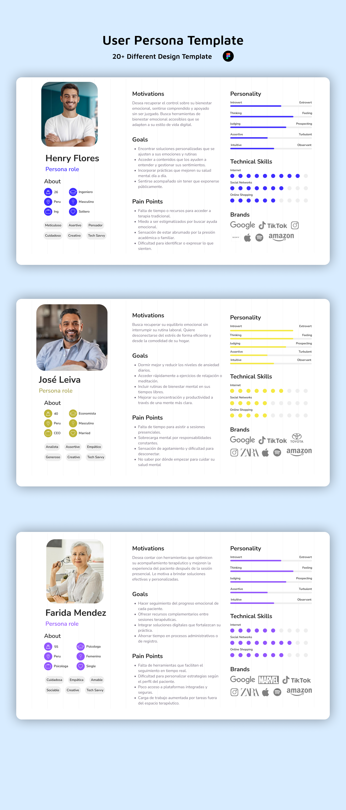

### 2.3.2. User Task Matrix

#### Se presenta cada tarea con su Frecuencia e importancia segun el tipo de usuario, Customer o Proveedor, en el cual podemos identificar las prioridades segun tipo de user.


### 2.3.3. User Journey Mapping


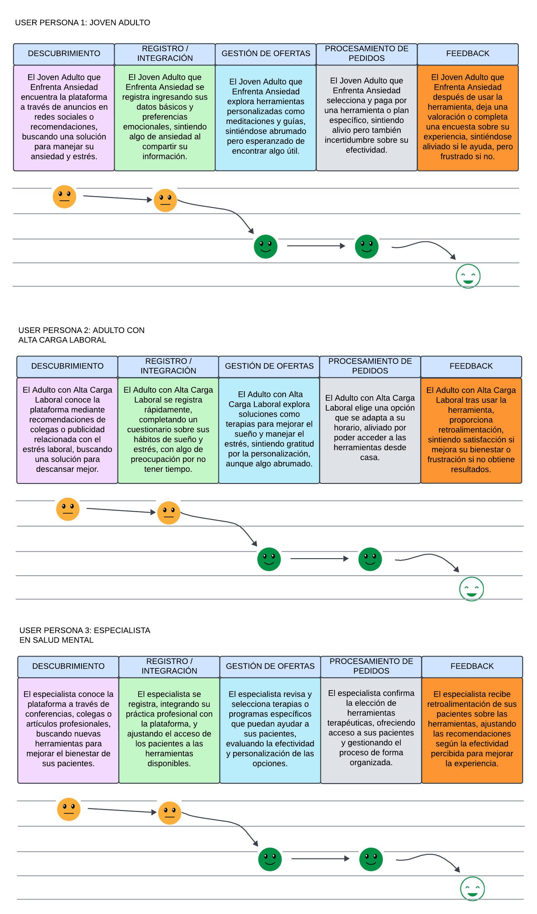

### 2.3.4. Empathy Mapping
#### Se presentan los tres Empathy Mapping, uno para cada segmento objetivo en el cual se empatiza con el tipo de usuario.

#### * User Empathy Mapping joven
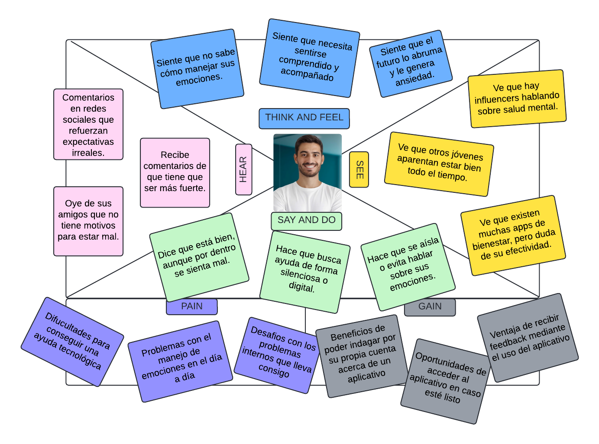
#### * User Empathy Mapping adulto
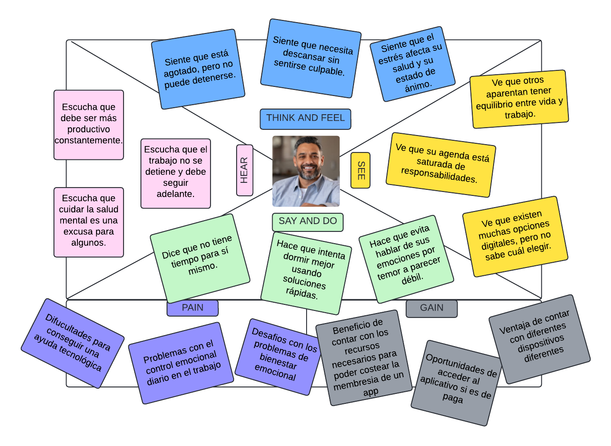
#### * User Empathy Mapping psicóloga
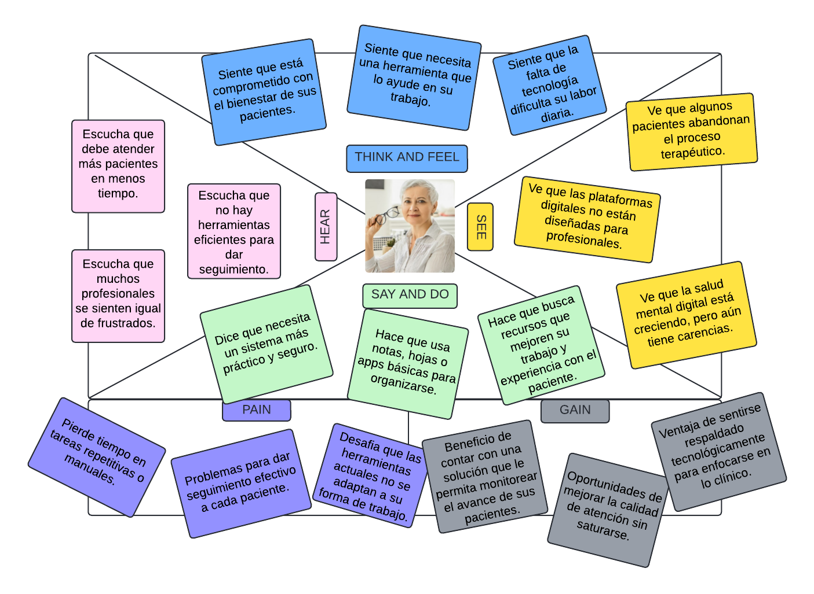
 
### 2.3.5. As-is Scenario Mapping  
#### * As-is Scenario Mapping joven
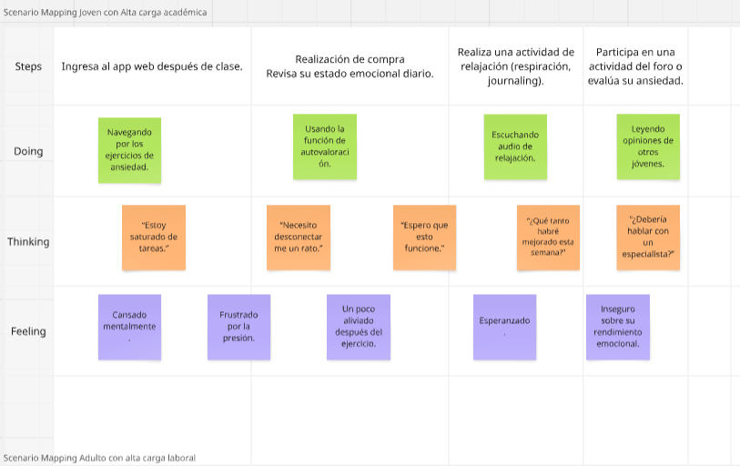
#### * As-is Scenario Mapping adulto
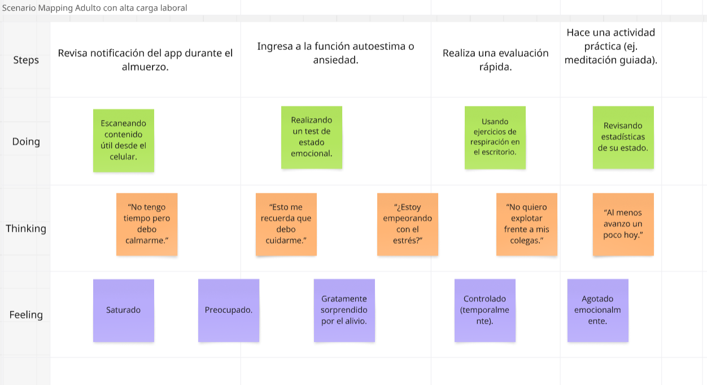
#### * As-is Scenario Mapping psicologo
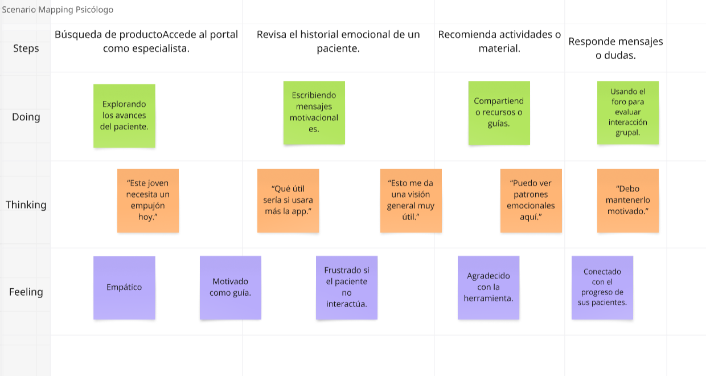
Link de acceso: [Entrar acá](https://miro.com/welcomeonboard/RU10Z25nMGRCNENEMEpzWnVlaGUwWGlNSEV1YjBjOVQ2YkdiOHVRalIyVGQzSEJVblVKTnJOTkhUWEt6eUtIR1V3bk5Ia2V1SGZPTS9kSE9Xa1pBN05vK0sva1JpNVNUV0JIREdBZ09OdjE4QnFQZmhrYnZSdDg2Z2hnZ3dla29NakdSWkpBejJWRjJhRnhhb1UwcS9BPT0hdjE=?share_link_id=3143734650 "Link miro")

## 2.4. Ubiquitous Language

En **Domain-Driven Design (DDD)**, el “**Ubiquitous Language**” consiste en definir un vocabulario compartido que sea comprendido por todo el equipo: desarrolladores, diseñadores, expertos en salud mental y usuarios clave. Este lenguaje común garantiza claridad conceptual y facilita la implementación técnica coherente con el dominio del problema.

**Usuario (User):**  
Persona que utiliza la aplicación para mejorar su bienestar emocional. Puede ser un joven adulto, un adulto con estrés laboral o un especialista en salud mental.

**Estado Emocional (Emotional State):**  
Representación actual del estado anímico del usuario, basado en su autopercepción y en datos recogidos por el sistema.

**Módulo Terapéutico (Therapeutic Module):**  
Conjunto de actividades, ejercicios o contenidos diseñados para abordar un tema específico como ansiedad, autoestima, relaciones, estrés o sueño.

**Ruta Personalizada (Personalized Path):**  
Secuencia adaptativa de módulos y ejercicios recomendados por el sistema según el perfil y estado emocional del usuario.

**Ejercicio Emocional (Emotional Exercise):**  
Actividades prácticas como meditación, respiración guiada, escritura terapéutica o visualizaciones que ayudan a regular emociones.

**Seguimiento Emocional (Emotional Tracking):**  
Registro regular de emociones que permite analizar el progreso del usuario y ajustar recomendaciones.

**Diario Emocional (Emotional Journal):**  
Espacio personal donde el usuario escribe sobre su día, emociones y reflexiones como parte del proceso terapéutico.

**Especialista (Specialist):**  
Profesional de la salud mental que utiliza la plataforma para hacer seguimiento del progreso emocional de sus pacientes, interpretar métricas e intervenir si es necesario.

**Alerta de Riesgo Emocional (Emotional Risk Alert):**  
Notificación automática que se activa cuando se detectan señales de deterioro emocional o patrones de riesgo.

**Sesión Terapéutica (Therapeutic Session):**  
Encuentro estructurado entre el especialista y el paciente, ya sea presencial o digital, registrado en la plataforma.

**IoT Emocional (Emotional IoT):**  
Dispositivos inteligentes que recogen datos físicos del usuario (frecuencia cardíaca, calidad del sueño, etc.) para enriquecer el análisis emocional.

**Panel de Bienestar (Wellness Dashboard):**  
Interfaz donde se visualizan indicadores clave del estado emocional, progreso en módulos y recomendaciones activas.

# Capítulo III: Requeriments Specification
## 3.1. To-Be Scenario Mapping. 

En esta sección, se detallan las fases principales del proceso optimizado de acompañamiento emocional mediante la aplicación **Youper**, diseñada para atender las necesidades específicas de cada segmento de usuario. Se explica cómo la automatización inteligente, el análisis emocional en tiempo real y la personalización dinámica transforman la experiencia del usuario. Esta estrategia permite que tanto los usuarios como los especialistas en salud mental puedan enfocarse en el bienestar emocional con mayor eficacia, tomando decisiones más informadas y centradas en datos emocionales recolectados de forma continua.

### Segmento 1: Jóvenes Adultos en búsqueda de regulación emocional y autoconocimiento
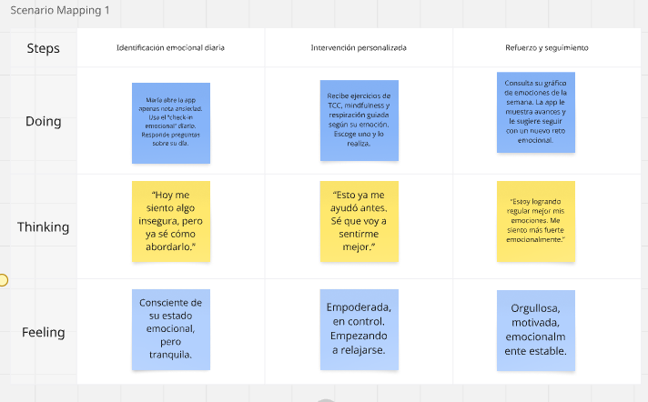

### Segmento 2: Adultos Profesionales con Estrés Crónico y Alteraciones del Sueño
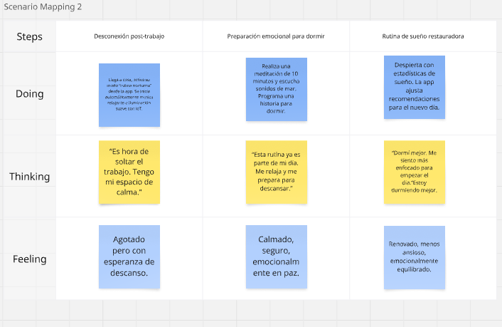

### Segmento 3: Especialistas en Salud Mental que optimizan el acompañamiento terapéutico digital
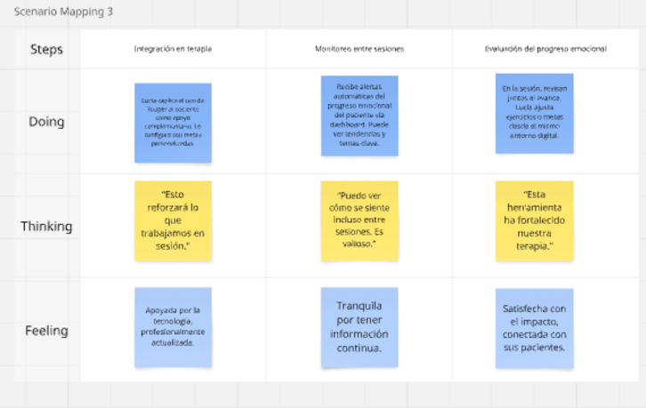

## 3.2. User Stories. 

Tras analizar las Epics definidas, procedimos a desglosarlas en User Stories más detalladas, enfocándonos en cubrir las funcionalidades principales de cada una. Este proceso nos permitió identificar los requisitos específicos del usuario y los casos de uso de cada Epic, lo que facilitó la priorización y planificación de las siguientes etapas de desarrollo. Las User Stories fueron creadas tomando en cuenta las necesidades funcionales, experiencia de usuario y personalización, asegurando una cobertura completa.

| IPC ID   | TÍTULO DE LA EPIC                                                       |
|----------|-------------------------------------------------------------------------|
| EPIC001  | Personalización de la experiencia del usuario                           |
| EPIC002  | Módulos de bienestar emocional (estrés, autoestima, relaciones)         |
| EPIC003  | Evaluación emocional inicial y periódica                                |
| EPIC004  | Recomendaciones inteligentes basadas en IA y TCC                        |
| EPIC005  | Seguimiento del estado emocional y progreso del usuario                 |
| EPIC006  | Meditaciones guiadas y ejercicios de respiración                        |
| EPIC007  | Contenido de relajación (música, sonidos, historias para dormir)        |
| EPIC008  | Notificaciones y recordatorios de bienestar diario                      |
| EPIC009  | Integración con dispositivos IoT para monitoreo de estrés y sueño       |
| EPIC010  | Plataforma para profesionales de salud mental                           |
| EPIC011  | Interfaz intuitiva y accesible para todos los usuarios                  |
| EPIC012  | Sistema Freemium (versión gratuita y versión premium)                   |
| EPIC013  | Biblioteca de contenidos adicionales (artículos, podcasts, videos)      |
| EPIC014  | Registro y autenticación segura del usuario                             |
| EPIC015  | Configuración de metas y objetivos emocionales personalizados           |
| EPIC016  | Sistema de retroalimentación y mejora continua del usuario              |
| EPIC017  | Landing (desarrollo y experiencia de usuario)                           |
| EPIC018  | Web Application (desarrollo y experiencia de usuario)                   |
| EPIC019  | Backend API (Integración y gestión de API)                              |


| Epic / Story ID | Título                                            | Descripción                                                                                                           | Criterios de Aceptación                                                                                                                                      | Relacionado con (Epic ID) |
|-----------------|---------------------------------------------------|-----------------------------------------------------------------------------------------------------------------------|--------------------------------------------------------------------------------------------------------------------------------------------------------------|----------------------------|
| US001           | Ver el historial de emociones                     | **Como** psicólogo, **Quiero** ver el historial de emociones**Para** hacer un seguimiento del progreso del usuario.               | Dado que soy psicólogo y necesito apoyo emocional, Cuando accedo a la app, Entonces puedo ver el historial de emociones para hacer un seguimiento del progreso del usuario. | EPIC005                    |
| US002           | Recibir recomendaciones diarias                   | Como administrador, Quiero recibir recomendaciones diarias Para mejorar mi bienestar emocional.                      | Dado que soy administrador y necesito apoyo emocional, Cuando accedo a la app, Entonces puedo recibir recomendaciones diarias para mejorar mi bienestar emocional.         | EPIC004                    |
| US003           | Escuchar música relajante                         | Como responsable, Quiero escuchar música relajante Para reducir mi nivel de estrés.                                  | Dado que soy responsable y necesito apoyo emocional, Cuando accedo a la app, Entonces puedo escuchar música relajante para reducir mi nivel de estrés.                   | EPIC002                    |
| US004           | Ver los datos de sueño                            | Como usuario con problemas de sueño, Quiero ver los datos de sueño Para mejorar la calidad del descanso.              | Dado que soy usuario con problemas de sueño y necesito apoyo emocional, Cuando accedo a la app, Entonces puedo ver los datos de sueño para mejorar la calidad del descanso. | EPIC009                    |
| US005           | Acceder a meditaciones guiadas                    | Como psicólogo, Quiero acceder a meditaciones guiadas Para calmar mi ansiedad.                                       | Dado que soy psicólogo y necesito apoyo emocional, Cuando accedo a la app, Entonces puedo acceder a meditaciones guiadas para calmar mi ansiedad.                      | EPIC006                    |
| US006           | Editar mi perfil                                  | Como administrador, Quiero editar mi perfil Para mantener mis datos actualizados.                                    | Dado que soy administrador y necesito apoyo emocional, Cuando accedo a la app, Entonces puedo editar mi perfil para mantener mis datos actualizados.                     | EPIC001                    |
| US007           | Leer artículos de salud mental                    | Como responsable, Quiero leer artículos de salud mental Para entender mejor mis emociones.                           | Dado que soy responsable y necesito apoyo emocional, Cuando accedo a la app, Entonces puedo leer artículos de salud mental para entender mejor mis emociones.              | EPIC013                    |
| US008           | Monitorear indicadores de estrés                  | Como usuario, Quiero monitorear indicadores de estrés Para prevenir crisis emocionales.                              | Dado que soy usuario y necesito apoyo emocional, Cuando accedo a la app, Entonces puedo monitorear indicadores de estrés para prevenir crisis emocionales.                | EPIC002                    |
| US009           | Enviar retroalimentación a la app                 | Como psicólogo, Quiero enviar retroalimentación a la app Para mejorar la experiencia del usuario.                    | Dado que soy psicólogo y necesito apoyo emocional, Cuando accedo a la app, Entonces puedo enviar retroalimentación a la app para mejorar la experiencia del usuario.       | EPIC010                    |
| US010           | Agendar una sesión                                | Como administrador, Quiero agendar una sesión Para recibir orientación emocional personalizada.                      | Dado que soy administrador y necesito apoyo emocional, Cuando accedo a la app, Entonces puedo agendar una sesión para recibir orientación emocional personalizada.         | EPIC001                    |
| US011           | Visualizar beneficios de la app en la landing page | Como visitante nuevo, Quiero ver los beneficios principales de la app en la landing page Para entender rápidamente su utilidad. | Dado que el visitante accede a la página principal, Cuando visualiza la sección principal, Entonces verá beneficios destacados y llamados a la acción.                   | EPIC017                    |
| US012           | Acceder al historial de emociones desde la aplicación web | Como usuario, Quiero acceder a mi historial emocional desde la web Para revisar mi progreso en cualquier dispositivo. | Dado que el usuario inicia sesión desde la web, Cuando accede a la sección de historial emocional, Entonces podrá visualizar sus registros anteriores.                  | EPIC018                    |
| US013           | Obtener datos de sueño desde dispositivo IoT      | Como backend, Quiero recibir datos de sueño de dispositivos IoT Para integrarlos en el monitoreo emocional.          | Dado que el usuario sincroniza su dispositivo IoT, Cuando se envían los datos al backend, Entonces estos deben almacenarse correctamente en la base de datos.             | EPIC019                    |
| US014           | Realizar ejercicios de respiración para calmarme en momentos de ansiedad | Como usuario con ansiedad, Quiero realizar ejercicios de respiración Para calmarme en momentos de ansiedad.         | Dado que el usuario con ansiedad accede a la funcionalidad, Cuando la utilice correctamente, Entonces podrá lograr calmarme en momentos de ansiedad.          | EPIC006                    |
| US015           | Ver el estado emocional de mis dependientes para dar seguimiento a su bienestar | Como responsable, Quiero ver el estado emocional de mis dependientes Para dar seguimiento a su bienestar.            | Dado que el responsable accede a la funcionalidad, Cuando la utilice correctamente, Entonces podrá lograr dar seguimiento a su bienestar.                     | EPIC005                    |
| US016           | Recibir reportes periódicos de emociones para evaluar el progreso del tratamiento | Como psicólogo, Quiero recibir reportes periódicos de emociones Para evaluar el progreso del tratamiento.            | Dado que el psicólogo accede a la funcionalidad, Cuando la utilice correctamente, Entonces podrá lograr evaluar el progreso del tratamiento.                  | EPIC003                    |
| US017           | Configurar metas emocionales personalizadas para adaptar la experiencia del usuario | Como administrador, Quiero configurar metas emocionales personalizadas Para adaptar la experiencia del usuario.     | Dado que el administrador accede a la funcionalidad, Cuando la utilice correctamente, Entonces podrá lograr adaptar la experiencia del usuario.               | EPIC015                    |
| US018           | Recibir notificaciones diarias para recordar mis ejercicios emocionales | Como usuario, Quiero recibir notificaciones diarias Para recordar mis ejercicios emocionales.                        | Dado que el usuario accede a la funcionalidad, Cuando la utilice correctamente, Entonces podrá lograr recordar mis ejercicios emocionales.                    | EPIC008                    |
| US019           | Escuchar sonidos para dormir para mejorar la calidad de mi sueño       | Como usuario con insomnio, Quiero escuchar sonidos para dormir Para mejorar la calidad de mi sueño.                 | Dado que el usuario con insomnio accede a la funcionalidad, Cuando la utilice correctamente, Entonces podrá lograr mejorar la calidad de mi sueño.            | EPIC007                    |
| US020           | Ver recomendaciones personalizadas para mejorar mi estado emocional    | Como usuario, Quiero ver recomendaciones personalizadas Para mejorar mi estado emocional.                           | Dado que el usuario accede a la funcionalidad, Cuando la utilice correctamente, Entonces podrá lograr mejorar mi estado emocional.                            | EPIC004                    |
| US021           | Acceder a artículos y videos de bienestar para aprender más sobre salud emocional | Como usuario, Quiero acceder a artículos y videos de bienestar Para aprender más sobre salud emocional.             | Dado que el usuario accede a la funcionalidad, Cuando la utilice correctamente, Entonces podrá lograr aprender más sobre salud emocional.                     | EPIC013                    |
| US022           | Registrarme de forma segura para proteger mis datos personales         | Como usuario, Quiero registrarme de forma segura Para proteger mis datos personales.                                | Dado que el usuario accede a la funcionalidad, Cuando la utilice correctamente, Entonces podrá lograr proteger mis datos personales.                          | EPIC014                    |
| US023           | Monitorear mi progreso emocional para ver cómo evoluciono día a día    | Como usuario, Quiero monitorear mi progreso emocional Para ver cómo evoluciono día a día.                           | Dado que el usuario accede a la funcionalidad, Cuando la utilice correctamente, Entonces podrá lograr ver cómo evoluciono día a día.                          | EPIC005                    |
| US024           | Acceder a la app desde múltiples dispositivos para usar la app en cualquier momento | Como usuario, Quiero acceder a la app desde múltiples dispositivos Para usar la app en cualquier momento.            | Dado que el usuario accede a la funcionalidad, Cuando la utilice correctamente, Entonces podrá lograr usar la app en cualquier momento.                        | EPIC011                    |
| US025           | Mejorar el rendimiento de la landing para ofrecer una experiencia más fluida | Como desarrollador, Quiero mejorar el rendimiento de la landing Para ofrecer una experiencia más fluida.            | Dado que el desarrollador accede a la funcionalidad, Cuando la utilice correctamente, Entonces podrá lograr ofrecer una experiencia más fluida.               | EPIC017                    |
| US026           | Ver recomendaciones basadas en TCC para recibir apoyo emocional más efectivo | Como usuario, Quiero ver recomendaciones basadas en TCC Para recibir apoyo emocional más efectivo.                   | Dado que el usuario accede a la funcionalidad, Cuando la utilice correctamente, Entonces podrá lograr recibir apoyo emocional más efectivo.                   | EPIC004                    |
| US027           | Agendar sesiones para mis dependientes para ayudarles a recibir atención profesional | Como responsable, Quiero agendar sesiones para mis dependientes Para ayudarles a recibir atención profesional.       | Dado que el responsable accede a la funcionalidad, Cuando la utilice correctamente, Entonces podrá lograr ayudarles a recibir atención profesional.            | EPIC010                    |
| US028           | Tener una versión gratuita con funciones básicas para probar la app antes de pagar | Como usuario, Quiero tener una versión gratuita con funciones básicas Para probar la app antes de pagar.             | Dado que el usuario accede a la funcionalidad, Cuando la utilice correctamente, Entonces podrá lograr probar la app antes de pagar.                           | EPIC012                    |
| US029           | Ver mis estadísticas emocionales para reflexionar sobre mi estado actual | Como usuario, Quiero ver mis estadísticas emocionales Para reflexionar sobre mi estado actual.                       | Dado que el usuario accede a la funcionalidad, Cuando la utilice correctamente, Entonces podrá lograr reflexionar sobre mi estado actual.                     | EPIC005                    |
| US030           | Conectarme con mi smartwatch para monitorear mi sueño y estrés automáticamente | Como usuario, Quiero conectarme con mi smartwatch Para monitorear mi sueño y estrés automáticamente.                | Dado que el usuario accede a la funcionalidad, Cuando la utilice correctamente, Entonces podrá lograr monitorear mi sueño y estrés automáticamente.           | EPIC009                    |
| US031           | Consultar gráficos de progreso emocional para analizar la evolución del usuario | Como psicólogo, Quiero consultar gráficos de progreso emocional Para analizar la evolución del usuario.             | Dado que el psicólogo accede a la funcionalidad, Cuando la utilice correctamente, Entonces podrá lograr analizar la evolución del usuario.                    | EPIC010                    |
| US032           | Ajustar el contenido de la landing page para asegurar que la información esté actualizada | Como administrador, Quiero ajustar el contenido de la landing page Para asegurar que la información esté actualizada. | Dado que el administrador accede a la funcionalidad, Cuando la utilice correctamente, Entonces podrá lograr asegurar que la información esté actualizada.     | EPIC017                    |
| US033           | Recibir sugerencias de contenido emocional para encontrar recursos útiles rápidamente | Como usuario, Quiero recibir sugerencias de contenido emocional Para encontrar recursos útiles rápidamente.          | Dado que el usuario accede a la funcionalidad, Cuando la utilice correctamente, Entonces podrá lograr encontrar recursos útiles rápidamente.                  | EPIC004                    |
| US034           | Probar la API para manejo de usuarios para garantizar su correcto funcionamiento | Como desarrollador, Quiero probar la API para manejo de usuarios Para garantizar su correcto funcionamiento.         | Dado que el desarrollador accede a la funcionalidad, Cuando la utilice correctamente, Entonces podrá lograr garantizar su correcto funcionamiento.            | EPIC019                    |
| US035           | Usar la app en mi idioma nativo para sentirme más cómodo al usarla                          | Como usuario, Quiero usar la app en mi idioma nativo Para sentirme más cómodo al usarla.                                     | Dado que el usuario accede a la funcionalidad, Cuando la utilice correctamente, Entonces podrá lograr sentirme más cómodo al usarla.                                | EPIC011                    |
| US036           | Establecer metas emocionales                                                                 | Como usuario, Quiero establecer metas emocionales personalizadas Para mejorar mi bienestar a lo largo del tiempo.           | Dado que el usuario desea trabajar en su salud emocional. Cuando accede a la sección de metas. Entonces puede definir metas con plazos y seguimiento.               | EPIC015                    |
| US037           | Recibir retroalimentación sobre mi progreso                                                  | Como usuario, Quiero recibir retroalimentación continua Para saber si estoy avanzando hacia mis objetivos emocionales.       | Dado que el usuario ha estado cumpliendo sus metas. Cuando revisa su panel de progreso. Entonces recibe mensajes personalizados con su avance.                     | EPIC016                    |
| US038           | Acceder al perfil del paciente                                                               | Como psicólogo, Quiero acceder al perfil emocional del paciente Para preparar la sesión terapéutica.                        | Dado que el psicólogo tiene una sesión próxima. Cuando accede al sistema. Entonces puede ver el historial emocional del paciente.                                   | EPIC010                    |
| US039           | Conectar reloj inteligente                                                                   | Como usuario, Quiero conectar mi smartwatch Para monitorear el estrés y sueño automáticamente.                              | Dado que el usuario tiene un dispositivo compatible. Cuando lo vincula en la app. Entonces puede visualizar datos integrados.                                       | EPIC009                    |
| US040           | Autenticación con redes sociales                                                              | Como usuario, Quiero iniciar sesión con mi cuenta de Google o Facebook Para evitar crear una nueva cuenta.                  | Dado que el usuario tiene cuenta social activa. Cuando elige iniciar sesión social. Entonces accede a la app sin registrarse de nuevo.                             | EPIC014                    |
| US041           | Diseño inclusivo de interfaz                                                                 | Como diseñador, Quiero implementar accesibilidad en colores y texto Para mejorar la experiencia de usuarios con discapacidad visual. | Dado que un usuario tiene dificultad visual. Cuando navega en la app. Entonces puede activar modo alto contraste y texto grande.                               | EPIC011                    |
| US042           | Implementar módulo de emociones en app web                                                   | Como desarrollador, Quiero crear un módulo web para registrar emociones diarias Para sincronizar datos entre plataformas.    | Dado que el usuario accede desde navegador. Cuando registra su emoción. Entonces se guarda y sincroniza con su perfil.                                              | EPIC018                    |
| US043           | Optimizar velocidad de carga de landing                                                      | Como desarrollador frontend, Quiero mejorar el rendimiento de la landing page Para reducir la tasa de rebote de usuarios nuevos. | Dado que un usuario entra por primera vez. Cuando se carga la página. Entonces debe completarse en menos de 2 segundos.                                         | EPIC017                    |
| US044           | Crear endpoint para historial emocional                                                      | Como desarrollador backend, Quiero desarrollar un endpoint REST Para recuperar el historial emocional del usuario.           | Dado que el usuario tiene datos registrados. Cuando se hace una petición al endpoint. Entonces devuelve los datos correctamente.                                    | EPIC019                    |
| US045          | Notificación de tareas emocionales diarias                                                   | Como usuario con baja motivación, quiero recibir notificaciones diarias con pequeñas tareas emocionales, para mejorar mi estado de ánimo de manera gradual. | Dado que soy un usuario con baja motivación, Cuando abro la app por la mañana, Entonces recibo una notificación con una tarea emocional positiva para realizar. | EPIC008                    |
| US046           | Personalización de colores de la interfaz                                                       | Como usuario, quiero cambiar los colores de la interfaz según mi estado de ánimo, para sentirme más cómodo y en sintonía con la app.       | Dado que quiero adaptar la interfaz, Cuando ingreso a ajustes de personalización, Entonces puedo elegir entre diferentes paletas de colores.                                | EPIC011                    |
| US047           | Consulta rápida de tips mentales                                                                 | Como usuario que se siente abrumado, quiero tener acceso rápido a una lista de tips mentales, para manejar mis emociones en momentos difíciles. | Dado que me siento abrumado, Cuando ingreso a la sección de primeros auxilios emocionales, Entonces veo una lista de tips prácticos según mi estado.                        | EPIC013                    |
| US048           | Notificación de cambio brusco en emociones                                                      | Como psicólogo, quiero recibir una alerta cuando el usuario tenga un cambio brusco en su estado emocional, para intervenir oportunamente.   | Dado que el usuario tiene seguimiento emocional activo, Cuando detecto un cambio repentino en sus emociones, Entonces recibo una alerta en mi panel profesional.             | EPIC010                    |
| US049           | Visualización gráfica de evolución emocional                                                    | Como usuario, quiero ver una gráfica de mi evolución emocional en el tiempo, para conocer mis avances y retrocesos.                         | Dado que he registrado emociones durante semanas, Cuando accedo a la sección de progreso, Entonces visualizo una gráfica de mi estado emocional.                             | EPIC005                    |
| US050           | Módulo de relaciones interpersonales                                                            | Como usuario en conflicto con mi pareja, quiero acceder a un módulo específico para mejorar mis relaciones, para desarrollar habilidades de comunicación y empatía. | Dado que selecciono el área de relaciones en la pantalla de inicio, Cuando ingreso al módulo, Entonces puedo acceder a ejercicios de comunicación y resolución de conflictos. | EPIC002                    |
| US051           | Autoevaluación de autoestima                                                                    | Como usuario con baja autoestima, quiero realizar evaluaciones periódicas, para medir mis avances en el área emocional.                    | Dado que estoy en el módulo de autoestima, Cuando paso una semana de uso, Entonces la app me sugiere hacer una nueva autoevaluación.                                          | EPIC003                    |
| US052           | Implementación de ejercicio de respiración con IA                                               | Como desarrollador, quiero implementar ejercicios de respiración guiados por IA, para que el usuario reciba instrucciones dinámicas según su ritmo. | Dado que el usuario inicia el ejercicio, Cuando detecto su ritmo respiratorio, Entonces adapto las instrucciones en tiempo real.                                         | EPIC006                    |
| US053           | Acceso offline a contenidos descargados                                                         | Como usuario sin conexión estable, quiero acceder a meditaciones y sonidos descargados, para seguir cuidando mi salud mental sin depender de internet. | Dado que descargué contenidos previamente, Cuando no tengo conexión, Entonces puedo acceder a ellos desde la biblioteca offline.                                       | EPIC007                    |
| US054           | Dashboard administrativo de usuarios premium                           | Como administrador, quiero ver estadísticas de usuarios premium, para analizar el uso y la conversión dentro del sistema freemium.             | Dado que soy administrador del sistema, Cuando accedo al panel premium, Entonces veo métricas de conversión y uso.                                                      | EPIC012                    |
| US055           | Seguimiento de hábitos positivos                                       | Como usuario, quiero registrar hábitos positivos diarios, para reforzar mis rutinas saludables.                                                 | Dado que accedo a mi perfil de hábitos, Cuando marco una acción como completada, Entonces se suma al conteo y me da retroalimentación positiva.                          | EPIC015                    |
| US056           | Autenticación mediante biometría                                       | Como usuario, quiero acceder a la app mediante huella o reconocimiento facial, para mayor comodidad y seguridad.                                | Dado que tengo habilitado el acceso biométrico, Cuando abro la app, Entonces puedo ingresar con mi huella o rostro.                                                      | EPIC014                    |
| US057           | Recomendaciones de contenido según progreso                            | Como usuario, quiero recibir recomendaciones basadas en mi avance emocional, para acceder a contenido más relevante.                            | Dado que la IA analiza mis registros, Cuando accedo a la sección de sugerencias, Entonces obtengo contenido adaptado a mi progreso.                                     | EPIC004                    |
| US058           | Retroalimentación sobre efectividad de sesiones                        | Como usuario, quiero calificar las sesiones de meditación, para mejorar la calidad del contenido.                                               | Dado que termino una meditación guiada, Cuando aparece la opción de calificar, Entonces puedo dejar una puntuación y comentario.                                         | EPIC016                    |
| US059           | Formulario rápido de estado emocional                                  | Como usuario, quiero completar formularios rápidos de estado emocional, para registrar mi estado en segundos.                                  | Dado que tengo poco tiempo, Cuando ingreso a la sección de estado emocional, Entonces puedo elegir una opción rápida y registrar cómo me siento.                         | EPIC003                    |
| US060           | Integración con reloj inteligente                                       | Como usuario con smartwatch, quiero sincronizar los datos de sueño y estrés, para tener un monitoreo más completo.                              | Dado que tengo activada la integración IoT, Cuando mi smartwatch registra datos, Entonces se reflejan automáticamente en la app.                                          | EPIC009                    |
| US061           | Botón SOS emocional                                                    | Como usuario en crisis, quiero tener acceso rápido a un botón SOS emocional, para recibir ayuda o contención inmediata.                         | Dado que estoy en crisis emocional, Cuando presiono el botón SOS, Entonces recibo contenido de contención y opciones de ayuda profesional.                               | EPIC005                    |
| US062           | Dashboard de carga de sesiones en backend                            | Como desarrollador backend, quiero monitorear el estado de carga de sesiones, para asegurarme de que los datos del usuario estén seguros.       | Dado que el backend recibe registros de usuarios, Cuando consulto el dashboard de carga, Entonces visualizo estadísticas y errores en tiempo real.                      | EPIC019                    |
| US063           | Animaciones suaves en la landing page                                | Como desarrollador frontend, quiero incluir animaciones suaves en la landing page, para generar una experiencia atractiva y profesional.        | Dado que ingreso a la landing page, Cuando se carga el contenido, Entonces se muestran animaciones sin afectar el rendimiento.                                           | EPIC017                    |
| US063 (duplicada) | Pruebas automatizadas en el módulo emocional                         | Como desarrollador QA, quiero implementar pruebas automatizadas en el módulo emocional, para garantizar su estabilidad y precisión.             | Dado que tengo pruebas configuradas, Cuando actualizo el código del módulo emocional, Entonces las pruebas corren automáticamente y notifican errores.                  | EPIC018                    |
| US064           | Acceso rápido a meditaciones favoritas                                | Como usuario, Quiero guardar mis meditaciones favoritas Para acceder a ellas rápidamente cuando las necesite.                                   | Dado que el usuario ha marcado meditaciones como favoritas, Cuando accede a su perfil, Entonces puede ver una lista con sus meditaciones favoritas.                     | EPIC006                    |
| US065           | Historial de sesiones con psicólogo                                   | Como usuario, Quiero ver el historial de sesiones con mi psicólogo Para hacer seguimiento a mi tratamiento.                                     | Dado que el usuario ha tenido sesiones con un psicólogo, Cuando accede al módulo de historial, Entonces puede visualizar fechas, notas y duración de las sesiones.      | EPIC005                    |
| US066           | Botón de contacto rápido con profesional                              | Como usuario en crisis, Quiero tener un botón de contacto rápido con un profesional Para recibir asistencia inmediata.                          | Dado que el usuario se siente en crisis emocional, Cuando presiona el botón SOS, Entonces se establece contacto con un profesional disponible.                           | EPIC010                    |
| US067           | Validación de identidad con código OTP                                | Como usuario, Quiero validar mi identidad mediante un código OTP Para asegurar que solo yo accedo a mi cuenta.                                 | Dado que el usuario intenta iniciar sesión, Cuando introduce su correo electrónico, Entonces recibe un código OTP para completar el acceso.                              | EPIC014                    |
| US068           | Panel de métricas emocionales para psicólogos                         | Como psicólogo, Quiero ver un panel con métricas emocionales resumidas Para tomar decisiones informadas durante la terapia.                    | Dado que el psicólogo tiene pacientes asignados, Cuando accede al panel de métricas, Entonces ve un resumen de evolución emocional y eventos destacados.                 | EPIC010                    |
| US069           | Descarga de informes emocionales                 | Como usuario, Quiero poder descargar mis informes emocionales en PDF Para compartirlos con mi terapeuta. | Dado que el usuario accede a su historial emocional, Cuando presiona el botón de descarga, Entonces se genera un archivo PDF con su evolución emocional. | EPIC005                    |
| US070           | Integración con Google Fit                       | Como usuario, Quiero conectar la app con Google Fit Para unificar datos de sueño y actividad física.     | Dado que el usuario autoriza la integración, Cuando sincroniza sus datos, Entonces los datos de sueño y actividad aparecen en la app.                     | EPIC009                    |
| US071           | Recordatorio de evaluación emocional semanal     | Como usuario, Quiero recibir recordatorios para hacer evaluaciones semanales Para seguir mi evolución emocional. | Dado que el usuario no ha completado su evaluación, Cuando llega el día programado, Entonces recibe una notificación para realizarla.                    | EPIC003                    |
| US072           | Personalización del avatar de usuario            | Como usuario, Quiero personalizar mi avatar en la app Para expresar mi identidad.                        | Dado que el usuario está registrado, Cuando accede al editor de perfil, Entonces puede cambiar su avatar con diferentes estilos.                          | EPIC001                    |
| US073           | Comparación de emociones por semana              | Como usuario, Quiero comparar mis emociones entre semanas Para identificar patrones de cambio emocional. | Dado que hay registros semanales suficientes, Cuando accede al panel de comparación, Entonces ve gráficas comparativas por semana.                        | EPIC005                    |
| US074           | Modo oscuro automático                           | Como usuario, Quiero que la app cambie automáticamente a modo oscuro de noche Para no forzar mi vista.   | Dado que son más de las 20:00 horas, Cuando se abre la app, Entonces se activa el modo oscuro automáticamente.                                              | EPIC011                    |
| US075           | Evaluación emocional antes de sesiones           | Como usuario, Quiero completar una breve evaluación antes de una sesión Para que mi terapeuta entienda mi estado actual. | Dado que el usuario tiene una sesión programada, Cuando la sesión está por comenzar, Entonces se le solicita completar una evaluación rápida.         | EPIC003                    |

## 3.3. Impact Mapping. 

Segmento 1: Jóvenes adultos que enfrentan ansiedad y estrés académico,sentimental, laboral, económico o familiar, y que desean mejorar su bienestar emocional a través de herramientas accesibles, personalizadas y discretas.


 Segmento 2: Adultos con alta carga laboral que experimentan dificultades para conciliar el sueño o gestionar el estrés diario, y buscan alternativas digitales para mejorar su salud mental desde casa.
 


 Segmento 3: Especialistas de la salud mental que utilicen y brinden soluciones efectivas a los usuarios que les permita seguir paso a paso el proceso de cada paciente, con el objetivo de mejorar su bienestar emocional.
 
 

## 3.4. Product Backlog. 


Una vez que se han redactado todas las historias de usuario (US), es esencial establecer un orden de prioridad. Para ello, se utiliza el Product Backlog, que permite organizar las historias según su valor y relevancia para el proyecto. La estimación del esfuerzo necesario para completar cada historia se realizó mediante la asignación de Story Points, basados en la escala de Fibonacci (1, 2, 3, 5, 8). A mayor número de puntos, mayor es el esfuerzo o el impacto asociado a la historia.

| #  | Story ID | Título                         | Descripción                                                                                      | Story Points |
|----|----------|--------------------------------|--------------------------------------------------------------------------------------------------|--------------|
| 1  | US001    | Ver el historial de emociones  | Como psicólogo, quiero ver el historial de emociones para hacer un seguimiento del progreso del usuario. | 5            |
| 2  | US002    | Recibir recomendaciones diarias| Como administrador, quiero recibir recomendaciones diarias para mejorar mi bienestar emocional.        | 3            |
| 3  | US003    | Escuchar música relajante      | Como responsable, quiero escuchar música relajante para reducir mi nivel de estrés.                    | 3            |
| 4  | US004    | Ver los datos de sueño                          | Como usuario con problemas de sueño, quiero ver los datos de sueño para mejorar la calidad del descanso.               | 5            |
| 5  | US005    | Acceder a meditaciones guiadas                  | Como psicólogo, quiero acceder a meditaciones guiadas para calmar mi ansiedad.                                         | 5            |
| 6  | US006    | Editar mi perfil                                | Como administrador, quiero editar mi perfil para mantener mis datos actualizados.                                      | 2            |
| 7  | US007    | Leer artículos de salud mental                  | Como responsable, quiero leer artículos de salud mental para entender mejor mis emociones.                             | 3            |
| 8  | US008    | Monitorear indicadores de estrés                | Como usuario, quiero monitorear indicadores de estrés para prevenir crisis emocionales.                                | 5            |
| 9  | US009    | Enviar retroalimentación a la app              | Como psicólogo, quiero enviar retroalimentación a la app para mejorar la experiencia del usuario.                      | 2            |
| 10 | US010    | Agendar una sesión                              | Como administrador, quiero agendar una sesión para recibir orientación emocional personalizada.                        | 3            |
| 11 | US011    | Ver beneficios en la landing page              | Como visitante nuevo, quiero ver los beneficios principales de la app en la landing page para entender su utilidad.    | 3            |
| 12 | US012    | Acceder al historial emocional desde la web    | Como usuario, quiero acceder a mi historial emocional desde la web para revisar mi progreso en cualquier dispositivo.  | 5            |
| 13 | US013    | Obtener datos de sueño desde IoT               | Como backend, quiero recibir datos de sueño de dispositivos IoT para integrarlos en el monitoreo emocional.            | 8            |
| 14 | US014    | Realizar ejercicios de respiración para calmarme| Como usuario con ansiedad, quiero realizar ejercicios de respiración para calmarme en momentos de ansiedad.            | 5            |
| 15 | US015    | Ver estado emocional de dependientes           | Como responsable, quiero ver el estado emocional de mis dependientes para dar seguimiento a su bienestar.              | 5            |
| 16 | US016    | Recibir reportes periódicos de emociones       | Como psicólogo, quiero recibir reportes periódicos de emociones para evaluar el progreso del tratamiento.              | 5            |
| 17 | US017    | Configurar metas emocionales personalizadas    | Como administrador, quiero configurar metas emocionales para adaptar la experiencia del usuario.                       | 5            |
| 18 | US018    | Recibir notificaciones para ejercicios emocionales | Como usuario, quiero recibir notificaciones diarias para recordar mis ejercicios emocionales.                       | 3            |
| 19 | US019    | Escuchar sonidos para dormir                   | Como usuario con insomnio, quiero escuchar sonidos para dormir para mejorar la calidad de mi sueño.                    | 3            |
| 20 | US020    | Ver recomendaciones personalizadas             | Como usuario, quiero ver recomendaciones personalizadas para mejorar mi estado emocional.                              | 5            |
| 21 | US021    | Acceder a artículos y videos de bienestar      | Como usuario, quiero acceder a artículos y videos de bienestar para aprender más sobre salud emocional.                | 3            |
| 22 | US022    | Registrarme de forma segura                    | Como usuario, quiero registrarme de forma segura para proteger mis datos personales.                                   | 3            |
| 23 | US023    | Monitorear mi progreso emocional               | Como usuario, quiero monitorear mi progreso emocional para ver cómo evoluciono día a día.                              | 5            |
| 24 | US024    | Acceder a la app desde múltiples dispositivos  | Como usuario, quiero acceder a la app desde múltiples dispositivos para usar la app en cualquier momento.              | 3            |
| 25 | US025    | Mejorar rendimiento de la landing              | Como desarrollador, quiero mejorar el rendimiento de la landing para ofrecer una experiencia más fluida.               | 5            |
| 26 | US026    | Ver recomendaciones basadas en TCC             | Como usuario, quiero ver recomendaciones basadas en TCC para recibir apoyo emocional más efectivo.                     | 5            |
| 27  | US027  | Agendar sesiones para dependientes      | Como responsable, quiero agendar sesiones para mis dependientes para ayudarles a recibir atención profesional.         | 5         |
| 28  | US028  | Tener versión gratuita con funciones básicas | Como usuario, quiero tener una versión gratuita para probar la app antes de pagar.                                      | 3         |
| 29  | US029  | Ver estadísticas emocionales            | Como usuario, quiero ver mis estadísticas emocionales para reflexionar sobre mi estado actual.                        | 5         |
| 30  | US030  | Conectarme con mi smartwatch            | Como usuario, quiero conectarme con mi smartwatch para monitorear mi sueño y estrés automáticamente.                  | 8         |


=======

# Capítulo IV: Product Design

## 4.1. Style Guidelines

Las Style Guidelines son un conjunto de reglas fundamentales que definen y detallan los elementos de diseño y comunicación de un proyecto para asegurar una comunicación visual coherente y profesional. Para Youper, definiremos criterios como colores, tipografía y estructura para diseñar la landing page y web application.

### 4.1.1. General Style Guidelines

**Branding:**
<br>Para la creación del logo de nuestro producto Youper, se ha optado por un diseño minimalista que refleja el objetivo de la aplicación. El aspecto del logo se compone del ícono de una hoja con detalles de ramas de un cerebro, lo que refleja la vida y el bienestar, acompañado de un corazón que refleja el bienestar y amor propio.


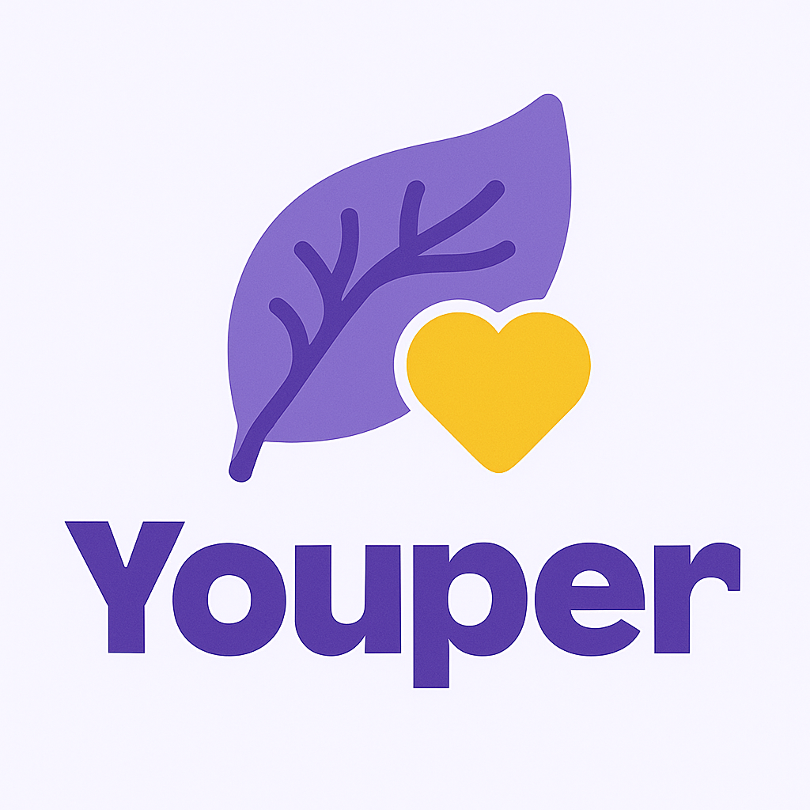

<br>**Typography:**
<br>Para la elección de las tipografías que utilizaremos para Youper, se han seleccionado fuentes simples y modernas que transmitan la estética de la aplicación. A continuación, se presentan las tipografías utilizadas para Youper:

<br>- **Mada:** Tipografía de estilo árabe modernista. Se caracteriza por descendentes bajos, contornos abiertos y formas de bajo contraste, lo que lo hace adecuado para señalización, tamaños de punto pequeños e interfaces de usuario. Transmite un sentimiento modernista y simplista.

<br> <br>

<br>- **Koulen:** Fuente tipográfica ideal para titulares, títulos y subtítulos, e incluso diseños de banners. Sus características los hacen ideales para crear texto impactante y atractivo. <br>

<br> <br>


**Colors:**
<br>Los colores son los encargados de brindar la primera percepción visual de los usuarios. En este contexto, la paleta de colores seleccionados para Youper está conformada por morado como tonalidad principal, que simboliza el pensamiento, delicadeza y espiritualidad. Por otro lado, el color amarillo simboliza la alegría, optimismo y la creatividad. Como tonalidades secundarias se hace uso de variedades cromáticas del color blanco, negro y plomo. Esta paleta asegura que se transmita un mensaje positivo a los usuarios.

<br>A continuación se presentan los colores seleccionados:

<br>- **Cool Gray (#A1A4C7):** Un tono gris suave con matices azulados que transmite calma, profesionalismo y modernidad.

<br>

<br>- **Lavender (web) (#D4D7F2):** Un púrpura claro con matices rosados, asociado a la delicadeza, tranquilidad y creatividad.

<br>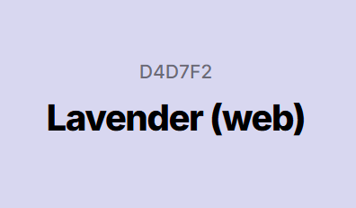

<br>- **Xanthous (#FFC965):** Un amarillo vibrante con matices dorados que transmite energía, optimismo y calidez.

<br>

<br>- **Hundayi yellow (#F6B253):** Un amarillo fuerte y moderno. Transmite innovación y visibilidad.

<br>

<br>- **White smoke (#F2F2F2):** Un blanco grisáceo muy tenue, que brinda una sensación de limpieza, suavidad y ligereza.

<br>

<br>- **Jet (#353531):** Un negro profundo con ligeros toques grisáceos, que representa elegancia, misterio y firmeza.

<br>

<br>- **Black (#000000):** El color más oscuro. Transmite sofisticación, poder y sobriedad.

<br>

<br>- **Silver (#A4A2A2):** Un gris metálico brillante que representa modernidad, tecnología y elegancia con un toque futurista.

<br>


<br>**Spacing:**
<br>Youper está diseñado para ofrecer una experiencia visual relajante y emocionalmente armoniosa. A continuación, se detallan las especificaciones de espaciado recomendadas para lograr una interfaz accesible, clara y centrada en el bienestar del usuario:

<br>**Espaciado entre líneas (line-height):**<br>
<br>**- Texto de cuerpo:**
<br>El espaciado entre líneas debe ser de 1.5 a 1.7 veces el tamaño de la fuente. Este rango brinda una sensación de amplitud y calma visual, facilitando la lectura sin generar fatiga ocular.

<br>**Espaciado entre párrafos:**<br>
<br>- **Margen inferior:**
<br>Cada párrafo debe tener un margen inferior de al menos 130% del tamaño de la fuente. Esta separación ayuda a procesar cada bloque de contenido como una idea completa, favoreciendo la comprensión emocional y cognitiva.

<br>**Margen y espaciado alrededor de elementos de la interfaz:**<br>
<br>- **Espacio entre componentes de UI (cards, botones, inputs, etc.):**
<br>Mantener mínimo 24 píxeles de separación. Este margen promueve una sensación de orden y reduce la sobrecarga cognitiva, especialmente en secciones densas o funcionales.

<br>**Espaciado entre secciones o módulos:**<br>
<br>**- Margen superior e inferior:**
<br>Debe aplicarse un margen de mínimo 60 píxeles entre bloques de contenido o secciones temáticas. Esto refuerza una estructura clara y ayuda a separar emocionalmente los distintos momentos de navegación (ej. exploración, reflexión, acción).

<br>**Espaciado entre elementos de menú y navegación:**<br>
<br>**- Espacio horizontal entre ítems de menú:**
<br>Cada elemento debe tener al menos 18 píxeles de espacio lateral. Esta distancia mejora la precisión al interactuar y brinda una apariencia limpia y accesible, incluso desde dispositivos móviles.

<br>**Espaciado alrededor de imágenes e ilustraciones:**<br>
<br>- **Margen alrededor de recursos visuales:**
<br>Las imágenes, íconos y gráficos deben tener un margen mínimo de 25 píxeles alrededor. Esto refuerza su rol como elementos de apoyo emocional o informativo, sin invadir el texto.

<br>**Espaciado en el pie de página (footer):**<br>
<br>- **Margen superior e inferior:**
<br>El pie de página debe estar separado del contenido principal con un espacio de entre 50 a 70 píxeles. Esto le da aire y evita que se perciba como una extensión aglomerada del contenido anterior.

### 4.1.2. Web Style Guidelines

Para Youper, planeamos desarrollar una plataforma web que tenga un enfoque de elegancia y sencillez que ofrezca una experiencia cómoda y eficiente para los usuarios. Por lo tanto, implementaremos un diseño adaptable (conocido como Web Responsive Design) con el objetivo de optimizar la presentación de la información en cualquier dispositivo. Esto asegurará que el contenido se mantenga intacto.

- **Panel de control principal:** Los usuarios podrán visualizar su panel de control personal que le permitirá gestionar sus emociones del día, así como acceso a botones que lo llevarán a las herramientas que ofrece la aplicación.
- **Herramientas de apoyo:** Se le ofrecerá al usuario muchas herramientas que lo apoyarán a llevar y gestionar sus emociones de manera más eficiente, utilizando guías paso a paso como documentos, videos, ejercicios de respiración, etc.
- **Mensajes y Comunicación:** Los usuarios podrán comunicarse fácilmente con otros usuarios en la sección de comunidades o con su terapeuta personal.

## 4.2. Information Architecture

### 4.2.1. Organization System

1. **Landing Page e Inicio de la Aplicación:**
   <br> **Tipo de organización visual:** Jerárquica
   <br> La landing page presentará y destacará información más relevante al principio como las características y beneficios de Youper. Por otro lado, la pantalla de inicio destacará elementos clave como el estado emocional del usuario, recomendaciones personalizadas y accesos rápidos a sesiones guiadas. Esto se logrará mediante mayor tamaño, colores llamativos y ubicaciones estratégicas, dirigiendo la atención del usuario hacia lo más importante de forma inmediata.
  
2. **Módulos Terapéuticos y Ejercicios Guiados:**
   <br> **Tipo de organización visual:** Secuencial
   <br> Se implementará este tipo de organización en secciones en módulos terapeúticos o de ejercicios guiados como respiración consciente o rutinas de sueño. En ellas, la información estará diseñada de manera progresiva, guiando al usuario paso por paso a través de cada actividad. Esta estructura facilita la comprensión y la ejecución ordenada de cada ejercicio.

3. **Herramientas y Recursos Interactivos:**
   <br> **Tipo de organización visual:** Matricial
   <br> Se aplicará en la sección de herramientas y recursos, donde se ofrecen contenidos como videos, podcasts y documentos. El usuario podrá filtrarlos o combinarlos por criterios, facilitando una exploración personalizada.

4. **Exploración de Contenido Emocional:**
   <br> **Esquema de categorización:** Por Tópicos
   <br> Los recursos estarán organizados por temas como ansiedad, autoestima, estrés, insomnio o relaciones interpersonales. Esto permitirá a los usuario acceder rápida y eficientemente al contenido más relevante para su situación emocional.

5. **Historial de Progreso del Usuario:**
   <br> **Esquema de categorización:** Cronológico
   <br> Se registrará las actividades realizadas por los usuarios mediante el historial, ordenados por fecha. Lo que permitirá una visualización más clara de su evolución emocional y el seguimiento de su proceso terapéutico.

6. **Contenido Personalizado por Perfil de Usuario:**
  <br>**Esquema de categorización:** Según Audiencia
  <br>Los contenidos se adaptarán según el perfil del usuario:

   - **Jóvenes adultos:** Recursos enfocados en identidad, autoestima y estrés académico.

   - **Adultos con alta carga laboral:** Contenidos sobre insomnio, manejo del estrés y burnout.

   - **Especialistas en salud mental:** Acceso a guías clínicas y recursos especializados.
 
7. **Búsqueda de Contenido:**
   <br> **Esquema de categorización:** Alfabético
  <br> Se aplicará en la búsqueda por orden alfabético para la búsqueda del contenido. Esto facilitará el acceso rápido a definiciones, términos o técnicas específicas.


### 4.2.2. Labeling Systems

**Landing Page:**
- **Home/Inicio:** Sección principal que mostrará la idea principal de la aplicación.
- **Features/Características:** Sección que muestra las principales funciones de la aplicación
- **Benefits/Beneficios:** Sección que muestra los beneficios de utilizar la aplicación.
- **Testimonials/Testimonios:** Sección que muestra los testimonios de usuarios que han utilizado la aplicación.
- **About/Acerca de:** Sección para conocer a los desarrolladores de la plataforma y los planes de pago.
- **Contact/Contacto:** Sección en la cual se le brindará al usuario todos los canales por los cuales se puede contactar.

**Web Application:**
- **Home:** Página principal de la aplicación que muestra los datos principales del usuario respecto a su bienestar emocional, así como acceso a herramientas, ejercicios y chat con usuarios o terapeuta personal
- **Perfil:** Permitirá a los usuarios acceder a su información personal, modificar sus datos, ver su historial de actividad y gestionar sus preferencias.
- **Terapeuta:** Permite visualizar la información de el/la terapeuta personal.
- **Herramientas:** Acceso a herramientas como artículos, videos, etc.
- **Ejercicios:** Acceso a herramientas para disminuir sentimientos como angustia, estrés, etc.
- **Búsqueda:** Permite realizar búsquedas en la aplicación para acceder a contenidos según criterios.
- **Favoritos:** Acceso directo a las sesiones o herramientas guardadas por el usuario.
- **Notificaciones:** Acceso a las notificaciones sobre su proceso terapeútico, recomendaciones o mensajes.

### 4.2.3. SEO Tags and Meta Tags

**Landing Page:**
- **Title:** Texto que será visible en la parte superior del navegador en las páginas de resultados de los motores de búsqueda (SERP). <br> `<title>Youper – Your digital space for emotional well-being</title>`

- **Codificación de carácteres:** Esta etiqueta ayudará a que muestre correctamente los caracteres especiales en la página. <br> `<meta charset="utf-8">`

- **Description:** Etiqueta meta que proporciona una breve descripción de la página. <br> `<meta name="description" content="Smart platform that helps you improve your emotional well-being."/>`

- **Key Words:** Etiqueta que indica palabras clave del contenido de la página. <br> `<meta name="keywords" content="emotional health, welfare, self-esteem, digital therapy, mindfulness"/>`

- **Author & Copyright:** Etiqueta que muestra la información del autor o autores. <br> `<meta name="author" content="MyMind Team"/>
<meta name="copyright" content="Copyright MyMind team" />` <br> `<meta name="copyright" content="Copyright MyMind team" />`


**Web Application:**
- **Title:** Texto que será visible en la parte superior del navegador en las páginas de resultados de los motores de búsqueda (SERP). <br> `<title>Youper</title>`

- **Description:** Etiqueta meta que proporciona una breve descripción de la página. <br> `<meta name="description" content="Youper official app web."/>`

- **Key Words:** Etiqueta que indica palabras clave del contenido de la página. <br> `<meta name="keywords" content="emotional health, welfare, self-esteem, digital therapy, mindfulness"/>`

- **Author & Copyright:** Etiqueta que muestra la información del autor o autores. <br> `<meta name="author" content="MyMind Team"/>` <br> `<meta name="copyright" content="Copyright MyMind team" />`

### 4.2.4. Searching Systems

- **Barra de búsqueda general:** Ubicada en la parte superior derecha de la plataforma para acceder rápidamente a los recursos que ofrece como: manejo del estrés, ejercicios de respiración, diarios emocionales, etc.
- **Sugerencias automáticas:** El sistema mostrará resultados predictivos mientras el usuario escribe (autocompletado), basados en búsquedas frecuentes y contenido popular.
- **Filtros de búsqueda:** Se proporcionarán a los usuarios filtros para refinar su búsqueda con características clave, como categorías (ansiedad, estrés, sueño, etc.), contenidos (ejercicios interactivos, videos, sesiones guiadas, artículos), nivel (principiantes, intermedio, avanzado).
- **Filtros avanzados:** Se proporcionarán filtros para refinar la búsqueda, como calificaciones, recientes y disponibilidad.

### 4.2.5. Navigation Systems

**Landing Page:** <br>
La navegación en la landing page estará enfocada en captar el interés de nuevos usuarios y guiarlos de forma clara hacia la acción deseada, como registrarse o conocer los beneficios del producto. Se utilizará un menú superior visible con enlaces hacia secciones clave como Características, Beneficios, Testimonios, Acerca de y Contacto. El logotipo funcionará como acceso directo a la sección principal, permitiendo volver a la sección inicial.

**Web Application:** <br>
La navegación en la aplicación web se organizará a través de un dashboard personalizado que funcionará como punto inicial desde el cual el usuario podrá acceder a todas las herramientas y contenidos de la aplicación. Este dashboard estará disponible inmediatamente después de iniciar sesión, y su diseño facilitará la exploración de los módulos más relevantes para cada tipo de usuario. <br>
Además, se presentará accesos directos desde el panel de navegación lateral ubicado en el ícono de perfil, donde se podrá acceder a secciones como Perfil, Historial, Mi Progreso y Comunidad.

### 4.3. Landing Page UI Design.

Las Landing Pages son herramientas diseñadas para transformar a los visitantes en posibles clientes, utilizando elementos como mensajes atractivos e información relevante sobre el producto, entre otros. Por esta razón, se optó por emplear esta estrategia, y se creó una versión preliminar tanto para dispositivos móviles como para computadoras.

Para la versión de computadora, se diseñaron ventanas con opciones claramente especificadas que facilitan la comprensión del usuario, acompañadas de descripciones detalladas de cada función del sitio web para evitar cualquier dificultad. Además, la barra de navegación se ha colocado en una posición fija, de manera que esté siempre accesible, permitiendo al usuario navegar cómodamente por la Landing Page.

[Link de la Landing](https://1asi0730-2510-4370-g2-youper.github.io/Landing-Page/)


## 4.3.1.  Landing Page Wireframe.

-Desktop Web Browser
En esta primera parte, se presenta la página de inicio de la plataforma web. Se incluyen botones para que el usuario tenga acceso a otras páginas de nuestro sitio web. En el pie de página, se visualizan las opciones que te llevan a las diversas secciones.


## 4.3.2.  Landing Page Mock-up.

A continuación, se presenta el mockup de la landing page diseñado en Figma, que incluye una estructura clara y amigable. La página está organizada en varias secciones clave:


### 4.4. Web Applications UX/UI Design.
## 4.4.1. Web Applications Wireframes.

En esta sección, se presentan los wireframes que ilustran la estructura y disposición de los elementos en la interfaz de la aplicación web. Estos wireframes permiten visualizar de manera clara y concisa la disposición de los componentes en las distintas páginas, facilitando la planificación del diseño y la navegación.
A continuación, se detallan los wireframes correspondientes a las diferentes secciones de la aplicación web.


[Figma: Mockup de la aplicación web](https://www.figma.com/design/A2Pd9XD8hb39RlUyH4HEq4/Youper?node-id=367-2&p=f&t=QkhY6CUl6ljKKnrz-0)

## 4.4.2. Web Applications Wireflow Diagrams.

En esta sección, se presentan los wireflow diagramas que ilustran los flujos de interacción en la aplicación web. Estos diagramas permiten visualizar de manera clara y concisa los pasos que seguirá el usuario para lograr distintos objetivos dentro de la aplicación. A continuación, se detallan los diagramas correspondientes a los distintos flujos de usuario.

## Diagrama 1 – User Goal  
**Como nuevo usuario deseo completar mi registro e intereses para recibir una experiencia personalizada**

#### Descripción:
En el presente *Wireflow*, se muestra el flujo que seguirá un nuevo usuario de **Youper** para completar su registro y configurar su perfil emocional.
Inicialmente, deberá ingresar con su correo y contraseña. Luego, el sistema lo redirigirá a una pantalla para verificación y recolección de datos personales adicionales, como apellidos, número de contacto, país y género.
Una vez completado este paso, accederá a una nueva pantalla donde podrá seleccionar los temas emocionales que más le interesan abordar, como estrés, autoestima, relaciones románticas, ansiedad, entre otros. Esto permitirá a la aplicación personalizar la experiencia y los contenidos ofrecidos desde el inicio.


### Diagrama 2 – User Goal  
**Como usuario, deseo poder visualizar todos los puntos importantes de cada módulo que ofrece la aplicación web**

#### Descripción:
En este *Wireflow* se representa el recorrido que realiza un usuario desde el menú principal para acceder a la sección de módulos emocionales de la aplicación **Youper**.
Una vez autenticado, el usuario podrá hacer clic en la opción **“Explorar Módulos”**. En esta pantalla se mostrará un resumen visual y textual de cada módulo disponible. Cada módulo incluirá una descripción breve, sus beneficios clave y un botón de acceso directo a las herramientas principales.


### Diagrama 3 – User Goal  
**Como usuario, deseo acceder fácilmente a secciones complementarias como música relajante, profesionales disponibles y artículos útiles desde el menú lateral**

#### Descripción:
En este *Wireflow* se ilustra cómo un usuario navega por la aplicación web de **Youper** utilizando el menú lateral izquierdo, donde se concentran accesos directos mediante íconos intuitivos a funciones complementarias que enriquecen su bienestar emocional.
Desde cualquier pantalla principal de la aplicación, el usuario podrá visualizar un menú lateral con íconos.


### Diagrama 4 – User Goal  
**Como psicólogo autorizado, deseo visualizar a los pacientes asignados y acceder a sus observaciones clínicas**

#### Descripción:
En este *Wireflow* se detalla el flujo que sigue un psicólogo dentro de la plataforma web de **Youper** para acceder a los pacientes que tiene autorizados visualizar y consultar observaciones clínicas previas.
Desde el menú lateral izquierdo, el profesional podrá seleccionar un ícono de **"Pacientes Asignados"**. Al ingresar, se mostrará una lista de pacientes a los que tiene acceso, junto con información básica como nombre, edad, fecha del último ingreso y estado emocional general.


### Diagrama 5 – User Goal  
**Como psicólogo, deseo recibir sugerencias personalizadas y visualizar el gráfico emocional del paciente para tomar decisiones terapéuticas más informadas**

#### Descripción:
Este *Wireflow* representa el flujo que sigue un psicólogo desde el panel de pacientes para acceder a la sección de **"Complementos"**, un área especializada que ofrece sugerencias automáticas y gráficos emocionales de los pacientes, con base en el análisis de sus interacciones y estados registrados en la app.


### 4.4.2. Web Applications Mock-ups.

En esta sección se presentan los mock-ups de las aplicaciones web, diseñadas específicamente para los segmentos objetivos definidos. Estos mock-ups permiten visualizar la apariencia y disposición de los elementos de la interfaz, facilitando la comprensión del diseño final y su implementación final para el apartado del desarrollo.


### 4.4.3. Web Applications User Flow Diagrams.

## Segmento objetivo 1: Jóvenes Adultos que necesitan enfrentar su ansiedad

**User Goal:**  
Como Joven, deseo registrarme en la Web Application de Youper para recibir una experiencia adaptada a mis necesidades emocionales.
**User Flow:**, se evidencia un flujo que comienza en el login con mi correo y contraseña, continúa con la verificación adicional de datos como apellidos, número de contacto, país y género, y finaliza en una pantalla donde seleccionas los temas emocionales que me interesan para que la plataforma personalice mi recorrido desde el inicio.


## Segmento objetivo 2: Adultos con alta carga laboral que experimentan estrés y problemas de sueño

**User Goal:** Como Adulto con alta carga laboral, deseo acceder desde mi hogar a una rutina nocturna personalizada con sonidos relajantes y meditaciones guiadas para conciliar el sueño y reducir mi estrés diario.

**User Flow:** El usuario accede a la aplicación web de Youper desde su hogar, en horas de la noche, luego de una jornada laboral intensa. Desde la pantalla principal, el sistema detecta el horario y muestra una sugerencia destacada: “Prepara tu rutina nocturna”. Al hacer clic, se accede a una pantalla con opciones personalizadas como “Meditación para dormir”, “Sonidos relajantes (lluvia, bosque, océano)” y “Desconexión guiada para soltar el estrés”. El usuario selecciona “Meditación para dormir” y se reproduce una meditación guiada de entre 10 a 20 minutos, con voz calmante, música suave y visuales oscuros para facilitar la relajación.


## Segmento objetivo 3: Reflejar claramente que está dirigido a profesionales de la salud mental y destacar su rol en el acompañamiento emocional mediante herramientas digitales

**User Goal:** Como Especialista en salud mental, deseo acceder al historial emocional y a los registros de progreso de mis pacientes desde el panel profesional de Youper, para hacer un seguimiento detallado y brindar recomendaciones personalizadas.

**User Flow:** El especialista inicia sesión en la plataforma web de Youper desde el Panel Profesional utilizando sus credenciales verificadas. Una vez autenticado, accede a un dashboard especializado, donde se muestra una lista de pacientes asignados, con indicadores visuales del estado emocional.


### 4.5. Web Applications Prototyping.

 Criterios esenciales para las decisiones de interacción

A continuación, se describen los criterios esenciales para las decisiones de interacción en relación con la **Arquitectura de la Información** de nuestra aplicación. Estos criterios abarcan los elementos de la interfaz y los principios que se aplican a ellos. 
Es importante destacar que, aunque la estructura general de la aplicación será consistente, se podrán observar algunas diferencias en los detalles visuales.

 Botones / Tarjetas del menú principal

Cada segmento objetivo cuenta con su propio menú principal, con sus propios botones.

link:[Texto que quieres mostrar](https://www.figma.com/proto/A2Pd9XD8hb39RlUyH4HEq4/Youper?node-id=368-2859&t=K3qQzYDNCLNbhiJ7-0&scaling=min-zoom&content-scaling=fixed&page-id=368%3A1453&starting-point-node-id=368%3A2859)

___

## 4.6. Domain-Driven Software Architecture

El enfoque de Domain Driven Design (DDD) busca establecer una comprensión común del dominio que define el espacio del problema. Este enfoque facilita una mejor colaboración entre los desarrolladores y los expertos en el dominio. DDD no se limita al uso de un lenguaje común, sino que también incluye una serie de patrones, métodos y diagramas arquitectónicos del sistema, cuyo propósito es alinear el software con el dominio y fortalecer la visión compartida que promueve este enfoque.<br>

### 4.6.1. Software Architecture Context Diagram.
El diagrama de contexto proporciona una visión general de alto nivel sobre cómo el sistema de software Youper se relaciona con sus usuarios y, en caso de existir, con otros sistemas externos.

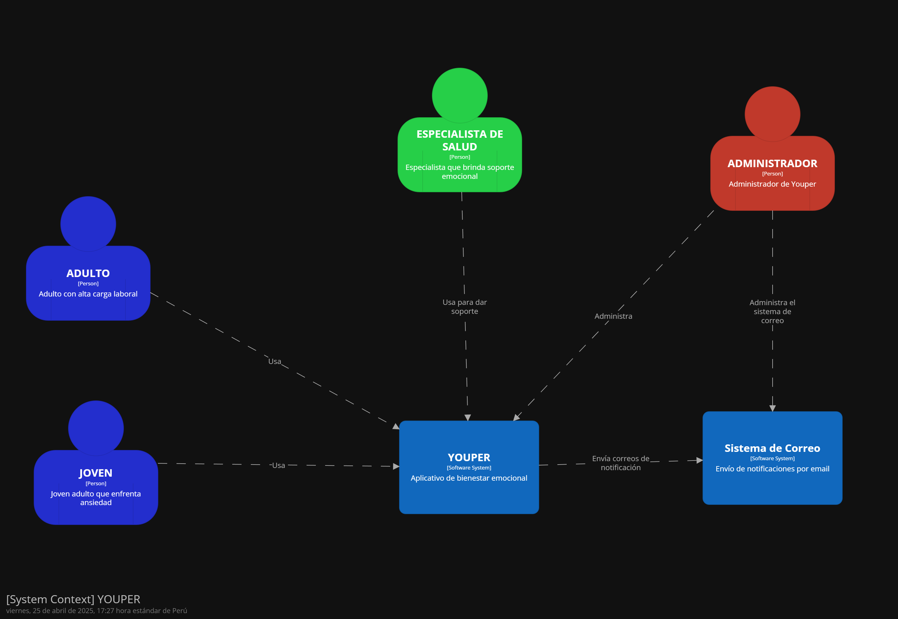

### 4.6.2. Software Architecture Container Diagram.
El diagrama de contenedores presenta una visión general de alto nivel sobre cómo interactúan las aplicaciones y las fuentes de datos que forman parte del funcionamiento del sistema de software Youper.

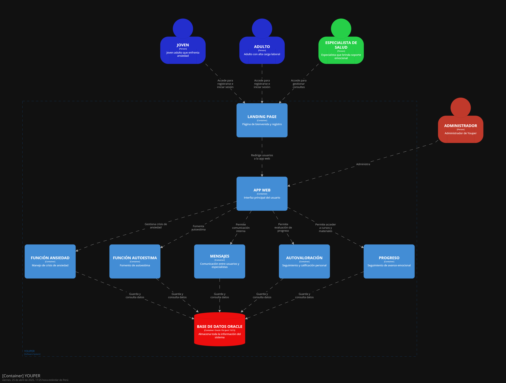

### 4.6.3. Software Architecture Components Diagrams
Los diagramas de componentes ofrecen una visión clara de cómo se relacionan los principales componentes del sistema de software. Estos elementos describen con mayor detalle la implementación de los módulos que conforman la aplicación.

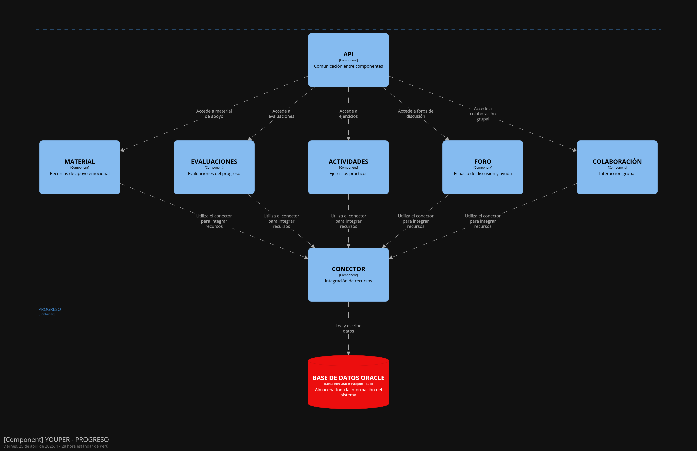


## 4.7. 
### 4.7.1. Class Diagrams
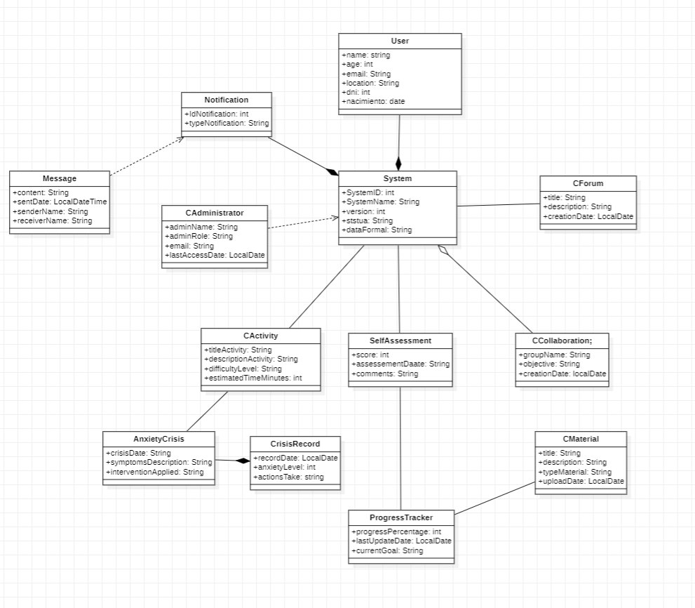

### 4.7.2. Class Dictionary.

1. User 
 |    Name   |  Type  | Descripción   |
| :- | :- | :- |
 |age        | int    | User's age|
 |email      | String | User's email|
 |location   | String | User's location|
 |dni        | int    | User's identification number|
 |nacimiento | date | User's date of birth|

2. Notification

 |    Name   |  Type  | Descripción   |
| :- | :- | :- |
|IdNotification | int | Notification identifier|
|typeNotification | String | Type of notification|

3. Message

 |    Name   |  Type  | Descripción   |
| :- | :- | :- |
|content | String | Message content|
|sentDate | LocalDateTime | Date and time the message was sent|
|senderName | String | Sender's name|
|receiverName | String | Receiver's name|

4. CAdministrator

 |    Name   |  Type  | Descripción   |
| :- | :- | :- |
|adminName | String | Administrator's name|
|adminRole | String | Administrator's role|
|email | String | Administrator's email|
|lastAccessDate | LocalDate | Last access date|

5. System

 |    Name   |  Type  | Descripción   |
| :- | :- | :- |
|SystemID | int | System identifier|
|SystemName | String | System name|
|version | int | System version|
|ststua | String | System status (note: possible typo, should be 'status')|
|dataFormal | String | Formal system date|

6. CForum

 |    Name   |  Type  | Descripción   |
| :- | :- | :- |
|title | String | Forum title|
|description | String | Forum description|
|creationDate | LocalDate | Forum creation date|

7. CActivity

 |    Name   |  Type  | Descripción   |
| :- | :- | :- |
|titleActivity | String | Activity title|
|descriptionActivity | String | Activity description|
|difficultyLevel | String | Activity difficulty level|
|estimatedTimeMinutes | int | Estimated time in minutes|

8. SelfAssessment

 |    Name   |  Type  | Descripción   |
| :- | :- | :- |
|score | int | Assessment score|
|assessmentDate | String | Date of assessment|
|comments | String | Assessment comments|

9. CCollaboration

 |    Name   |  Type  | Descripción   |
| :- | :- | :- |
|groupName | String | Group name|
|objective | String | Collaboration objective|
|creationDate | LocalDate | Collaboration creation date|

10. CMaterial

 |    Name   |  Type  | Descripción   |
| :- | :- | :- |
|title | String | Material title|
|description | String | Material description|
|typeMaterial | String | Material type|
|uploadDate | LocalDate | Material upload date|

11. AnxietyCrisis

 |    Name   |  Type  | Descripción   |
| :- | :- | :- |
|crisisDate | String | Date of the crisis|
|symptomsDescription | String | Description of the symptoms|
|interventionApplied | String | Applied intervention|

12. CrisisRecord

 |    Name   |  Type  | Descripción   |
| :- | :- | :- |
|recordDate | LocalDate | Record date|
|anxietyLevel | int | Anxiety level|
|actionsTake | string | Actions taken |

13. ProgressTracker

 |    Name   |  Type  | Descripción   |
| :- | :- | :- |
|progressPercentage | int | Progress percentage|
|lastUpdateDate | LocalDate | Last update date|
|currentGoal | String | Current goal|  


## 4.8. Database Design.
La elección del sistema de gestión de bases de datos (DBMS) es un factor fundamental para garantizar la eficiencia, escalabilidad y mantenibilidad de una aplicación web como Youper. A continuación, se presenta una comparación entre tres sistemas ampliamente utilizados en el desarrollo de software: MySQL, SQL Server y MongoDB.

**Comparación de DBMS**

<table>
  <thead>
    <tr>
      <th>Base de Datos</th>
      <th>Ventajas</th>
      <th>Desventajas</th>
    </tr>
  </thead>
  <tbody>
    <tr>
      <td style="text-align: center;">
        
      </td>
      <td>
        <ul>
          <li>Código abierto, con una comunidad de soporte activa y amplia documentación.</li>
          <li>Compatible con diversas plataformas y lenguajes de programación.</li>
          <li>Buen rendimiento para aplicaciones web con estructuras de datos relacionales.</li>
        </ul>
      </td>
      <td>
        <ul>
          <li>Menos eficiente para manejar estructuras de datos no relacionales o muy complejas.</li>
          <li>Carece de algunas funciones avanzadas que sí ofrecen otros motores, como SQL Server.</li>
          <li>Opciones de escalabilidad limitadas comparadas con soluciones NoSQL como MongoDB.</li>
        </ul>
      </td>
    </tr>
    <tr>
      <td style="text-align: center;">
        
      </td>
      <td>
        <ul>
          <li>Excelente integración con el ecosistema Microsoft (Visual Studio, Azure, etc.).</li>
          <li>Alto soporte para transacciones y consistencia de datos.</li>
          <li>Amplias funciones de seguridad (cifrado, auditoría, roles personalizados).</li>
        </ul>
      </td>
      <td>
        <ul>
          <li>Costo elevado para entornos productivos de gran escala.</li>
          <li>Requiere mayor consumo de recursos del sistema.</li>
          <li>Curva de aprendizaje más compleja para equipos sin experiencia en su entorno.</li>
        </ul>
      </td>
    </tr>
    <tr>
      <td style="text-align: center;">
        
      </td>
      <td>
        <ul>
          <li>Almacena datos en formato JSON, ideal para datos no estructurados.</li>
          <li>Escalabilidad horizontal sencilla.</li>
          <li>Buen rendimiento en grandes volúmenes de lectura y escritura.</li>
        </ul>
      </td>
      <td>
        <ul>
        <li>Limitado soporte para transacciones complejas entre colecciones.</li>
          <li>Menor madurez en temas de seguridad avanzada frente a soluciones como SQL Server.</li>
          <li>No recomendado para estructuras altamente relacionales.</li>
        </ul>
      </td>
    </tr>
  </tbody>
</table>

Después de evaluar las distintas alternativas, se ha decidido utilizar MySQL como el sistema de gestión de base de datos para el proyecto Youper. Esta elección responde a varias razones:
<li> Simplicidad y eficiencia: MySQL permite un diseño estructurado y eficiente para los módulos del sistema.</li>
<li> Amplio soporte en entornos web: Su compatibilidad con entornos como Vue.js y frameworks de backend (como ASP.NET Core, vía adaptadores) facilita su integración. </li>
<li> Costo y facilidad de adopción: Al ser open source, reduce barreras económicas y técnicas para el equipo. </li>
<li> Suficiente para la lógica relacional de Youper: Dado que el modelo de datos de Youper se basa principalmente en relaciones entre entidades (usuarios, sesiones, recomendaciones, emociones, etc.), MySQL cubre todas las necesidades actuales sin requerir características avanzadas de tipo empresarial. </li>

Esta decisión busca mantener un balance entre funcionalidad, facilidad de implementación y sostenibilidad en el desarrollo del proyecto.

<p align="center">
  
</p>

### 4.8.1. Database Diagram.
A continuación el diagrama elaborado para la Base de Datos de Youper.

<p align="center">
  
</p>

# Capítulo V: Product Implementation, Validation & Deployment
## 5.1. Software Configuration Management.
### 5.1.1. Software Development Environment Configuration.

#### Project Management

1. Trello: Para gestión general de tareas del equipo, asignación de roles.
- Link: [Trello](https://trello.com/invite/b/66c7b03600da2cf712927e84/ATTIbadabe6159d90d2f615ab9ae602eb3763DC0AF14/app-web)

#### Product UX/UI Design:

1. Figma: Para diseños comoWireframes, MockUps, Prototypes, etc) relacionados al proyecto.
- Link: [Figma](https://www.figma.com/design/A2Pd9XD8hb39RlUyH4HEq4/Untitled?node-id=0-1&p=f&t=wIqtjFudEOPeUqFT-0)


2. Lucidchart: Para diagramas de base de datos (ERD, diagramas de clases, etc.)
- Link: [Lucidchart](https://lucid.app/lucidchart/d0bb535d-ad28-48c9-8471-b7eb55be6789/edit?viewport_loc=-1615%2C-565%2C1951%2C1036%2C0_0&invitationId=inv_7f9e001c-5b1e-4529-9ec6-bff2c8b42a31)

#### Software Development:
1. Webstorm: Para el desarrollo de la Landing Page del proyecto.
- **Link:** [LandingPage]()

#### Software Documentation:

1. Visual Studio Code: Para la documentación del proyecto se utilizó Visual Studio Code y los capítulos en formato Markdown.
- **Link:** [Documentation](https://github.com/1ASI0730-2510-4370-G2-Youper/Report)


### 5.1.2. Source Code Management.
El proyecto se trabajará en base a las convenciones del flujo de trabajo establecidas por el modelo de Gitflow.
Landing Page Repository: [Landing Page Repository](https://github.com/1ASI0730-2510-4370-G2-Youper/Landing-Page)
- #### GitFlow Implementation:
Para aplicar el flujo de trabajo GitFlow en nuestro proyecto usando Git como sistema de control de versiones, hemos seguido como referencia el artículo “A successful Git branching model” de Vincent Driessen. Esta guía nos permitió establecer las reglas de organización que seguimos para estructurar y gestionar nuestro repositorio.

### **Master o Main branch**
La rama principal (master o main) representa el estado de producción de la aplicación. Es donde se mantiene el código más estable y desplegado.

### **Develop branch**
La rama develop actúa como el área principal donde se integran las últimas características y correcciones antes de ser trasladadas a master. Sirve para integrar cambios y realizar pruebas continuas.

### **Release branch**
Las ramas de release facilitan el proceso de preparación para una nueva versión del producto. Permiten aplicar correcciones menores mientras develop sigue recibiendo nuevas funcionalidades.
- Deriva de: develop
- Se fusiona en: develop y master


### **Feature branch**
Las ramas feature son utilizadas para desarrollar nuevas funcionalidades o mejoras específicas. Cada característica se desarrolla de forma aislada hasta estar lista para integrarse.
- Deriva de: develop
- Se fusiona de regreso a: develop


### **Hotfix branch**
Las ramas hotfix se crean para corregir errores críticos detectados en producción, asegurando una reacción rápida sin interrumpir el trabajo de desarrollo continuo.
- Deriva de: master.
- Se fusiona en: master y develop.


### **Conventional Commits**
Aplicamos la convención **Conventional Commits** para redactar mensajes de commit claros, consistentes y semánticos. Esta práctica facilita el rastreo de cambios, la generación automática de registros de cambios y mejora la colaboración en equipo.

La estructura recomendada para los mensajes es:

~~~
git commit -m “<type>[optional scope]: <title>“ -m “<description”
~~~
**Tipos De Conventional Commits**
~~~
1. feat: Para introducir una nueva funcionalidad.
2. fix: Para corregir un error existente.
3. docs: Cambios relacionados a la documentación.
4. style: Modificaciones de formato que no afectan el comportamiento del código.
5. refactor: Reestructuraciones internas sin cambios funcionales o correcciones de errores.
6. test: Agregado o modificación de pruebas.
7.chore: Tareas de mantenimiento o cambios que no afectan el código de producción.
8. perf: Mejoras de rendimiento.
~~~

### 5.1.3. Source Code Style Guide & Conventions.

Todo el código de la solución deberá ser escrito completamente en inglés para mantener la consistencia internacional y facilitar su mantenimiento.

**HTML**

- Emplear nombres de etiquetas y atributos en minúscula.
- Cerrar correctamente todas las etiquetas HTML.
- Especificar siempre los atributos `alt`, `width`, y `height` para imágenes para mejorar la accesibilidad.
- Evitar espacios innecesarios en los atributos HTML.

**CSS**

- Asignar nombres de IDs y clases descriptivos que reflejen el propósito del elemento.
- Utilizar nombres cortos pero claros para IDs y clases.
- Aplicar propiedades abreviadas cuando sea posible para optimizar el código.
- Evitar el uso de unidades después de valores de cero (`0`).
- Ordenar las declaraciones CSS en orden alfabético para facilitar su lectura.

**JavaScript**

- Mantener una sintaxis expandida: llaves de apertura en la misma línea de la declaración, cierre en línea nueva.
- Aplicar `lowerCamelCase` en el nombramiento de variables y funciones.
- Usar `let` y `const` para declarar variables en lugar de `var`.
- Asegurar que los nombres de las funciones sean descriptivos y en `lowerCamelCase`.

**C#**

- Usar `PascalCase` para nombres de clases y métodos.
- Emplear `camelCase` para variables y parámetros.
- Mantener líneas de código con una longitud razonable para mejorar la legibilidad.
- Añadir comentarios breves y claros que expliquen el propósito de clases y métodos.
- Aplicar el principio de responsabilidad única: una clase o método debe encargarse de una única tarea.

**Lenguaje Gherkin**

- Redactar títulos descriptivos y concisos para escenarios (`Feature`, `Scenario`).
- Respetar estrictamente la estructura `Given-When-Then`.
- Usar un lenguaje orientado al negocio, entendible para todos los stakeholders, evitando detalles técnicos.
- Implementar `Scenario Outline` cuando existan múltiples casos similares.
- Agregar comentarios cuando se requiera contexto o explicaciones adicionales.

### 5.1.4. Software Deployment Configuration.
                                                                  
=======
# Capítulo V: Product Implementation, Validation \& Deployment

## 5.1. Software Configuration Management
En esta sección, el equipo define las decisiones, convenciones y configuraciones técnicas necesarias para asegurar la consistencia, trazabilidad y calidad del desarrollo de la aplicación YouperApp durante todo su ciclo de vida.

###  5.1.1. Software Development Environment Configuration
El entorno de desarrollo de YouperApp se ha configurado para garantizar eficiencia, colaboración y estabilidad entre todos los miembros del equipo. A continuación, se detallan las herramientas utilizadas:

IDE principal: WebStorm / Visual Studio Code (según preferencia del desarrollador).

Lenguajes de programación: JavaScript, TypeScript, HTML, CSS.

Frameworks y librerías: React (Frontend), Node.js (Backend).

Control de versiones: Git.

Gestión de dependencias: npm / yarn.

Herramientas de colaboración: GitHub (repositorios y gestión de issues), Slack (comunicación), Notion (documentación).
###  5.1.2. Source Code Management
El equipo gestiona el código fuente mediante Git, utilizando GitHub como plataforma central. La organización del repositorio sigue una estructura clara:

Uso de la rama principal main para despliegues estables.

Desarrollo en ramas individuales por funcionalidad o corrección (feature/nombre, fix/nombre).

Revisión de código vía pull requests con aprobación de al menos un integrante antes de fusionar.

Commits con mensajes descriptivos siguiendo la convención: tipo: descripción breve (ej. feat: agrega pantalla de inicio de sesión).
###  5.1.3. Source Code Style Guide \& Conventions
Para asegurar la consistencia en el código fuente de YouperApp, el equipo aplica las siguientes convenciones:

Estilo de código:

Linting y formateo automático: 

Nombres de variables y funciones:

Componentes y archivos:
   
###  5.1.4. Software Deployment Configuration
El proceso de despliegue de YouperApp considera los siguientes elementos:

Frontend (Landing Page y Web App)

Backend (API RESTful)

Repositorio GitHub: Contiene scripts automatizados de build y deploy.

Pasos generales de despliegue:

Validación de código en main.

Build automático con scripts definidos.

Deploy continuo desde GitHub a Vercel/Render.

Verificación en entorno de producción.

## 5.2. Landing Page, Service \& Applications Implementation
En esta sección se explica y evidencia el proceso de implementación, pruebas,
documentación y despliegue del Landing Page, Web Services y Frontend Web
Applications.

### 5.2.1. Sprints

## 5.2.1.1. Sprint Planning 1
En esta sección se especifica los aspectos principales del Sprint Planning Meeting.

<table>
<tr>
    <th colspan="5">Sprint </th>
    <th colspan="9">Sprint 1</th>
  </tr>
      <tr>
    <td colspan="13">Sprint Planning Background</td>
  </tr>
  <tr>
    <td colspan="5">Date</td>
    <td colspan="8">2025-04-9</td>
</tr>
  <tr>
    <td colspan="5">Time</td>
    <td colspan="8">4:00PM</td>
  </tr>
  <tr>
    <td colspan="5">Location</td>
    <td colspan="8">Servidor de Discord del equipo</td>
<tr>
    <td colspan="5">Prepared By</td>
    <td colspan="8">Andre Orellana</td>
</tr>
<tr>
    <td colspan="5">Attendees (to planning meeting)</td>
    <td colspan="8"> Tasayco Osorio Raul Hiroshi, Nanfuñay Liza Pedro Jesús,Mel Andre Rodriguez Orellana, Angel Berrospi Marin, Joel Prudencio Alcantara</td>
</tr>
<tr>
    <td colspan="5">Sprint  1 Review Summary</td>
    <td colspan="8">En esta segunda sección se planteó el mejormiento del desarrollo y estructura de la Landing page antes de subirse al repositorio.</td>
</tr>
<tr>
    <td colspan="5">Sprint 1 Retrospective Summary</td>
    <td colspan="8">En esta sesión todos los participantes, opinaron, mejoraron sus habilidades y cada uno se encargó de las mejoras dadas en la retroalimentación, también en el desarrollo de la landing y finalmente se decidió subir el landing en el último día</td>
</tr>
<tr>
    <td colspan="13">Sprint Goal & User Stories</td>
</tr>
<tr>
    <td colspan="5">Sprint 1 Goal</td>
    <td colspan="8"> La meta de este Sprint 1 es la mejora tanto en planteamiento y desarrollo de la documentación y que nuestra Landing Page tenga una correcta funcionalidad para el usuario de forma amigable.  

</td>
</tr>
<tr>
    <td colspan="5">Sprint 1 Velocity</td>
    <td colspan="8">velocity 7</td> 
</tr>
<tr>
    <td colspan="5">Sum of Story Points</td>
    <td colspan="8">8 story points</td>
</tr>
</table>

## 5.2.1.2. Aspect Leaders and Collaborators
En esta sección el equipo que incluye la elaboración de un artefacto Leadership-andCollaboration Matrix (LACX), que indique por cada aspecto dentro del alcance del Sprint, quién es el líder y quién o quiénes son colaboradores en dicho aspecto, con el fin de brindar mayor claridad y efectividad en la comunicación al interior del equipo.


## 5.2.1.3. Sprint Backlog 1
Una sección de Sprint Backlog debe iniciar con una introducción que resuma el objetivo principal del Sprint.
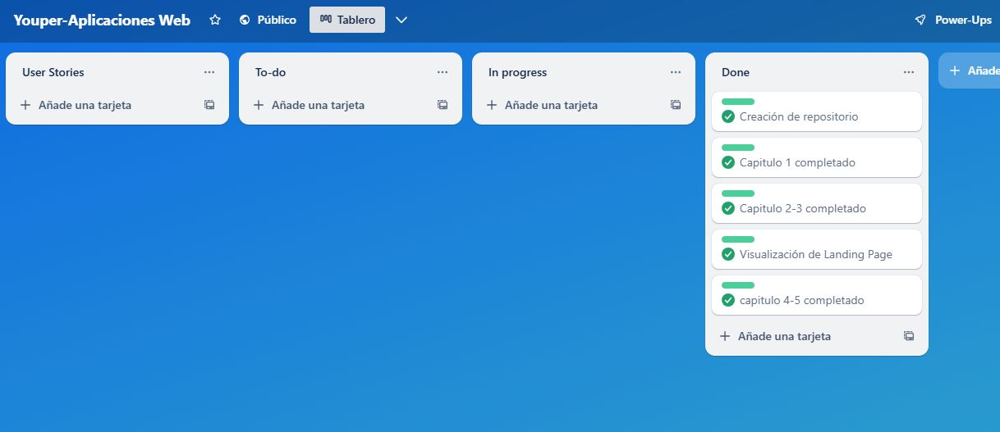

<table>
<tr>
    <th colspan="3">Sprint #</th>
    <th colspan="10">Sprint 1</th>
</tr>
<tr>
    <td colspan="3">User Story</td>
    <td colspan="10">Work-Item/Task</td>
</tr>
<tr>
    <td colspan="1">Id</td>
    <td colspan="2">Title</td>
    <td colspan="1">Id</td>
    <td colspan="2">Title</td>
    <td colspan="3">Description</td>
    <td colspan="1">Estimation</td>
    <td colspan="2">Assigned To</td>
    <td colspan="1">Status (To-do / InProcess / To-Review / Done)</td>
</tr>
<tr>
    <td colspan="1">US01</td>
    <td colspan="2">Encontrar información del propósito de la aplicación</td>
    <td colspan="1">UT01</td>
    <td colspan="2">Desarrollar el Lean Ux Process</td>
    <td colspan="3">Estructurar y agregar información sobre el propósito de la aplicación.</td>
    <td colspan="1">2</td>
    <td colspan="2">Angek Guillermo Berrospi</td>
    <td colspan="1">Done</td>
</tr>
<tr>
    <td colspan="1">US02</td>
    <td colspan="2">Encontrar información del propósito de la aplicación</td>
    <td colspan="1">UT02</td>
    <td colspan="2">Crear diseños de la landing page</td>
    <td colspan="3">Estructurar y agregar información sobre el tipo de diseño de la aplicación.</td>
    <td colspan="1">2</td>
    <td colspan="2"> Mel Andre Orellana</td>
    <td colspan="1">Done</td>
</tr>
<tr>
    <td colspan="1">US02</td>
    <td colspan="2">Encontrar información del propósito de la aplicación</td>
    <td colspan="1">UT03</td>
    <td colspan="2">Implementar estilos en la landing page</td>
    <td colspan="3">Implementar los estilos y diseño de la landing page.</td>
    <td colspan="1">3</td>
    <td colspan="2">Guillermo Tantaleán</td>
    <td colspan="1">Done</td>
</tr>
<tr>
    <td colspan="1">US03</td>
    <td colspan="2">Encontrar información del propósito de la aplicación</td>
    <td colspan="1">UT04</td>
    <td colspan="2">Implementar funcionalidad en la landing page</td>
    <td colspan="3">Implementar la funcionalidad de la landing page</td>
    <td colspan="1">4</td>
    <td colspan="2">Raul Hiroshi Tasayco</td>
    <td colspan="1">Done</td>
</tr>
<tr>
    <td colspan="1">US04</td>
    <td colspan="2">Encontrar información del propósito de la aplicación</td>
    <td colspan="1">UT05</td>
    <td colspan="2">Desarrollo de entrevistas y la estructura</td>
    <td colspan="3">Incorporar nuevas entrevistas con su diseño para el contenido.</td>
    <td colspan="1">2</td>
    <td colspan="2">Pedro Jesús Nanfuñay</td>
    <td colspan="1">Done</td>
</tr>
<tr>
    <td colspan="1">US04</td>
    <td colspan="2">Encontrar información del propósito de la aplicación</td>
    <td colspan="1">UT06</td>
    <td colspan="2">Apoyo en el porceso de documentción</td>
    <td colspan="3">Incorporar información relevante para el contenido.</td>
    <td colspan="1">2</td>
    <td colspan="2">Joel Prudencio Alcantara</td>
    <td colspan="1">Done</td>
</tr>
</table>

## 5.2.1.4. Development Evidence for Sprint Review
En esta sección se explica y presenta los avances en implementación con relación a los productos de la solución según el alcance del Sprint: Landing Page, Web Applications, Web Services


## 5.2.1.5. Execution Evidence for Sprint Review
Esta sección inicia con un resumen que explique lo alcanzado en este Sprint y
presenta screenshots de las principales vistas implementadas

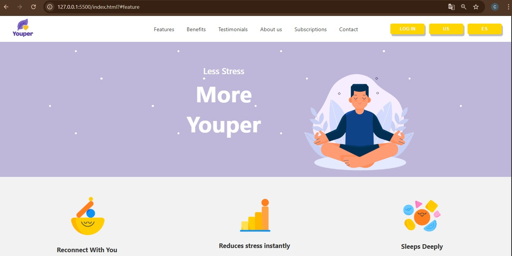

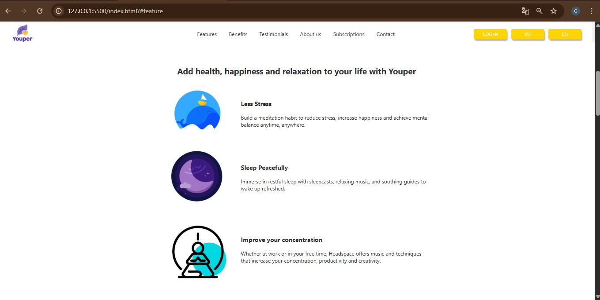

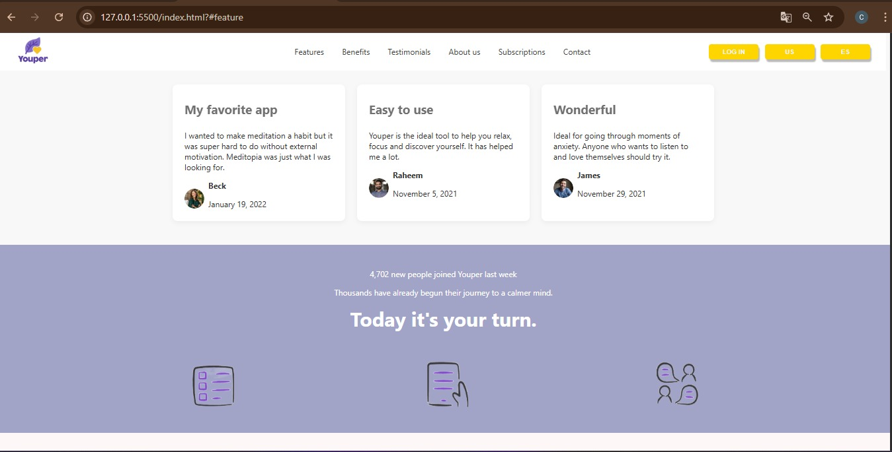

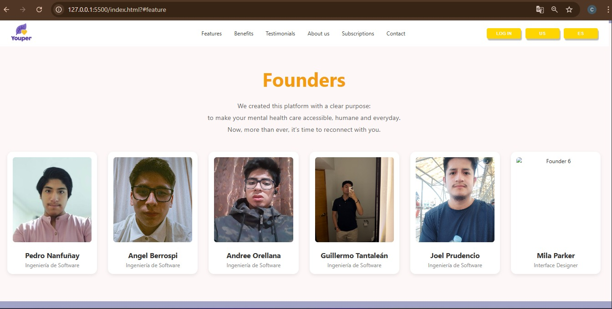

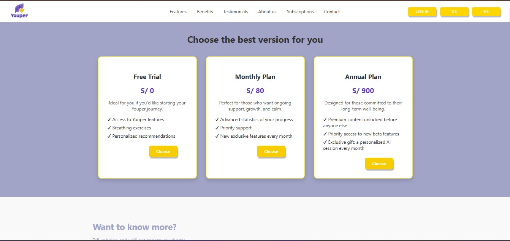

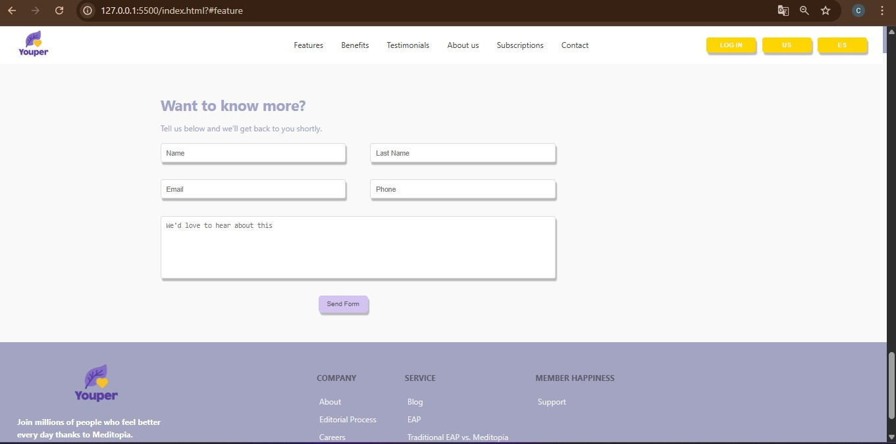


## 5.2.1.6. Services Documentation Evidence for Sprint Review
En esta sección se incluye la relación de Endpoints documentados con OpenAPI,
relacionados con el alcance del Sprint. 


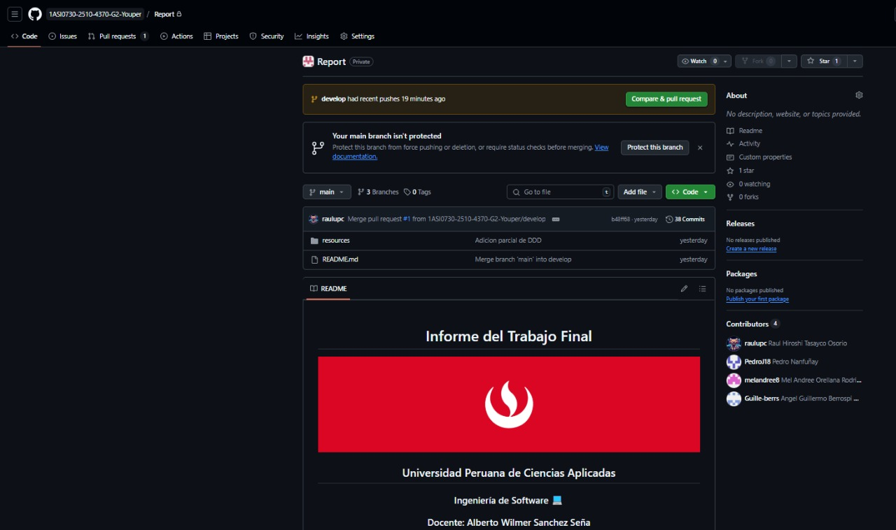


## 5.2.1.7  Software Deployment Evidence for Sprint Review
En esta sección se resume los procesos realizados en relación con Deployment
durante este Sprint. 


## 5.2.1.8. Team Collaboration Insights during Sprint
En esta sección el equipo explica cómo se han desarrollado las actividades de implementación y se presenta capturas en imagen de los analíticos de colaboración y commits en GitHub, realizados por los miembros del equipo.

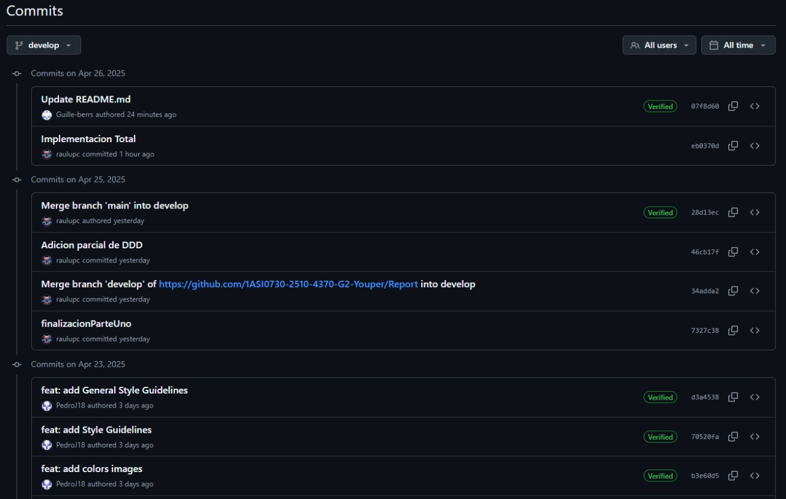

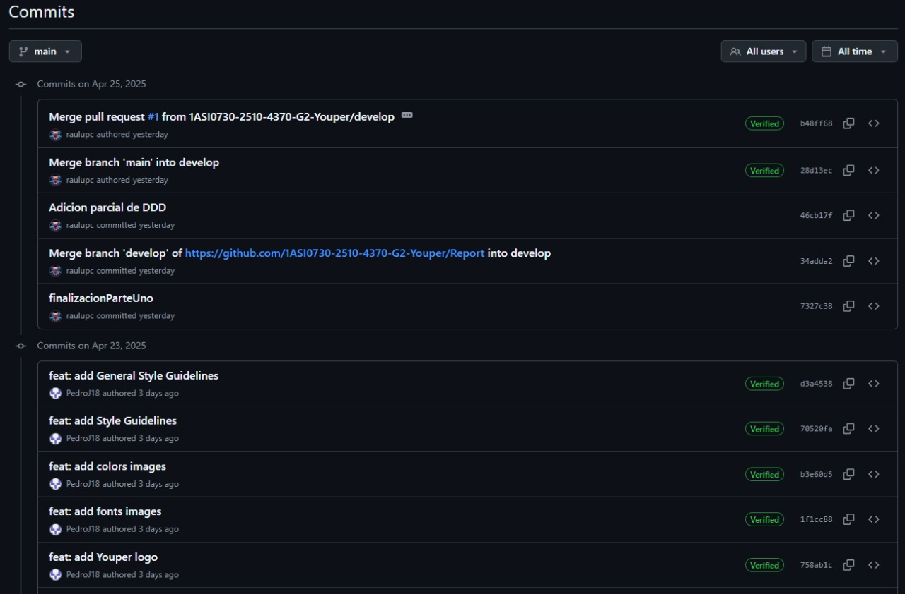

### 5.2.2. Sprints

## 5.2.2.1. Sprint Planning 2
En esta sección se especifica los aspectos principales del Sprint Planning Meeting.

<table>
<tr>
    <th colspan="5">Sprint </th>
    <th colspan="9">Sprint 2</th>
  </tr>
      <tr>
    <td colspan="13">Sprint Planning Background</td>
  </tr>
  <tr>
    <td colspan="5">Date</td>
    <td colspan="8">2025-05-14</td>
</tr>
  <tr>
    <td colspan="5">Time</td>
    <td colspan="8">5:00PM</td>
  </tr>
  <tr>
    <td colspan="5">Location</td>
    <td colspan="8">Servidor de Discord del equipo</td>
<tr>
    <td colspan="5">Prepared By</td>
    <td colspan="8">Angel Guillermo Berrospi</td>
</tr>
<tr>
    <td colspan="5">Attendees (to planning meeting)</td>
    <td colspan="8"> Tasayco Osorio Raul Hiroshi, Nanfuñay Liza Pedro Jesús,Mel Andre Rodriguez Orellana, Angel Berrospi Marin, Joel Prudencio Alcantara</td>
</tr>
<tr>
    <td colspan="5">Sprint  2 Review Summary</td>
    <td colspan="8">En esta segunda sección se planteó el mejormiento del desarrollo y estructura de la Landing page antes de subirse al repositorio.</td>
</tr>
<tr>
    <td colspan="5">Sprint 2 Retrospective Summary</td>
    <td colspan="8">En esta sesión todos los participantes, opinaron, mejoraron sus habilidades y cada uno se encargó de las mejoras dadas en la retroalimentación, también en el desarrollo de la landing y finalmente se decidió subir el landing en el último día.</td>
</tr>
<tr>
    <td colspan="13">Sprint Goal & User Stories</td>
</tr>
<tr>
    <td colspan="5">Sprint 2 Goal</td>
    <td colspan="8"> La meta de este Sprint 2 es la mejora tanto en planteamiento y desarrollo de la documentación y que nuestra Landing Page tenga una correcta funcionalidad para el usuario de forma amigable.  

</td>
</tr>
<tr>
    <td colspan="5">Sprint 2 Velocity</td>
    <td colspan="8">velocity 7</td> 
</tr>
<tr>
    <td colspan="5">Sum of Story Points</td>
    <td colspan="8">7 story points</td>
</tr>
</table>


## 5.2.2.2. Aspect Leaders and Collaborators
En esta sección el equipo que incluye la elaboración de un artefacto Leadership-andCollaboration Matrix (LACX), que indique por cada aspecto dentro del alcance del Sprint, quién es el líder y quién o quiénes son colaboradores en dicho aspecto, con el fin de brindar mayor claridad y efectividad en la comunicación al interior del equipo.


## 5.2.2.3. Sprint Backlog 2
Una sección de Sprint Backlog debe iniciar con una introducción que resuma el objetivo principal del Sprint.


<table>
<tr>
    <th colspan="3">Sprint #</th>
    <th colspan="10">Sprint 2</th>
</tr>
<tr>
    <td colspan="3">User Story</td>
    <td colspan="10">Work-Item/Task</td>
</tr>
<tr>
    <td colspan="1">Id</td>
    <td colspan="2">Title</td>
    <td colspan="1">Id</td>
    <td colspan="2">Title</td>
    <td colspan="3">Description</td>
    <td colspan="1">Estimation</td>
    <td colspan="2">Assigned To</td>
    <td colspan="1">Status (To-do / InProcess / To-Review / Done)</td>
</tr>
<tr>
    <td colspan="1">US05</td>
    <td colspan="2">Documentar mejoras en el desarrollo</td>
    <td colspan="1">UT07</td>
    <td colspan="2">Documentar mejoras técnicas"</td>
    <td colspan="3">Crear una documentación clara sobre decisiones y mejoras implementadas en el desarrollo</td>
    <td colspan="1">3</td>
    <td colspan="2">Angel Berrospi</td>
    <td colspan="1">Done</td>
</tr>
<tr>
    <td colspan="1">US06</td>
    <td colspan="2">Mejorar usabilidad de la landing page</td>
    <td colspan="1">UT08</td>
    <td colspan="2">Optimizar experiencia de usuario</td>
    <td colspan="3">Ajustar la estructura visual para mejorar la navegación y accesibilidad.</td>
    <td colspan="1">5</td>
    <td colspan="2">Mel Andre Orellana</td>
    <td colspan="1">Done</td>
</tr>
<tr>
    <td colspan="1">US07</td>
    <td colspan="2">Añadir mejoras en el frontend de la landing</td>
    <td colspan="1">UT09</td>
    <td colspan="2">Implementar mejores diseños a la landing page</td>
    <td colspan="3">Incluir ayudas visuales y mensajes emergentes para guiar al nuevo usuario en la landing.</td>
    <td colspan="1">5</td>
    <td colspan="2">Guillermo Tantaleán</td>
    <td colspan="1">Done</td>
</tr>
<tr>
    <td colspan="1">US08</td>
    <td colspan="2">Mejorar accesibilidad visual de la landing</td>
    <td colspan="1">UT08</td>
    <td colspan="2">Ajustar contraste y etiquetas</td>
    <td colspan="3">Aplicar mejoras de accesibilidad como mayor contraste de colores y etiquetas semánticas.</td>
    <td colspan="1">5</td>
    <td colspan="2">Pedro Jesús Nanfuñay</td>
    <td colspan="1">Done</td>
</tr>
<tr>
    <td colspan="1">US09</td>
    <td colspan="2">Diseño de Documentación</td>
    <td colspan="1">UT10</td>
    <td colspan="2">Añadir diseños de alta calidad a la documentación</td>
    <td colspan="3">Incorporar nuevas estructuras, apoyar en la mejora de la documentación y su presentación de alta calidad para que sean relevantes en el contenido.</td>
    <td colspan="1">3</td>
    <td colspan="2">Raul Hiroshi Tasayco</td>
    <td colspan="1">Done</td>
</tr>
<tr>
    <td colspan="1">US10</td>
    <td colspan="2">Diseño de Documentación</td>
    <td colspan="1">UT11</td>
    <td colspan="2">Añadir diseños de alta calidad a la documentación</td>
    <td colspan="3">Incorporar nuevas estructuras, apoyar en la mejora de la documentación y su presentación de alta calidad para que sean relevantes en el contenido.</td>
    <td colspan="1">3</td>
    <td colspan="2">Joel Prudencio Alcantara</td>
    <td colspan="1">Done</td>
</tr>
</table>


## 5.2.2.4. Development Evidence for Sprint Review
En esta sección se explica y presenta los avances en implementación con relación a los productos de la solución según el alcance del Sprint: Landing Page, Web Applications, Web Services


## 5.2.2.5. Execution Evidence for Sprint Review
Esta sección inicia con un resumen que explique lo alcanzado en este Sprint y
presenta screenshots de las principales vistas implementadas


## 5.2.2.6. Services Documentation Evidence for Sprint Review
En esta sección se incluye la relación de Endpoints documentados con OpenAPI,
relacionados con el alcance del Sprint. 


## 5.2.2.7  Software Deployment Evidence for Sprint Review
En esta sección se resume los procesos realizados en relación con Deployment
durante este Sprint. 


## 5.2.2.8. Team Collaboration Insights during Sprint
En esta sección el equipo explica cómo se han desarrollado las actividades de implementación y se presenta capturas en imagen de los analíticos de colaboración y commits en GitHub, realizados por los miembros del equipo.


### Conclusiones

- El presente trabajo nos permitió documentar y desarrollar una plataforma que tiene como objetivo mejorar el bienestar emocional de los usuarios. Basándonos en principios éticos y utilizando técnicas que nos han permitido transmitir correctamente las características y funcionalidades de la plataforma. Ello ha permitido garantizar las decisiones con el proyecto como el diseño visual, navegación y funcionalidad, mejorando la eficiencia del equipo.

- La Landing Page fue diseñada priorizando una experiencia clara, amigable y accesible, facilitando que los visitantes comprendan rápidamente los beneficios de Youper y se interesen en probar el servicio. Cada sección contribuye en comunicar el valor y objetivos que Youper ofrece.

### Bibliografía


- Causas comunes de los trastornos mentales * Psyciencia. (2022, 21 febrero). Psyciencia. https://www.psyciencia.com/algunas-causas-comunes-de-los-trastornos-mentales/
- En el Día Mundial de la Salud Mental, conoce qué es y por qué aumentaron los casos de depresión y ansiedad en la región. (2022, 11 octubre). National Geographic. https://www.nationalgeographicla.com/ciencia/2022/10/como-la-covid-19-afecto-a-la-salud-mental-en-latinoamerica
- Francia, G. (2021, 5 febrero). Significado del color morado en psicología. psicologia-online.com. https://www.psicologia-online.com/significado-del-color-morado-en-psicologia-5475.html
- Koulen Font Family | Download Free Fonts for Desktop & Webfonts. (s. f.). https://www.cufonfonts.com/font/koulen
- Koulen - Google Fonts. (s. f.). Google Fonts. https://fonts.google.com/specimen/Koulen
- Mada Font Family | Download Free Fonts for Desktop & Webfonts. (s. f.). https://www.cufonfonts.com/font/mada
- Mada - Google Fonts. (s. f.). Google Fonts. https://fonts.google.com/specimen/Mada
- Menéndez, M. (2021, 15 abril). Qué significa el color amarillo en la psicología. psicologia-online.com. https://www.psicologia-online.com/que-significa-el-color-amarillo-en-la-psicologia-4067.html
- “No hay salud sin salud mental”. (2020, 8 octubre). OPS/OMS | Organización Panamericana de la Salud. https://www.paho.org/es/noticias/8-10-2020-no-hay-salud-sin-salud-mental#:~:text=Los%20trastornos%20mentales%2C%20neurol%C3%B3gicos%20y,diagnosticado%20con%20un%20trastorno%20mental
- Rcn, N. (2024, 27 octubre). Informe de la ONU reveló las principales causas de trastornos mentales en el mundo. Noticias RCN. https://www.noticiasrcn.com/salud-y-bienestar/informe-de-la-onu-revelo-principales-causas-de-trastornos-mentales-en-el-mundo-765066
- WHO. (2022, 2 marzo). La pandemia de COVID-19 provoca un aumento del 25% en la prevalencia de ansiedad y depresión en todo el mundo. https://www.who.int/news/item/02-03-2022-covid-19-pandemic-triggers-25-increase-in-prevalence-of-anxiety-and-depression-worldwide
- World Health Organization: WHO. (2022, 8 junio). Trastornos mentales. https://www.who.int/es/news-room/fact-sheets/detail/mental-disorders

### Anexos


