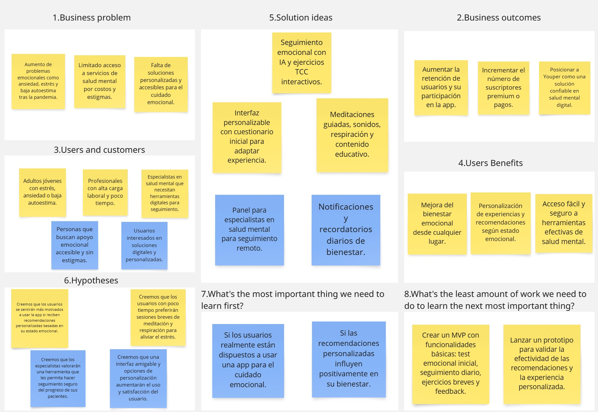
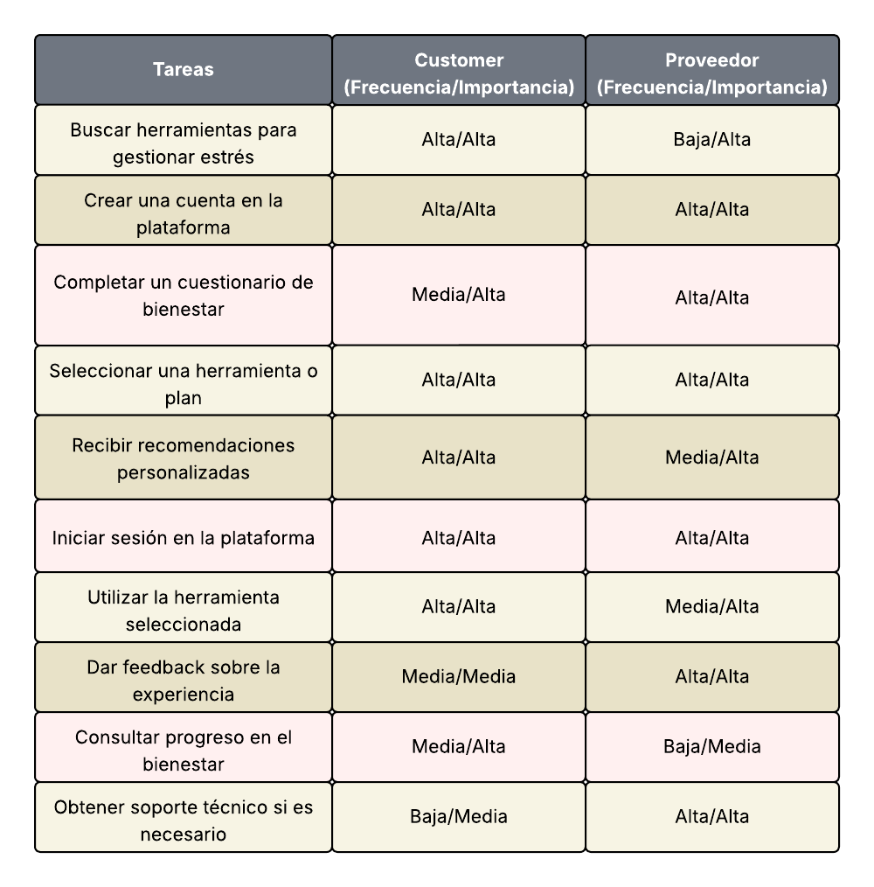
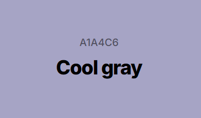
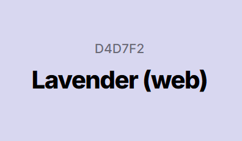
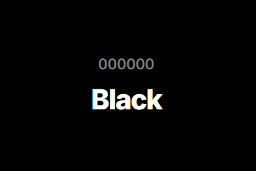

# Informe del Trabajo Final

## Universidad Peruana de Ciencias Aplicadas
### Ingeniería de Software 💻
### Docente: Alberto Wilmer Sanchez Seña
### NRC: 4370
## YOUPER 

* Integrantes
    * Tantaleán Mesta Guillermo Fabián U202311958
    * Tasayco Osorio Raul Hiroshi U202319415
    * Nanfuñay Liza Pedro Jesús U202215462
    * Angel Guillermo Berrospi Marin U202114701
    * Orellana Rodriguez Mel Andree U202116018

## Contenido

- [✨ Informe Trabajo Final ✨](#-informe-trabajo-final-)
    - [Universidad Peruana de Ciencias Aplicadas 🎓](#universidad-peruana-de-ciencias-aplicadas-)
  - [Registro de versiones del Informe](#registro-de-versiones-del-informe)
  - [Project Report Collaboration Insights](#project-report-collaboration-insights)
  - [Contenido](#contenido)
  - [Student Outcome](#student-outcome)
- [Capítulo I: Introducción](#capítulo-i-introducción)
  - [1.1. Startup Profile](#11-startup-profile)
    - [1.1.1. Descripción de la Startup](#111-descripción-de-la-startup)
    - [1.1.2 Perfiles de integrantes del equipo](#112-perfiles-de-integrantes-del-equipo)
  - [1.2. Solution Profile](#12-solution-profile)
    - [1.2.1 Antecedentes y problemática](#121-antecedentes-y-problemática)
      - [⁉️5“W”s + 2"H"'s](#️5ws--2hs)
        - [🟡 WHAT (QUÉ)](#-what-qué)
        - [🟡 WHEN (CUANDO)](#-when-cuando)
        - [🟡 WHERE (DONDE)](#-where-donde)
        - [🟡 WHO (QUIEN)](#-who-quien)
        - [🟡 WHY (POR QUE)](#-why-por-que)
        - [🟡 HOW (COMO)](#-how-como)
        - [🟡 HOW MUCH (CUANTO)](#-how-much-cuanto)
    - [1.2.2 Lean Ux Process](#122-lean-ux-process)
      - [1.2.2.1. Lean UX Problem Statements](#1221-lean-ux-problem-statements)
      - [1.2.2.2. Lean UX Assumptions](#1222-lean-ux-assumptions)
        - [Business Outcomes:](#business-outcomes)
        - [User Outcomes](#user-outcomes)
      - [1.2.2.3. Lean UX Hypothesis Statements](#1223-lean-ux-hypothesis-statements)
      - [1.2.2.4. Lean UX Canvas](#1224-lean-ux-canvas)
  - [Segmentos Objetivos](#segmentos-objetivos)
- [Capítulo II: Requeriments Elicitation \& Analysis](#capítulo-ii-requeriments-elicitation--analysis)
  - [2.1. Competidores](#21-competidores)
    - [2.1.1. Análisis competitivo](#211-análisis-competitivo)
    - [2.1.2. Estrategias y tácticas frente a competidores](#212-estrategias-y-tácticas-frente-a-competidores)
  - [2.2. Entrevistas 📝](#22-entrevistas-)
    - [2.2.1. Diseño de entrevistas](#221-diseño-de-entrevistas)
    - [2.2.2. Registro de entrevistas](#222-registro-de-entrevistas)
    - [2.2.3. Análisis de entrevistas](#223-análisis-de-entrevistas)
  - [2.3. Needfinding](#23-needfinding)
    - [2.3.1. User Personas](#231-user-personas)
    - [2.3.2. User Task Matrix](#232-user-task-matrix)
    - [2.3.3. User Journey Mapping](#233-user-journey-mapping)
    - [2.3.4. Empathy Mapping](#234-empathy-mapping)
    - [2.3.5. As-is Scenario Mapping](#235-as-is-scenario-mapping)
  - [2.4. Ubiquitous Language](#24-ubiquitous-language)
- [Capítulo III: Requeriments Specification](#capítulo-iii-requeriments-specification)
  - [3.1. To-Be Scenario Mapping](#31-to-be-scenario-mapping)
  - [3.2. User Stories](#32-user-stories)
  - [3.3. Impact Mapping](#33-impact-mapping)
  - [3.4. Product Backlog](#34-product-backlog)
- [Capítulo IV: Product Desing](#capítulo-iv-product-desing)
  - [4.1. Style Guidelines](#41-style-guidelines)
    - [4.1.1. General Style Guidelines](#411-general-style-guidelines)
    - [4.1.2. Web Style Guidelines](#412-web-style-guidelines)
  - [4.2. Information Architecture](#42-information-architecture)
    - [4.2.1. Organization Systems](#421-organization-systems)
    - [4.2.2. Labeling Systems](#422-labeling-systems)
    - [4.2.3. SEO Tags and Meta Tags](#423-seo-tags-and-meta-tags)
    - [4.2.4. Searching Systems](#424-searching-systems)
    - [4.2.5. Navigation Systems](#425-navigation-systems)
  - [4.3. Landing Page UI Desing](#43-landing-page-ui-desing)
    - [4.3.1. Landing Page Wireframes](#431-landing-page-wireframes)
    - [4.3.2. Landing Page Mock-Up](#432-landing-page-mock-up)
  - [4.4. Web Applications UX/UI Desing](#44-web-applications-uxui-desing)
    - [4.4.1. Web Applications Wireframes](#441-web-applications-wireframes)
    - [4.4.2. Web Applications Wireflow Diagrams](#442-web-applications-wireflow-diagrams)
    - [4.4.3. Web Applications User Flow Diagrams](#443-web-applications-user-flow-diagrams)
  - [4.5. Web Applications Prototyping](#45-web-applications-prototyping)
  - [4.6. Domain-Driven Software Architecture](#46-domain-driven-software-architecture)
    - [4.6.1. Software Architecture Context Diagram](#461-software-architecture-context-diagram)
    - [4.6.2. Software Architecture Container Diagram](#462-software-architecture-container-diagram)
    - [4.6.3. Software Architecture Components Diagram](#463-software-architecture-components-diagram)
  - [4.7. Software Object-Oriented Desing](#47-software-object-oriented-desing)
    - [4.7.1. Class Diagram](#471-class-diagram)
    - [4.7.2. Class Dictionary](#472-class-dictionary)
  - [4.8. Database Desing](#48-database-desing)
    - [4.8.1. Database Diagram](#481-database-diagram)
- [Capítulo V: Product Implementation, Validation \& Deployment](#capítulo-v-product-implementation-validation--deployment)
  - [5.1. Software Configuration Management](#51-software-configuration-management)
    - [5.1.1. Software Development Environment Configuration](#511-software-development-environment-configuration)
    - [5.1.2. Source Code Management](#512-source-code-management)
    - [5.1.3. Source Code Style Guide \& Conventions](#513-source-code-style-guide--conventions)
    - [5.1.4. Software Deployment Configuration](#514-software-deployment-configuration)
  - [5.2. Landing Page, Service \& Applications Implementation](#52-landing-page-service--applications-implementation)
    - [5.2.x. Sprints](#52x-sprints)
  - [5.3. Validation Interviews](#53-validation-interviews)
    - [5.3.1. Diseño de Entrevistas](#531-diseño-de-entrevistas)
    - [5.3.2. Registro de Entrevistas](#532-registro-de-entrevistas)
    - [5.3.3. Evaluaciones según heurísticas](#533-evaluaciones-según-heurísticas)
  - [5.4. Video About-the-Product](#54-video-about-the-product)
- [Conclusiones](#conclusiones)
  - [Conclusiones y recomendaciones](#conclusiones-y-recomendaciones)
  - [Video About-the-Team](#video-about-the-team)

# Capítulo I: Introducción

## 1.1. Startup Profile

### 1.1.1. Descripción de la Startup

**MyMind** es una startup innovadora que está enfocada en impulsar y transformar el cuidado de la salud mental. A través de nuestra plataforma Youper, se permitirá a los usuarios mejorar y gestionar su bienestar emocional a través de herramientas digitales y el seguimiento personalizado adaptado a las necesidades individuales de cada usuario.

**Misión:** Promover el bienestar emocional a las personas mediante una plataforma digital personalizada, accesible y basada en evidencia, que integre tecnología y acompañamiento terapéutico para mejorar la calidad de vida de los usuarios.

**Visión:** Ser referentes en innovación tecnológica para la salud mental, con el objetivo de facilitar el acceso a herramientas digitales que fomenten el autocuidado, el desarrollo personal y emocional y una sociedad más empática y saludable

### 1.1.2. Perfiles de integrantes del equipo

| Integrante | Descripción |
|-|-|
| |  |
|  | Me llamo Pedro Jesús Nanfuñay Liza, estudiante de la carrera de Ingeniería de Software. Me considero una persona responsable, perseverante y siempre dispuesto a trabajar en equipo. Tengo conocimientos en lenguajes de programación como C++ y Python; en desarrollo web como HTML, CSS y JavaScript; en base de datos relacionales y no relacionales como SQL y MongoDB; y en frameworks como Angular y PrimeVue. Espero poder aportar de manera positiva al equipo y cumplir con los objetivos establecidos. |
|  | Me llamo Angel Guillermo Berrospi, soy estudiante de ingeniería de software, me considero una persona responsable y sociable con mis compañeros dando siempre alternativas de solución ante los problemas, me gusta aprender más sobre la tecnología y cómo progresa conforme pase el tiempo. Puedo brindar aporte al equipo por los conocimientos de programación cómo C++, SQL, y un poco de Python, HTML y CSS. Por lo tanto de esta forma trato de mejorar siempre cómo persona y profesional. |
|  | Mi nombre es Raul Hiroshi Tasayco Osorio, soy un estudiante de la carrera de Ingeniería de Software, me gusta trabajar en equipo, puesto que me considero alguien responsable y que puede dar buenos aportes al grupo, en cuanto a las tecnólogías que aprendí tanto adentro como afuera de la universidad se encuentran Python, C++, HTML, CSS, SQL, Mariadb. Considero que estos trabajos en grupo nos ayudan bastante para poder tener una buena coordinación en equipo y mejorar mutuamente. |
| |  |
| |  |

## 1.2. Solution Profile

### 1.2.1 Antecedentes y problemática

| LAS 5W y 2H | Pregunta | Descripción |
|-------------|----------|-------------|
| What? | ¿Cuál es el problema?  | La falta de acceso oportuno, económico y personalizado a procesos terapéuticos, agravada por barreras como el costo, el tiempo y la escasa disponibilidad de atención profesional. Esto impide que muchas personas enfrenten adecuadamente sus problemas de salud mental. |
| Why? | ¿Cuál es la causa del problema? | La causa del problema surge de diversos factores personales, como los antecedentes familiares, experiencias traumáticas, consumo de sustancias, estigmatización, y factores sociales recientes como la pandemia del Covid-19, que aumentó un 25% la prevalencia mundial de ansiedad y depresión (OMS, 2022). |
| When? | ¿Cuándo surge el problema? | Aunque el problema ha existido desde hace años, se intensificó notablemente durante la pandemia de Covid-19, donde el confinamiento, el aislamiento social y la incertidumbre provocaron un fuerte impacto en la salud emocional a nivel global. |
| Where? | ¿Dónde surge el problema? | El problema tiene un alcance global, con mayor impacto en situaciones de pobreza extrema, experiencias traumáticas, o en regiones donde el acceso a un proceso terapéutico sea escaso. Según la última edición del Atlas de Salud Mental de la OMS reveló que en 2020 los gobiernos de todo el mundo destinaron a la salud, por término medio, poco más del 2% de sus presupuestos de salud, y numerosos países de ingresos bajos comunicaron disponer de menos de un trabajador de salud mental por cada 100 000 habitantes. (OMS, 2022) |
| Who? | ¿Quiénes son afectados? | Los principales afectados son los jóvenes y adultos que enfrentan altos niveles de estrés, ansiedad, o dificultades emocionales y no cuentan con recursos o tiempo suficiente para recibir atención profesional. En el caso de los niños o adolescentes, la pandemia afectó el proceso de socialización y de educabilidad, informa Campodónico. (Redacción National Geographic, 2022) |
| How? | ¿Cómo se manifiesta el problema? | A través de la falta de soluciones digitales enfocadas en facilitar el acompañamiento terapéutico continuo. Las iniciativas existentes suelen ser costosas  o poco adaptadas a las realidades emocionales de los usuarios. |
| How Much? | ¿Cuál es la magnitud del problema? | A nivel personal, puede derivar en trastornos crónicos, aislamiento o riesgo suicida que fueron causas de experiencias tales como la pérdida del empleo, distanciamiento social, fallecimiento de seres cercanos o el temor a contagiar a otros . A nivel social, genera sobrecarga en los sistemas de salud, pérdida de productividad y deterioro del bienestar general. |

## 1.2.2 Lean Ux Process

## 1.2.2.1. Lean Ux Problem Statment
###
Para los adultos jóvenes y profesionales con alta carga laboral que sufren de ansiedad, estrés, baja autoestima y otros transtornos emocionales, quienes enfrentan barreras como el costo elevado, la estigmación y la falta de acceso a atención de salud mental adecuada, el problema es que no tienen acceso a una solución personalizada, accesible y efectiva que se adapte a sus necesidades emocionales y les brinde apoyo emocional continuo.

## 1.2.2.2. Lean UX Assumptions
### 
- Assumptions 1: Los usuarios tienen dificultades para acceder a atención de salud mental debido a 
barreras como el costo, la estigmación o la falta de tiempo.
- Assumptions 2: Las herramientas digitales, como la inteligencia artificial y la terapia cognitivo-conductual, pueden ser efectivas para mejorar el bienestar emocional de los usuarios si están bien personalizadas y adaptadas.
- Assumptions 3: Los usuarios valoran la personalización de su experiencia, como la adaptación a sus necesidades emocionales y su progreso.
- Assumptions 4: El seguimiento constante de las emociones, la meditación, los ejercicios de respiración y el uso de sonidos relajantes ayudan a reducir los niveles de estrés y mejorar la calidad de vida.
- Assumptions 5: La integración de herramientas para que los profesionales de salud mental sigan el progreso de sus pacientes, aumenta la efectividad de la intevención y el bienestar a largo plazo.
  
## 1.2.2.3. Lean UX Hypothesis Statements
###
- Hypothesis 1: Si los usuarios pueden acceder a un acompañamiento emocional personalizado, basado en inteligencia artificial y TCC, entonces experimentarán una mejora significativa en su bienestar emocional.
- Hypothesis 2: Si los usuarios tienen la opción de personalizar su experiencia en la plataforma, adaptándola a sus necesidades emocionales específicas, entonces se comprometerán más con la aplicación y continuarán usándola a largo plazo.
- Hypothesis 3: Si Youper permite a los profesionales de salud mental realizar un seguimiento eficaz del progreso de sus pacientes, entonces los pacientes tendrán un mejor manejo de su salud mental y se sentirán más apoyados.
- Hypothesis 4: Si se integran funcionalidades como meditaciones guiadas, música relajante y sonidos de naturaleza, los usuarios experimentarán una reducción del estrés y una mejora en la calidad del sueño.

## 1.2.2.4. Lean UX Canvas

## 2.3. Needfinding

### 2.3.1. User Personas

### 2.3.2. User Task Matrix

#### Se presenta cada tarea con su Frecuencia e importancia segun el tipo de usuario, Customer o Proveedor, en el cual podemos identificar las prioridades segun tipo de user.

### 2.3.3. User Journey Mapping

### 2.3.4. Empathy Mapping
#### Se presentan los tres Empathy Mapping, uno para cada segmento objetivo en el cual se empatiza con el tipo de usuario.

#### * User Empathy Mapping joven

#### * User Empathy Mapping adulto

#### * User Empathy Mapping psicóloga

### 2.3.5. As-is Scenario Mapping
#### * As-is Scenario Mapping joven

#### * As-is Scenario Mapping adulto

#### * As-is Scenario Mapping psicologo

Link de acceso: [Entrar acá](https://miro.com/welcomeonboard/RU10Z25nMGRCNENEMEpzWnVlaGUwWGlNSEV1YjBjOVQ2YkdiOHVRalIyVGQzSEJVblVKTnJOTkhUWEt6eUtIR1V3bk5Ia2V1SGZPTS9kSE9Xa1pBN05vK0sva1JpNVNUV0JIREdBZ09OdjE4QnFQZmhrYnZSdDg2Z2hnZ3dla29NakdSWkpBejJWRjJhRnhhb1UwcS9BPT0hdjE=?share_link_id=3143734650 "Link miro")

## 2.4. Ubiquitous Language

En **Domain-Driven Design (DDD)**, el “**Ubiquitous Language**” consiste en definir un vocabulario compartido que sea comprendido por todo el equipo: desarrolladores, diseñadores, expertos en salud mental y usuarios clave. Este lenguaje común garantiza claridad conceptual y facilita la implementación técnica coherente con el dominio del problema.

**Usuario (User):**  
Persona que utiliza la aplicación para mejorar su bienestar emocional. Puede ser un joven adulto, un adulto con estrés laboral o un especialista en salud mental.

**Estado Emocional (Emotional State):**  
Representación actual del estado anímico del usuario, basado en su autopercepción y en datos recogidos por el sistema.

**Módulo Terapéutico (Therapeutic Module):**  
Conjunto de actividades, ejercicios o contenidos diseñados para abordar un tema específico como ansiedad, autoestima, relaciones, estrés o sueño.

**Ruta Personalizada (Personalized Path):**  
Secuencia adaptativa de módulos y ejercicios recomendados por el sistema según el perfil y estado emocional del usuario.

**Ejercicio Emocional (Emotional Exercise):**  
Actividades prácticas como meditación, respiración guiada, escritura terapéutica o visualizaciones que ayudan a regular emociones.

**Seguimiento Emocional (Emotional Tracking):**  
Registro regular de emociones que permite analizar el progreso del usuario y ajustar recomendaciones.

**Diario Emocional (Emotional Journal):**  
Espacio personal donde el usuario escribe sobre su día, emociones y reflexiones como parte del proceso terapéutico.

**Especialista (Specialist):**  
Profesional de la salud mental que utiliza la plataforma para hacer seguimiento del progreso emocional de sus pacientes, interpretar métricas e intervenir si es necesario.

**Alerta de Riesgo Emocional (Emotional Risk Alert):**  
Notificación automática que se activa cuando se detectan señales de deterioro emocional o patrones de riesgo.

**Sesión Terapéutica (Therapeutic Session):**  
Encuentro estructurado entre el especialista y el paciente, ya sea presencial o digital, registrado en la plataforma.

**IoT Emocional (Emotional IoT):**  
Dispositivos inteligentes que recogen datos físicos del usuario (frecuencia cardíaca, calidad del sueño, etc.) para enriquecer el análisis emocional.

**Panel de Bienestar (Wellness Dashboard):**  
Interfaz donde se visualizan indicadores clave del estado emocional, progreso en módulos y recomendaciones activas.

# Capítulo III: Requeriments Specification
## 3.1. To-Be Scenario Mapping. 

En esta sección, se detallan las fases principales del proceso optimizado de acompañamiento emocional mediante la aplicación **Youper**, diseñada para atender las necesidades específicas de cada segmento de usuario. Se explica cómo la automatización inteligente, el análisis emocional en tiempo real y la personalización dinámica transforman la experiencia del usuario. Esta estrategia permite que tanto los usuarios como los especialistas en salud mental puedan enfocarse en el bienestar emocional con mayor eficacia, tomando decisiones más informadas y centradas en datos emocionales recolectados de forma continua.

### Segmento 1: Jóvenes Adultos en búsqueda de regulación emocional y autoconocimiento

### Segmento 2: Adultos Profesionales con Estrés Crónico y Alteraciones del Sueño

### Segmento 3: Especialistas en Salud Mental que optimizan el acompañamiento terapéutico digital

## 3.2. User Stories. 
## 3.3. Impact Mapping. 
## 3.4. Product Backlog. 

# Capítulo IV: Product Design

## 4.1. Style Guidelines

Las Style Guidelines son un conjunto de reglas fundamentales que definen y detallan los elementos de diseño y comunicación de un proyecto para asegurar una comunicación visual coherente y profesional. Para Youper, definiremos criterios como colores, tipografía y estructura para diseñar la landing page y web application.

### 4.1.1. General Style Guidelines

**Branding:**
 Para la creación del logo de nuestro producto Youper, se ha optado por un diseño minimalista que refleja el objetivo de la aplicación. El aspecto del logo se compone del ícono de una hoja con detalles de ramas de un cerebro, lo que refleja la vida y el bienestar, acompañado de un corazón que refleja el bienestar y amor propio.

 **Typography:**
 Para la elección de las tipografías que utilizaremos para Youper, se han seleccionado fuentes simples y modernas que transmitan la estética de la aplicación. A continuación, se presentan las tipografías utilizadas para Youper:

 - **Mada:** Tipografía de estilo árabe modernista. Se caracteriza por descendentes bajos, contornos abiertos y formas de bajo contraste, lo que lo hace adecuado para señalización, tamaños de punto pequeños e interfaces de usuario. Transmite un sentimiento modernista y simplista.

   

 - **Koulen:** Fuente tipográfica ideal para titulares, títulos y subtítulos, e incluso diseños de banners. Sus características los hacen ideales para crear texto impactante y atractivo.  

   

**Colors:**
 Los colores son los encargados de brindar la primera percepción visual de los usuarios. En este contexto, la paleta de colores seleccionados para Youper está conformada por morado como tonalidad principal, que simboliza el pensamiento, delicadeza y espiritualidad. Por otro lado, el color amarillo simboliza la alegría, optimismo y la creatividad. Como tonalidades secundarias se hace uso de variedades cromáticas del color blanco, negro y plomo. Esta paleta asegura que se transmita un mensaje positivo a los usuarios.

 A continuación se presentan los colores seleccionados:

 - **Cool Gray (#A1A4C7):** Un tono gris suave con matices azulados que transmite calma, profesionalismo y modernidad.

 

 - **Lavender (web) (#D4D7F2):** Un púrpura claro con matices rosados, asociado a la delicadeza, tranquilidad y creatividad.

 

 - **Xanthous (#FFC965):** Un amarillo vibrante con matices dorados que transmite energía, optimismo y calidez.

 

 - **Hundayi yellow (#F6B253):** Un amarillo fuerte y moderno. Transmite innovación y visibilidad.

 

 - **White smoke (#F2F2F2):** Un blanco grisáceo muy tenue, que brinda una sensación de limpieza, suavidad y ligereza.

 

 - **Jet (#353531):** Un negro profundo con ligeros toques grisáceos, que representa elegancia, misterio y firmeza.

 

 - **Black (#000000):** El color más oscuro. Transmite sofisticación, poder y sobriedad.

 

 - **Silver (#A4A2A2):** Un gris metálico brillante que representa modernidad, tecnología y elegancia con un toque futurista.

 

 **Spacing:**
 Youper está diseñado para ofrecer una experiencia visual relajante y emocionalmente armoniosa. A continuación, se detallan las especificaciones de espaciado recomendadas para lograr una interfaz accesible, clara y centrada en el bienestar del usuario:

 **Espaciado entre líneas (line-height):** 
 **- Texto de cuerpo:**
 El espaciado entre líneas debe ser de 1.5 a 1.7 veces el tamaño de la fuente. Este rango brinda una sensación de amplitud y calma visual, facilitando la lectura sin generar fatiga ocular.

 **Espaciado entre párrafos:** 
 - **Margen inferior:**
 Cada párrafo debe tener un margen inferior de al menos 130% del tamaño de la fuente. Esta separación ayuda a procesar cada bloque de contenido como una idea completa, favoreciendo la comprensión emocional y cognitiva.

 **Margen y espaciado alrededor de elementos de la interfaz:** 
 - **Espacio entre componentes de UI (cards, botones, inputs, etc.):**
 Mantener mínimo 24 píxeles de separación. Este margen promueve una sensación de orden y reduce la sobrecarga cognitiva, especialmente en secciones densas o funcionales.

 **Espaciado entre secciones o módulos:** 
 **- Margen superior e inferior:**
 Debe aplicarse un margen de mínimo 60 píxeles entre bloques de contenido o secciones temáticas. Esto refuerza una estructura clara y ayuda a separar emocionalmente los distintos momentos de navegación (ej. exploración, reflexión, acción).

 **Espaciado entre elementos de menú y navegación:** 
 **- Espacio horizontal entre ítems de menú:**
 Cada elemento debe tener al menos 18 píxeles de espacio lateral. Esta distancia mejora la precisión al interactuar y brinda una apariencia limpia y accesible, incluso desde dispositivos móviles.

 **Espaciado alrededor de imágenes e ilustraciones:** 
 - **Margen alrededor de recursos visuales:**
 Las imágenes, íconos y gráficos deben tener un margen mínimo de 25 píxeles alrededor. Esto refuerza su rol como elementos de apoyo emocional o informativo, sin invadir el texto.

 **Espaciado en el pie de página (footer):** 
 - **Margen superior e inferior:**
 El pie de página debe estar separado del contenido principal con un espacio de entre 50 a 70 píxeles. Esto le da aire y evita que se perciba como una extensión aglomerada del contenido anterior.
___

## 4.6. Domain-Driven Software Architecture

El enfoque de Domain Driven Design (DDD) busca establecer una comprensión común del dominio que define el espacio del problema. Este enfoque facilita una mejor colaboración entre los desarrolladores y los expertos en el dominio. DDD no se limita al uso de un lenguaje común, sino que también incluye una serie de patrones, métodos y diagramas arquitectónicos del sistema, cuyo propósito es alinear el software con el dominio y fortalecer la visión compartida que promueve este enfoque. 

### 4.6.1. Software Architecture Context Diagram.
El diagrama de contexto proporciona una visión general de alto nivel sobre cómo el sistema de software Youper se relaciona con sus usuarios y, en caso de existir, con otros sistemas externos.

### 4.6.2. Software Architecture Container Diagram.
El diagrama de contenedores presenta una visión general de alto nivel sobre cómo interactúan las aplicaciones y las fuentes de datos que forman parte del funcionamiento del sistema de software Youper.

### 4.6.3. Software Architecture Components Diagrams
Los diagramas de componentes ofrecen una visión clara de cómo se relacionan los principales componentes del sistema de software. Estos elementos describen con mayor detalle la implementación de los módulos que conforman la aplicación.

